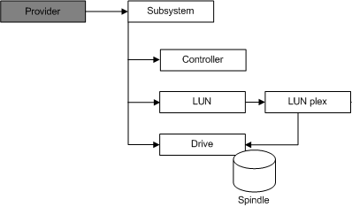

# Hardware Provider Objects

\[Beginning with Windows 8 and Windows Server 2012, the [Virtual Disk Service](virtual-disk-service-portal.md) COM interface is superseded by the [Windows Storage Management API](/windows-hardware/drivers/storage/windows-storage-management-api-portal).\]

The VDS object model includes a set of objects to query and configure hardware provider entities. (Note that while VDS includes a software provider, you must purchase a hardware provider and the associated hardware separately to take advantage of the hardware provider objects.) These hardware provider objects represent physical devices (such as subsystems, drives, and controllers) and virtual devices (such as LUNs and LUN plexes).

A hardware provider should create one COM object for each physical or virtual device.

The illustration that follows shows the relationship between the provider object and the set of hardware provider objects, as well as the relationship between the various hardware provider objects themselves.

A provider object can contain any number of subsystems. All hardware providers are capable of managing multiple instances of the same subsystem model. Many hardware providers are also capable of managing multiple instances of different subsystem models. A single computer can host any number of hardware providers.

A subsystem object can contain any number of controllers and drives, and can surface any number of LUNs. A LUN object comprises of at least one LUN plex, and each LUN plex maps to one or more drives, depending on the plex type. Controller objects can manage data input/output for any number of LUN objects.

## Related topics

<dl> <dt>

[VDS Object Model](vds-object-model.md)
</dt> </dl>

 

 
