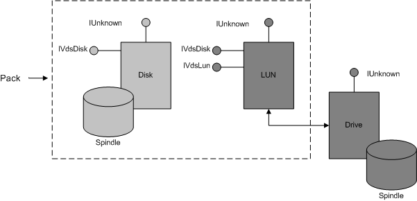

# Pack Object

\[Beginning with Windows 8 and Windows Server 2012, the [Virtual Disk Service](virtual-disk-service-portal.md) COM interface is superseded by the [Windows Storage Management API](/windows-hardware/drivers/storage/windows-storage-management-api-portal).\]

A pack object models a disk group, a collection of disks and volumes managed by the basic or dynamic software provider. A provider can contain multiple pack objects.

Using the API, applications can direct VDS to add one or more disks to a pack, bind the disks into volumes, and optionally move the disks as a unit between hosts. You cannot import an existing volume into a pack.

> [!Note]  
> Membership in a pack does not imply consistency among disks with respect to performance, media, interconnection protocol, or other characteristics.

 

Disk objects are either unallocated, and managed by VDS, or are members of exactly one pack. The basic software provider can have zero or more packs, each containing a single basic disk. The provider imposes no limits to the number of volumes on a basic disk. The dynamic provider can have zero or more packs with multiple dynamic disks in each pack. This provider limits the number of volumes on a disk, based on the one-megabyte size of the logical disk manager (LDM) database. Given that a volume has at least one plex and one disk extent, the maximum number of volumes to a pack is approximately 1000. The maximum number goes down as the number of disks goes up.

In addition to disk objects, a pack can contain one or more LUN objects implemented by one or more hardware providers. To the Windows kernel, a LUN is just another disk. (LUN objects must be unmasked to the computer that is executing the provider program.) When the disk is a LUN, the LUN object exposes both the [**IVdsLun**](/windows/desktop/api/Vds/nn-vds-ivdslun) and [**IVdsDisk**](/windows/desktop/api/Vds/nn-vds-ivdsdisk) interfaces. A pack object uses **IVdsDisk**, instead of **IVdsLun**, to enumerate the LUNs in a pack. For a more detailed description of a LUN, see the [LUN Object](lun-object.md).

The following illustration shows a pack with two members: a disk and a LUN. An application can add these objects to an online pack and create a volume from the underlying disk and drive extents represented by spindles.

Use the [**IVdsSwProvider::CreatePack**](/windows/desktop/api/Vds/nf-vds-ivdsswprovider-createpack) method to create a new pack object. Callers can get a pointer to a specific pack by selecting the desired pack object from the enumeration that is returned by the [**IVdsSwProvider:: QueryPacks**](/windows/desktop/api/Vds/nf-vds-ivdsswprovider-querypacks) method. With a pack object, you can add, remove, or replace the members of a pack. When you add a disk object to a pack, VDS initializes a disk to unbind all existing volumes. In contrast, a LUN retains all binding details when it is added to a pack. If you remove the last disk from a pack, VDS deletes the pack object when the caller releases the last reference to the object.

Object properties include an object identifier, a name, pack status, and flags. An online pack is available for configuration and use, an offline pack is unavailable. VDS supports any number of online and offline packs.

**Windows Server 2003:** Supports only one online pack at a time.

VDS enforces a quorum of online disks within a pack. The quorum determines whether a pack can have an online status, and prevents multiple hosts from granting an online status to the same pack. If the number of online disks in a pack falls below the quorum (n/2 + 1), VDS takes the online pack offline.

The following table lists related interfaces, enumerations, and structures.

| Type                                              | Element                                                                                                |
|---------------------------------------------------|--------------------------------------------------------------------------------------------------------|
| Interfaces that are always exposed by this object | [**IVdsPack**](/windows/desktop/api/Vds/nn-vds-ivdspack) and [**IVdsPack2**](/windows/desktop/api/Vds/nn-vds-ivdspack2)\*.                                     |
| Associated enumerations                           | [**VDS\_PACK\_FLAG**](/windows/desktop/api/Vds/ne-vds-vds_pack_flag) and [**VDS\_PACK\_STATUS**](/windows/desktop/api/Vds/ne-vds-vds_pack_status).             |
| Associated structures                             | [**VDS\_PACK\_PROP**](/windows/desktop/api/Vds/ns-vds-vds_pack_prop) and [**VDS\_PACK\_NOTIFICATION**](/windows/desktop/api/Vds/ns-vds-vds_pack_notification). |

 

**\*Windows Server 2003:** This interface is not supported until Windows Vista.

## Related topics

<dl> <dt>

[Software Provider Objects](software-provider-objects.md)
</dt> <dt>

[LUN Object](lun-object.md)
</dt> <dt>

[**IVdsLun**](/windows/desktop/api/Vds/nn-vds-ivdslun)
</dt> <dt>

[**IVdsDisk**](/windows/desktop/api/Vds/nn-vds-ivdsdisk)
</dt> </dl>

 

 
