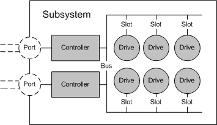

# Subsystem Object

\[Beginning with Windows 8 and Windows Server 2012, the [Virtual Disk Service](virtual-disk-service-portal.md) COM interface is superseded by the [Windows Storage Management API](/previous-versions/windows/desktop/stormgmt/windows-storage-management-api-portal).\]

A subsystem object models a storage subsystem. A subsystem is either a RAID enclosure or a PCI RAID card. A single host computer can be connected to any number of subsystems. Each subsystem is managed by exactly one hardware provider. In a SAN configuration, the subsystem class represents a SAN storage enclosure.

A subsystem can contain any number of controllers and drives, and can surface (unmask) any number of LUNs to the computer on which the hardware provider is running. Higher-end subsystems can unmask LUNs to other computers on the network. Each disk drive within a subsystem is connected to a bus and occupies a slot in the bus. Each controller within a subsystem has one or more controller ports.

The illustration that follows shows the physical devices contained in a subsystem (LUNs are not shown) and the relationships among them.

VDS applications use the [**IVdsHwProvider::QuerySubSystems**](/windows/desktop/api/Vds/nf-vds-ivdshwprovider-querysubsystems) method to query the subsystems that belong to a specific hardware provider. Callers can get a pointer to a specific subsystem by selecting the desired subsystem object from the enumeration that is returned by the **QuerySubSystems** method. With a subsystem object, you can set the subsystem status, create LUNs, replace drives, and query for controllers, drives, and LUNs.

In addition to an object identifier, a name, and a serial number, subsystem object properties include the subsystem status, health, and flags; a count of the controllers, slots, and buses; and a rebuild priority setting.

The following table lists related interfaces, enumerations, and structures.

| Type                                                                                      | Element                                                                                                                          |
|-------------------------------------------------------------------------------------------|----------------------------------------------------------------------------------------------------------------------------------|
| Interfaces that are always exposed by this object                                         | [**IVdsSubSystem**](/windows/desktop/api/Vds/nn-vds-ivdssubsystem).                                                                                          |
| Interfaces that are always exposed by this object in VDS 1.1 and 2.0 iSCSI providers only | [**IVdsSubSystemIscsi**](/windows/desktop/api/Vds/nn-vds-ivdssubsystemiscsi) and [**IVdsSubSystemImportTarget**](/windows/desktop/api/Vds/nn-vds-ivdssubsystemimporttarget).             |
| Interfaces that may be exposed by this object                                             | [**IVdsSubSystemNaming**](/windows/desktop/api/Vds/nn-vds-ivdssubsystemnaming) and [**IVdsMaintenance**](/windows/desktop/api/Vds/nn-vds-ivdsmaintenance).                               |
| Associated enumerations                                                                   | [**VDS\_SUB\_SYSTEM\_FLAG**](/windows/desktop/api/Vds/ne-vds-vds_sub_system_flag) and [**VDS\_SUB\_SYSTEM\_STATUS**](/windows/desktop/api/Vds/ne-vds-vds_sub_system_status).             |
| Associated structures                                                                     | [**VDS\_SUB\_SYSTEM\_PROP**](/windows/desktop/api/Vds/ns-vds-vds_sub_system_prop) and [**VDS\_SUB\_SYSTEM\_NOTIFICATION**](/windows/desktop/api/Vds/ns-vds-vds_sub_system_notification). |

 

## Related topics

<dl> <dt>

[Hardware Provider Objects](hardware-provider-objects.md)
</dt> <dt>

[**IVdsHwProvider::QuerySubSystems**](/windows/desktop/api/Vds/nf-vds-ivdshwprovider-querysubsystems)
</dt> </dl>

 

 
