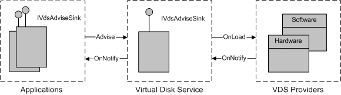

# VDS Notifications

\[Beginning with Windows 8 and Windows Server 2012, the [Virtual Disk Service](virtual-disk-service-portal.md) COM interface is superseded by the [Windows Storage Management API](/windows-hardware/drivers/storage/windows-storage-management-api-portal).\]

A provider can send an event notification to VDS, and VDS can in turn forward the notification to applications. The notification model that is used by VDS resembles the connection-point model that is used by COM objects.

VDS generates service notifications for events such as a drive letter assignment or the arrival of an unallocated disk. Once VDS allocates a disk to a provider, the provider is responsible for generating the associated notifications. The illustration that follows shows the interfaces and methods used in the VDS notification model.

To receive notifications, VDS registers its [**IVdsAdviseSink**](/windows/desktop/api/Vds/nn-vds-ivdsadvisesink) interface with the provider object by calling the [**IVdsProviderPrivate::OnLoad**](/windows/desktop/api/VdsHwPrv/nf-vdshwprv-ivdsproviderprivate-onload) method and passing a pointer to the interface. When a notification event occurs, such as the arrival of a new volume or drive, the provider passes the appropriate notification structure to VDS as an [**IVdsAdviseSink::OnNotify**](/windows/desktop/api/Vds/nf-vds-ivdsadvisesink-onnotify) method parameter.

The process is similar between an application and VDS. Specifically, to receive notifications, an application registers its [**IVdsAdviseSink**](/windows/desktop/api/Vds/nn-vds-ivdsadvisesink) interface with VDS by calling the [**IVdsService::Advise**](/windows/desktop/api/Vds/nf-vds-ivdsservice-advise) method and passing a pointer to the interface. When VDS receives a notification from a provider, it passes the appropriate notification structure to registered applications as an [**IVdsAdviseSink::OnNotify**](/windows/desktop/api/Vds/nf-vds-ivdsadvisesink-onnotify) method parameter.

> [!Note]  
> An application that calls [**Advise**](/windows/desktop/api/Vds/nf-vds-ivdsservice-advise) must eventually call the [**IVdsService::Unadvise**](/windows/desktop/api/Vds/nf-vds-ivdsservice-unadvise) method. Ideally, it should call **Unadvise** as soon as it no longer needs to receive notifications.

 

The table that follows lists the provider-generated notifications by object type.

| Object     | Notification                              | Value | Link to event description                                             |
|------------|-------------------------------------------|-------|-----------------------------------------------------------------------|
| Pack       | **VDS\_NF\_PACK\_ARRIVE**                 | 1     | [**VDS\_PACK\_NOTIFICATION**](/windows/desktop/api/Vds/ns-vds-vds_pack_notification)              |
| Pack       | **VDS\_NF\_PACK\_DEPART**                 | 2     | [**VDS\_PACK\_NOTIFICATION**](/windows/desktop/api/Vds/ns-vds-vds_pack_notification)              |
| Pack       | **VDS\_NF\_PACK\_MODIFY**                 | 3     | [**VDS\_PACK\_NOTIFICATION**](/windows/desktop/api/Vds/ns-vds-vds_pack_notification)              |
| Volume     | **VDS\_NF\_VOLUME\_ARRIVE**               | 4     | [**VDS\_VOLUME\_NOTIFICATION**](/windows/desktop/api/Vds/ns-vds-vds_volume_notification)          |
| Volume     | **VDS\_NF\_VOLUME\_DEPART**               | 5     | [**VDS\_VOLUME\_NOTIFICATION**](/windows/desktop/api/Vds/ns-vds-vds_volume_notification)          |
| Volume     | **VDS\_NF\_VOLUME\_MODIFY**               | 6     | [**VDS\_VOLUME\_NOTIFICATION**](/windows/desktop/api/Vds/ns-vds-vds_volume_notification)          |
| Volume     | **VDS\_NF\_VOLUME\_REBUILDING\_PROGRESS** | 7     | [**VDS\_VOLUME\_NOTIFICATION**](/windows/desktop/api/Vds/ns-vds-vds_volume_notification)          |
| Disk       | **VDS\_NF\_DISK\_ARRIVE**                 | 8     | [**VDS\_DISK\_NOTIFICATION**](/windows/desktop/api/Vds/ns-vds-vds_disk_notification)              |
| Disk       | **VDS\_NF\_DISK\_DEPART**                 | 9     | [**VDS\_DISK\_NOTIFICATION**](/windows/desktop/api/Vds/ns-vds-vds_disk_notification)              |
| Disk       | **VDS\_NF\_DISK\_MODIFY**                 | 10    | [**VDS\_DISK\_NOTIFICATION**](/windows/desktop/api/Vds/ns-vds-vds_disk_notification)              |
| Partition  | **VDS\_NF\_PARTITION\_ARRIVE**            | 11    | [**VDS\_PARTITION\_NOTIFICATION**](/windows/desktop/api/Vds/ns-vds-vds_partition_notification)    |
| Partition  | **VDS\_NF\_PARTITION\_DEPART**            | 12    | [**VDS\_PARTITION\_NOTIFICATION**](/windows/desktop/api/Vds/ns-vds-vds_partition_notification)    |
| Partition  | **VDS\_NF\_PARTITION\_MODIFY**            | 13    | [**VDS\_PARTITION\_NOTIFICATION**](/windows/desktop/api/Vds/ns-vds-vds_partition_notification)    |
| Subsystem  | **VDS\_NF\_SUB\_SYSTEM\_ARRIVE**          | 101   | [**VDS\_SUB\_SYSTEM\_NOTIFICATION**](/windows/desktop/api/Vds/ns-vds-vds_sub_system_notification) |
| Subsystem  | **VDS\_NF\_SUB\_SYSTEM\_DEPART**          | 102   | [**VDS\_SUB\_SYSTEM\_NOTIFICATION**](/windows/desktop/api/Vds/ns-vds-vds_sub_system_notification) |
| Subsystem  | **VDS\_NF\_SUB\_SYSTEM\_MODIFY**          | 151   | [**VDS\_SUB\_SYSTEM\_NOTIFICATION**](/windows/desktop/api/Vds/ns-vds-vds_sub_system_notification) |
| Controller | **VDS\_NF\_CONTROLLER\_ARRIVE**           | 103   | [**VDS\_CONTROLLER\_NOTIFICATION**](/windows/desktop/api/Vds/ns-vds-vds_controller_notification)  |
| Controller | **VDS\_NF\_CONTROLLER\_DEPART**           | 104   | [**VDS\_CONTROLLER\_NOTIFICATION**](/windows/desktop/api/Vds/ns-vds-vds_controller_notification)  |
| Controller | **VDS\_NF\_CONTROLLER\_MODIFY**           | 350   | [**VDS\_CONTROLLER\_NOTIFICATION**](/windows/desktop/api/Vds/ns-vds-vds_controller_notification)  |
| Controller | **VDS\_NF\_CONTROLLER\_REMOVED**          | 351   | [**VDS\_CONTROLLER\_NOTIFICATION**](/windows/desktop/api/Vds/ns-vds-vds_controller_notification)  |
| Port       | **VDS\_NF\_PORT\_MODIFY**                 | 352   | [**VDS\_PORT\_NOTIFICATION**](/windows/desktop/api/Vds/ns-vds-vds_port_notification)              |
| Port       | **VDS\_NF\_PORT\_REMOVED**                | 353   | [**VDS\_PORT\_NOTIFICATION**](/windows/desktop/api/Vds/ns-vds-vds_port_notification)              |
| Drive      | **VDS\_NF\_DRIVE\_ARRIVE**                | 105   | [**VDS\_DRIVE\_NOTIFICATION**](/windows/desktop/api/Vds/ns-vds-vds_drive_notification)            |
| Drive      | **VDS\_NF\_DRIVE\_DEPART**                | 106   | [**VDS\_DRIVE\_NOTIFICATION**](/windows/desktop/api/Vds/ns-vds-vds_drive_notification)            |
| Drive      | **VDS\_NF\_DRIVE\_MODIFY**                | 107   | [**VDS\_DRIVE\_NOTIFICATION**](/windows/desktop/api/Vds/ns-vds-vds_drive_notification)            |
| Drive      | **VDS\_NF\_DRIVE\_REMOVED**               | 354   | [**VDS\_DRIVE\_NOTIFICATION**](/windows/desktop/api/Vds/ns-vds-vds_drive_notification)            |
| LUN        | **VDS\_NF\_LUN\_ARRIVE**                  | 108   | [**VDS\_LUN\_NOTIFICATION**](/windows/desktop/api/Vds/ns-vds-vds_lun_notification)                |
| LUN        | **VDS\_NF\_LUN\_DEPART**                  | 109   | [**VDS\_LUN\_NOTIFICATION**](/windows/desktop/api/Vds/ns-vds-vds_lun_notification)                |
| LUN        | **VDS\_NF\_LUN\_MODIFY**                  | 110   | [**VDS\_LUN\_NOTIFICATION**](/windows/desktop/api/Vds/ns-vds-vds_lun_notification)                |

 

VDS generates the remaining notifications. The following table lists service-based notification constants by category.

| Category     | Notification                                | Value | Link to event description                                                 |
|--------------|---------------------------------------------|-------|---------------------------------------------------------------------------|
| Disk         | **VDS\_NF\_DISK\_ARRIVE**                   | 8     | [**VDS\_DISK\_NOTIFICATION**](/windows/desktop/api/Vds/ns-vds-vds_disk_notification)                  |
| Disk         | **VDS\_NF\_DISK\_DEPART**                   | 9     | [**VDS\_DISK\_NOTIFICATION**](/windows/desktop/api/Vds/ns-vds-vds_disk_notification)                  |
| Disk         | **VDS\_NF\_DISK\_MODIFY**                   | 10    | [**VDS\_DISK\_NOTIFICATION**](/windows/desktop/api/Vds/ns-vds-vds_disk_notification)                  |
| Drive letter | **VDS\_NF\_DRIVE\_LETTER\_FREE**            | 201   | [**VDS\_DRIVE\_LETTER\_NOTIFICATION**](/windows/desktop/api/Vds/ns-vds-vds_drive_letter_notification) |
| Drive letter | **VDS\_NF\_DRIVE\_LETTER\_ASSIGN**          | 202   | [**VDS\_DRIVE\_LETTER\_NOTIFICATION**](/windows/desktop/api/Vds/ns-vds-vds_drive_letter_notification) |
| File system  | **VDS\_NF\_FILE\_SYSTEM\_MODIFY**           | 203   | [**VDS\_FILE\_SYSTEM\_NOTIFICATION**](/windows/desktop/api/Vds/ns-vds-vds_file_system_notification)   |
| File system  | **VDS\_NF\_FILE\_SYSTEM\_FORMAT\_PROGRESS** | 204   | [**VDS\_FILE\_SYSTEM\_NOTIFICATION**](/windows/desktop/api/Vds/ns-vds-vds_file_system_notification)   |
| Volume       | **VDS\_NF\_MOUNT\_POINTS\_CHANGE**          | 205   | [**VDS\_MOUNT\_POINT\_NOTIFICATION**](/windows/desktop/api/Vds/ns-vds-vds_mount_point_notification)   |

 

## Related topics

<dl> <dt>

[VDS Object Model](vds-object-model.md)
</dt> <dt>

[**IVdsAdviseSink**](/windows/desktop/api/Vds/nn-vds-ivdsadvisesink)
</dt> <dt>

[**IVdsAdviseSink::OnNotify**](/windows/desktop/api/Vds/nf-vds-ivdsadvisesink-onnotify)
</dt> <dt>

[**IVdsProviderPrivate::OnLoad**](/windows/desktop/api/VdsHwPrv/nf-vdshwprv-ivdsproviderprivate-onload)
</dt> <dt>

[**IVdsService::Advise**](/windows/desktop/api/Vds/nf-vds-ivdsservice-advise)
</dt> </dl>

 

 
