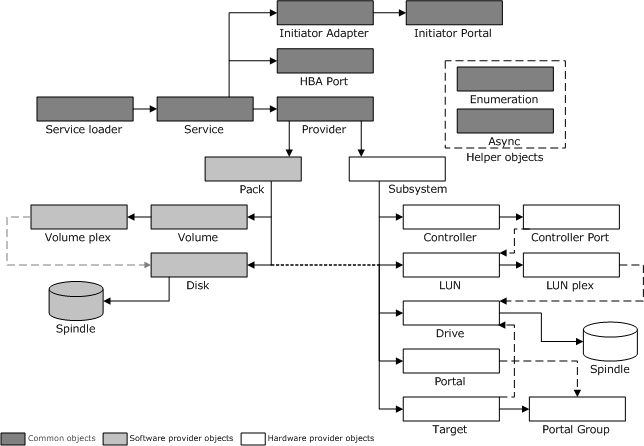

# VDS Object Model

\[Beginning with Windows 8 and Windows Server 2012, the [Virtual Disk Service](virtual-disk-service-portal.md) COM interface is superseded by the [Windows Storage Management API](/windows-hardware/drivers/storage/windows-storage-management-api-portal).\]

VDS provides indirect access to host-based storage devices, such as disks and CD-ROM devices, and to disk arrays that are managed by hardware RAID controllers. While some storage entities model physical devices, others model virtual constructs: volumes, partitions, and so on. The objects that are described in this topic represent both the physical and virtual entities of VDS.

Applications call the methods that are exposed by these objects and VDS calls the appropriate provider to perform the requested storage operations. An application never calls a provider program directly.

### Classification of Objects

As the following illustration shows, software provider programs implement objects that model host-based entities; hardware provider programs implement objects that model internal and external hardware RAID devices; the remaining common objects are either provider-independent, or are implemented by VDS. A spindle, which is not a VDS object, is a term for generic storage media that comprises of disk or drive extents.

To learn more about the behavior of each object, select from the following topics:

-   Service loader and service objects, see [Startup and Service Objects](startup-and-service-objects.md).
-   Enumeration and async objects, see [Helper Objects](helper-objects.md).
-   Provider object, see [Provider Object](provider-object.md).
-   Pack, disk, volume, and volume plex objects, see [Software Provider Objects](software-provider-objects.md).
-   Subsystem, controller, drive, LUN, and LUN plex objects, see [Hardware Provider Objects](hardware-provider-objects.md).

### Object Creation

The configuration and query operations that are associated with object creation can take considerable time to complete; as such, VDS invokes all methods asynchronously. The discovering provider returns all completion, error, or state change events. Software providers also log all the errors and significant state changes.

### Object Deletion

Several VDS methods delete or transform VDS objects. A caller can hold a reference, by way of an interface pointer, to a deleted object after the method returns. When the caller releases the interface, VDS deletes the object.

With regard to object deletion, callers should refrain from invoking anything except the [**IUnknown::Release**](/windows/win32/api/unknwn/nf-unknwn-iunknown-release) method on these interfaces. The provider must be robust enough to deal with errant callers; if a caller invokes a method on a deleted object, the provider should return **VDS\_E\_OBJECT\_DELETED**.

### Service Initialization

VDS supplies a class identifier (Clsid) for the service loader and the service objects, but only the service loader Clsid is public. Service initialization occurs when the providers, a calling application, and the service perform the following tasks:

-   Each new provider invokes the [**IVdsAdmin::RegisterProvider**](/windows/desktop/api/VdsHwPrv/nf-vdshwprv-ivdsadmin-registerprovider) method during installation to register with VDS. The call creates a registry key under the SYSTEM hive, identified by the object GUID of the provider. Contained under this key is the Clsid of the provider object, the name, version, and the version GUID of the provider.
    > [!Note]  
    > Provider object GUIDs are persistent; software and hardware object GUIDs are not.

     

-   An application calls the [**CoCreateInstance**](/windows/win32/api/combaseapi/nf-combaseapi-cocreateinstance) function, passing the service loader Clsid as an argument. With a pointer to the service loader object, the application can start VDS either locally or remotely by passing the desired computer name as a parameter to the [**IVdsServiceLoader::LoadService**](/windows/desktop/api/Vds/nf-vds-ivdsserviceloader-loadservice) method.
-   When the initial application attaches to the service, VDS first calls [**CoCreateInstance**](/windows/win32/api/combaseapi/nf-combaseapi-cocreateinstance) on each Clsid found under the registry key, and then calls the [**IVdsProviderPrivate::OnLoad**](/windows/desktop/api/VdsHwPrv/nf-vdshwprv-ivdsproviderprivate-onload) method on each provider to initialize the programs.

## Related topics

<dl> <dt>

[About VDS](about-vds.md)
</dt> <dt>

[**IVdsAdmin::RegisterProvider**](/windows/desktop/api/VdsHwPrv/nf-vdshwprv-ivdsadmin-registerprovider)
</dt> <dt>

[**IVdsServiceLoader::LoadService**](/windows/desktop/api/Vds/nf-vds-ivdsserviceloader-loadservice)
</dt> <dt>

[**IVdsProviderPrivate::OnLoad**](/windows/desktop/api/VdsHwPrv/nf-vdshwprv-ivdsproviderprivate-onload)
</dt> </dl>

 

 
