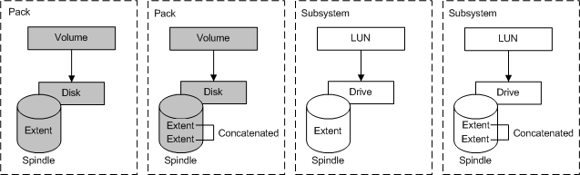
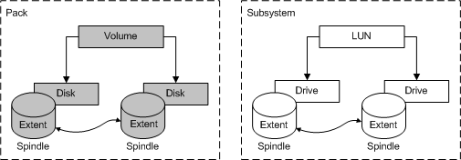
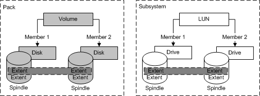
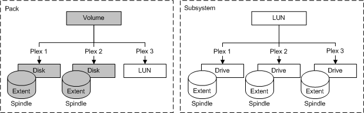
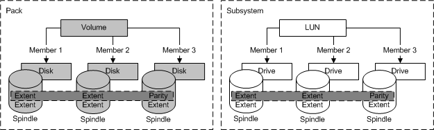

# Volume and LUN Binding

\[Beginning with Windows 8 and Windows Server 2012, the [Virtual Disk Service](virtual-disk-service-portal.md) COM interface is superseded by the [Windows Storage Management API](/windows-hardware/drivers/storage/windows-storage-management-api-portal).\]

Binding is the creation of volumes or LUNs. Volumes consist of disk extents and LUNs consist of drive extents. Binding selects for a set of mappings to physical resources and occurs within a subsystem, within a pack, or both. All provider programs support partially directed binding a model in which the caller specifies only those binding attributes of particular interest, and allows the provider to choose the rest. The operations in VDS for binding volumes and LUNs are similar but not identical. For example, hardware providers can offer additional binding options.

VDS supports the following five volume and LUN binding types for partially directed configurations. (Hardware providers can and do support many other bindings.)

| Term                                                                                                                                             | Description                                                                                    |
|--------------------------------------------------------------------------------------------------------------------------------------------------|------------------------------------------------------------------------------------------------|
| Simple                                                      | Linear mapping with one and only one contiguous extent.                              |
| Spanned                                                  | Linear mapping with multiple noncontiguous extents across multiple disks or drives.  |
| Striped                                                  | Mapping that interleaves contiguous volume extents across multiple disks or drives.  |
| Mirrored                                              | Mapping that maintains two or more identical data copies.                            |
| Striped with parity  | Mapping that distributes parity check information across multiple disks or drives.   |

 

VDS constructs mirrored, striped, and striped with parity bindings from more than one member. For example, a two-way mirror has two members. Each member can occupy extents on more than one disk or drive. VDS concatenates the extents to form the member and then binds the volume or LUN on the members. A provider can support all binding types, or any subset. In the VDS object model, each member of a mirror is an independent object called a plex.

Again, volume and LUN types are similar, but not exact. For a description of volume types, see the [Volume Object](volume-object.md); for LUN types, see the [LUN Object](lun-object.md). Binding types are either non-fault tolerant or fault tolerant.

### Non-Fault Tolerant Binding

Non-fault tolerant volumes and LUNs do not offer disaster recovery. If one of the spindles that contributes to a non-fault tolerant volume or LUN fails, the entire volume or LUN fails. In exchange for the risk to data, non-fault tolerant volumes and LUNs offer input/output performance that is generally superior to that of fault tolerant volumes and LUNs. VDS supports the following three non-fault tolerant types: simple, spanned, and striped.

Simple

Spanned

Striped

### Fault Tolerant Binding

The following fault tolerant volumes and LUNs offer disaster recovery. If one of the spindles that contributes to a fault tolerant volume or LUN fails, the data can be recovered. In exchange for data security, the input/output performance of fault tolerant volumes and LUNs is generally inferior to that of non-fault tolerant volumes and LUNs. VDS supports two fault tolerant types: mirrored and striped with parity.

Mirrored (three-way mirror)

Striped with parity

## Related topics

<dl> <dt>

[Configuration Overview](configuration.md)
</dt> <dt>

[Volume Object](volume-object.md)
</dt> <dt>

[LUN Object](lun-object.md)
</dt> </dl>

 

