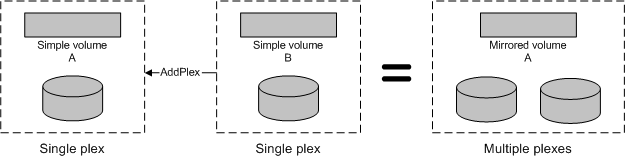

# Volume Plex Object

\[Beginning with Windows 8 and Windows Server 2012, the [Virtual Disk Service](virtual-disk-service-portal.md) COM interface is superseded by the [Windows Storage Management API](/previous-versions/windows/desktop/stormgmt/windows-storage-management-api-portal).\]

A volume plex object models a volume plex that is contained by a volume. Only a mirrored volume can have multiple plexes; all other volume types have one plex. Each plex contains a copy of the data on the volume. VDS supports four volume plex types: simple, spanned, striped, and striped with parity. For a description of each of these volume types, see the [Volume Object](volume-object.md).

There are two ways to create a volume with multiple plexes. You can use the [**IVdsPack::CreateVolume**](/windows/desktop/api/Vds/nf-vds-ivdspack-createvolume) method to create the mirrored volume directly, or use the [**IVdsVolume::AddPlex**](/windows/desktop/api/Vds/nf-vds-ivdsvolume-addplex) method to add one volume to another volume. The volumes (and the underlying disks) must be in the same pack. The following illustration shows an example of adding one volume (B) as a plex to another volume (A), and the resulting multiplexed volume (A). The data on volume A remains intact, while the data on volume B becomes a mirrored copy of the data on volume A.

You can query for volume plexes by invoking the [**IVdsVolume::QueryPlexes**](/windows/desktop/api/Vds/nf-vds-ivdsvolume-queryplexes) method. You can get a pointer to a specific volume plex by selecting the desired plex object from the enumeration that is returned by **QueryPlexes**. With the exception of the last plex, existing plexes can be broken or removed. Use the [**IVdsVolume::BreakPlex**](/windows/desktop/api/Vds/nf-vds-ivdsvolume-breakplex) to split a plex from a volume and convert the broken plex object into a volume object. Use the [**IVdsVolume::RemovePlex**](/windows/desktop/api/Vds/nf-vds-ivdsvolume-removeplex) to delete the plex altogether. You can attempt to repair a fault-tolerant plex by calling the [**IVdsVolumePlex::Repair**](/windows/desktop/api/Vds/nf-vds-ivdsvolumeplex-repair) method, which moves bad members to good disks.

In addition to an object identifier and plex type, volume plex object properties include the status, health, and transition state of the plex. This object has no flags.

The following table lists related interfaces, enumerations, and structures.

| Type                                              | Element                                                                                                                                                                            |
|---------------------------------------------------|------------------------------------------------------------------------------------------------------------------------------------------------------------------------------------|
| Interfaces that are always exposed by this object | [**IVdsVolumePlex**](/windows/desktop/api/Vds/nn-vds-ivdsvolumeplex).                                                                                                                                          |
| Associated enumerations                           | [**VDS\_VOLUME\_PLEX\_STATUS**](/windows/desktop/api/Vds/ne-vds-vds_volume_plex_status), [**VDS\_VOLUME\_PLEX\_TYPE**](/windows/desktop/api/Vds/ne-vds-vds_volume_plex_type), and [**VDS\_DISK\_EXTENT\_TYPE**](/windows/desktop/api/Vds/ne-vds-vds_disk_extent_type). |
| Associated structures                             | [**VDS\_VOLUME\_PLEX\_PROP**](/windows/desktop/api/Vds/ns-vds-vds_volume_plex_prop).                                                                                                                           |

 

## Related topics

<dl> <dt>

[Software Provider Objects](software-provider-objects.md)
</dt> <dt>

[Volume Object](volume-object.md)
</dt> </dl>

 

 
