# Basic VML Types

This topic describes VML, a feature that is deprecated as of Windows Internet Explorer 9. Webpages and applications that rely on VML should be migrated to SVG or other widely supported standards.

> [!Note]  
> As of December 2011, this topic has been archived. As a result, it is no longer actively maintained. For more information, see [Archived Content](/previous-versions/windows/internet-explorer/ie-developer/). For information, recommendations, and guidance regarding the current version of Windows Internet Explorer, see [Internet Explorer Developer Center](https://msdn.microsoft.com/ie/).

 

**Contents**

-   [Introduction](#introduction)
-   [boolean](#boolean)
-   [fraction](#fraction)
-   [ordinate](#ordinate)
-   [length](#length)
    -   [Alternative representations](#alternative-representations)
-   [measure](#measure)
    -   [Alternative representations](#alternative-representations)
-   [angle](#angle)
    -   [Alternative representations](#alternative-representations)
-   [color](#color)
    -   [Color units](#color-units)
    -   [HTML colors](#html-colors)
    -   [Scheme colors](#scheme-colors)
    -   [System colors](#system-colors)
    -   [Pure colors](#pure-colors)
    -   [Color adjustments](#color-adjustments)
-   [font](#font)
-   [bitmap](#bitmap)
    -   [Picture file formats](#picture-file-formats)
-   [vector](#vector)

## Introduction

This proposal uses a small number of basic types, listed in the table below.


| Type                  | Element           | Fundamental Representation | Description                                                                                          |
|-----------------------|-------------------|----------------------------|------------------------------------------------------------------------------------------------------|
| [boolean](#boolean)   |                   | 1 bit                      | A boolean value: true or false.                                                                      |
| [fraction](#fraction) |                   | number 2 6                 | A numeric value, scaled by 2 6 (65536) and stored as a signed integer.                               |
| [ordinate](#ordinate) |                   | 30-bit integer plus sign   | Part of a coordinate (e.g., in a path ), the values defined by coord.                                |
| [length](#length)     |                   | [EMU](#length)             | A physical length, such as the width of a line or the size of a font.                                |
| [measure](#measure)   |                   | EMU or number 2 6          | Either a physical length, including a number of device pixels, or a fraction of some other quantity. |
| [angle](#angle)       |                   | degrees 2 6                | An angle; positive is clockwise.                                                                     |
| [color](#color)       | [c](#color)       | complex                    | An element that allows a color to be derived.                                                        |
| [font](#font)         | [font](#font)     | complex                    | A description of a font.                                                                             |
| [bitmap](#bitmap)     | [bitmap](#bitmap) | href                       | A reference to an external picture file.                                                             |
| [vector](#vector)     | [v](#vector)      | complex                    | A description of a vector path                                                                       |


 

The "fundamental representation" is the highest precision representation that the proposal requires a conforming implementation to maintain; data will be lost if the implementation is not able to represent the data to the precision required. The color, font, and vector types correspond to elements which themselves have structure -- in a sense, they are not basic types; however, it is convenient to treat them as such within this proposal.

Each non-complex basic type has an associated element of the same name. These element names are reserved and may not be used for any other purpose within extensions, even if the use is within an onview="skip" extension element. Because of this, it is possible for an implementation that encounters unknown XML to provide efficient internal storage of the unknown XML as long as the values are enclosed in the "type" elements.


```HTML
<new:tag>1.578</new:tag>
<new:tag><v:fraction>1.578</v:fraction></new:tag>
```


In the first example above, the string "1.578" must be stored as a sequence of characters (the implementation does not know whether it is a string or a number); in the second example, the fraction element indicates that the content is a number, thus it may be converted to the high precision fraction representation.

Complex types (including bitmap) have associated element names that are used to delimit the value. This simplifies parsing by ensuring that the more complex parsing tasks are associated with unique element tags.

[ Back to top](#top)

## boolean


```HTML
boolean
<!entity % boolean "#pcdata" -- or nmtoken in an attribute -- >
```


A boolean value is represented as a keyword indicating the state of the flag. The following keywords are defined.


| Value for true | Value for false |
|----------------|-----------------|
| true           | false           |
| yes            | no              |
| on             | off             |
| t              | f               |
| 1              | 0               |


 

An implementation may write any value and must recognize all values. An implementation is free to change values from one representation to another.

[ Back to top](#top)

## fraction


```HTML
fraction
<!entity % fraction "#pcdata" -- or nmtoken in an attribute -- >
```


All numeric values (i.e., values of dimensionless quantities) within this proposal can be stored as integers by scaling them by 2  6 (65536). A number may be given either in this form, with the suffix f or as a decimal number with no suffix. Thus, the following hypothetical elements represent the same value.


```HTML
<fillwidth>0.25</fillwidth>
<fillwidth>16384f</fillwidth>
```


A quantity with the f suffix must be a whole number; fractional numbers are not permitted. The resultant integer must be representable as a 32-bit 2's complement signed number; thus, the effective range of the representation is  32768 (in fact, less than 32768 and greater than or equal to -32768.)

A conforming implementation is required to preserve values that are expressed as f values. Values represented as decimal numbers may be converted to an f value and stored that way. An application is permitted to record internally generated values in any appropriate unit; however, a value read in from an existing document must either be maintained to the full original precision or must be converted into an f value.

If the implementation is unable to do this, it must warn the user that data may be lost. (It is acceptable to issue such a warning once when externally generated data is first encountered.)

When a decimal value is converted into f format, the implementation may use any arithmetic rounding mode; however, a whole number must be converted to the f format exactly. It is recommended that implementations convert by rounding to minus infinity and that the convertion always be exact.

[ Back to top](#top)

## ordinate


```HTML
ordinate
<!entity % ordinate "#pcdata" -- or nmtoken in an attribute -- >
```


The units of the coordinate system established by coord are of some nominal type, which is referred to as ordinate. This is a measure of length, but it is only used in relation to the rectangle that coord establishes. Any value of type ordinate will be scaled by the *w* and *h* values of the coord and the resulting ratio used to establish a real measurement on the output device.

A conforming implementation must be able to handle ordinate values of up to 30 bits plus sign (i.e., a 31-bit signed integer, not a 32-bit signed integer). It is recommended, however, that implementations attempt to produce coordinates for path and similar elements that have about 16 bits of precision. This will minimize the chance of either underflow or overflow in a non-conforming implementation.

ordinate values are always integral. A decimal point may not appear in a value of type ordinate. No unit specifiers may be appended to values of type ordinate.

[ Back to top](#top)

## length


```HTML
length
<!entity % length "#pcdata" -- or nmtoken in an attribute -- >
```


A length is a real-world measurement or, sometimes, a measurement in device pixels. It is recommended that implementations avoid the use of device pixels (px).

All the standard [CSS1](https://www.w3.org/pub/WWW/TR/REC-CSS1) unit qualifiers are permitted on a length. In addition, the qualifier emu may be used. This qualifier refers to a unit -- the EMU (English Metric Unit) -- which is a common denominator of the measurement quantities in widespread use in computer graphics. The EMU is <sup>inch</sup> / 914400, i.e., there are 914400 EMU per inch. The following table lists the number of EMUs in a small number of commonly encountered units.


| Number of EMUs | Number per Inch | Number per Millimeter | Description             |
|----------------|-----------------|-----------------------|-------------------------|
| 360            |                 | 0.01                  | Win32 HIMETRIC          |
| 12700          | 72              |                       | "point"                 |
| 635            | 1440            |                       | Win32 TWIP              |
| 762            | 1200            |                       | High-resolution printer |


 

Fractional numbers of EMUs are not permitted. Any measurement must be representable as a 32-bit signed integral number of EMUs -- this limits the magnitude of a measurement to 2348 inches -- about 59 meters or 65 yards. Because the measurements always refer to the size of a rendering on a nominally screen- or page-sized output device, they will always be within this range.

Notice, however, that the representation is inappropriate for real-world measurements and that where these are recorded (for example, to record the real-world size of a path) some other representation must be used.

A conforming implementation is required to preserve values that are exact numbers of EMUs. Values represented in any other way may be converted to an EMU value and stored that way. An application is permitted to record internally generated values in any appropriate unit; however, a value read in from an existing document must either be maintained to the full original precision or must be converted into an EMU value.

If the implementation is unable to do this, it must warn the user that data may be lost. (It is acceptable to issue such a warning once when externally generated data is first encountered.)

In practice, physical lengths are used for relatively few measurements in this proposal. The data which is normally most important is the path data and this is encoded in the coordinate system defined, on a per-shape basis, by coord.

### Alternative representations

The standard length representations of HTML are defined by [CSS1](https://www.w3.org/pub/WWW/TR/REC-CSS1#length-units) . Relative units, with the exception of the pixel, are not meaningful in the context within which lengths are used in this proposal and must not be used. If the document records the intended (target) pixel size, this defines the translation of pixels into EMU; otherwise, the default of 90 dpi defined by [CSS1](https://www.w3.org/pub/WWW/TR/REC-CSS1#length-units) should be used.

With the exception of emu, any value may be given as a decimal fraction. When a decimal value is converted to EMU, the implementation may use any arithmetic rounding mode. (The only way for an authoring application to guarantee a particular result is to specify it in emu.)

If no unit specifier is given in a length value, the implementation must assume emu.

[ Back to top](#top)

## measure


```HTML
measure
<!entity % measure "#pcdata" -- or nmtoken in an attribute -- >
```


A measure is a quantity that may be either a [length](#length) or a [fraction](#fraction). This closely resembles the HTML and CSS length measurements, which can, in many cases, either be physical measurements or percentages of some other quantity. If no unit specifier is given, the value must be assumed to be a decimal fraction (thus, this behavior is inherited from fraction, not from length.)

Unlike length, a pixel value has a context-defined meaning, so conversion to emu is normally inappropriate. There are three possible fundamental representations that the implementation must maintain (i.e., one representation cannot be converted into another without loss of information).

1.  A fractional value should be maintained in the [fraction](#fraction) format (an " f " value).
2.  A physical length should be maintained in EMU.
3.  A pixel value should be maintained as a whole number of pixels.

Fractional numbers of pixels are not permitted.

### Alternative representations

All the alternate representations of both [fraction](#fraction) and [length](#length) are permitted.

[ Back to top](#top)

## angle


```HTML
angle
<!entity % angle "#pcdata" -- or nmtoken in an attribute -- >
```


The fundamental representation of an angle is a number of degrees multipled by 2 6 (65536) and stored as an integer. Because the coordinate space is inverted (positive y axis is down), a clockwise angle is positive. A conforming implementation is required to preserve the full precision of such a value.

An implementation is permitted to use any range for angles and is permitted to normalise an angle (for example to -180  to +180  or 0 to 360 ). Implementations are not required to be consistent; however, the integral representation of an angle must not exceed the range of a 32-bit signed integer.

The suffix fd is used to identify this representation of an angle (fractional degree). Notice that this is distinguished from the f suffix for a dimensionless fraction although identical arithmetic can be used to support it. The default for an angular value is simple degrees, i.e., an unscaled value. This may also be signalled with the suffix " " (the degree symbol); however, use of this depends on having a suitable document encoding -- consequently, the suffix deg is also defined to mean degrees. The full set of possible suffices are as follows.


| Suffix       | Conversion Factor | Comments                               |
|--------------|-------------------|----------------------------------------|
| fd           | 1                 | High-precision internal representation |
| none, deg,   | 65536             | Degrees                                |
| rad          | 65536pi/180       | Radians                                |


 

### Alternative representations

The scaling transformation has discontinuities at odd multiples of 45 . It is, therefore, extremely important for the conversion of any inexact quantity to be well defined. For this reason, the arithmetic of conversion is defined to round towards minus infinity.

Because this may be difficult or impossible to guarantee in some implementations, the use of the following is defined to be a level 3 feature:

1.  Any fractional degree value.
2.  Any radian value

Thus, values qualified fd and unqualified integral values, or integral values qualified deg or   must be handled exactly by a conforming level 0 implementation; other values need not. It is strongly recommended that any implementation handle the conversion from a fractional degree value to a scaled (fd) degree value exactly. This can be done without floating point support.

The more exacting requirements for conversion distinguish fd from f.

[ Back to top](#top)

## color


```HTML
c
<!element c  %color;>
```


Colors are an essential part of modern computer graphics. The proposal uses the established methods of specifying fixed colors. However, colors in diagrams are rarely simple static colors; they are often derived from other elements in the diagram. Much of this information is very application-specific, so this proposal provides two very basic mechanisms to specify such behavior:

1.  A color may be derived from another color in the same shape.
2.  A small number of arithmetic operations are defined for deriving, or modifying, a color.

The prototype shape mechanism supplements this by allow prototypes to be defined from which colors can be inherited.


```HTML
color
<!entity % color "( %color-unit; | pure | %color.adjustment; )*">
```


A color value is a superset of the [CSS1 color definition](https://www.w3.org/pub/WWW/TR/REC-CSS1#color-units) . The extensions allow the RGB color value to be determined from other colors within the shape or from an overall color scheme defined using CSS1.

If the value of an element is defined to be a color, the *content* of an element defines the color value by means of a single color token optionally modified by an arithmetic operation on the corresponding RGB color.

[ Back to top](#top)

### Color units

The full set of color tokens come from a variety of sources: HTML, CSS1, and this proposal. They are defined as follows using notation from [CSS1](https://www.w3.org/pub/WWW/TR/REC-CSS1) or the XPointer notation defined for XML linking.

In the XPointer definitions, the location source is the element containing the color value, and the expression refers to the whole element set of the shape as though any base prototype elements had been merged with the shape. When the corresponding element does not exist, the default value for that element is used in its place.


| Color            | Definition                                                                                                  | Level | Description                                                                                                                                                               |
|------------------|-------------------------------------------------------------------------------------------------------------|-------|---------------------------------------------------------------------------------------------------------------------------------------------------------------------------|
| name             | See below                                                                                                   | 0     | HTML color name, as listed in the table below.                                                                                                                            |
| \#rr'gg'bb'      | \#rr'gg'bb'                                                                                                 | 0     | Standard CSS1/sRGB color representation using values in the range 0..255 represented using 2 hexadecimal digits each.                                                     |
| \#rgb            | \#rrggbb                                                                                                    | 1     | Shortened CSS1 form with only three hexadecimal digits.                                                                                                                   |
| rgb(r,g,b)       | \#(r)(g)(b)                                                                                                 | 1     | CSS1 rgb form; the elements of the rgb value are converted as defined in [CSS1](https://www.w3.org/pub/WWW/TR/REC-CSS1#color-units) .                                      |
| fill             | ancestor(1,shape)<br/> child(1, fill)<br/> child(1, color)<br/>                           | 1     | The foreground fill color of the shape.                                                                                                                                   |
| fillBack         | ancestor(1,shape)<br/> child(1, fill)<br/> child(1, back)<br/> child(1, color)<br/> | 1     | The background color of the shape fill.                                                                                                                                   |
| line             | ancestor(1,shape)<br/> child(1, line)<br/> child(1, color)<br/>                           | 1     | The foreground line color of the shape.                                                                                                                                   |
| lineBack         | ancestor(1,shape)<br/> child(1, line)<br/> child(1,back) <br/> child(1, color)<br/> | 1     | The background line color of the shape.                                                                                                                                   |
| lineOrFill       | line, fill                                                                                                  | 1     | The line value if not defaulted, otherwise the fill value. This effectively returns the color that is at the edge of the shape.                                           |
| fillThenLine     | fill, line                                                                                                  | 1     | The fill value if not defaulted, otherwise the line value. This effectively returns the main shape color (if the shape is unfilled, the result will be the line color).   |
| shadow           | ancestor(1,shape)<br/> child(1, shadow)<br/> child(1, color)<br/>                         | 2     | The color of the shadow (this is a level 2 feature).                                                                                                                      |
| scheme           | See below                                                                                                   | 1     | A scheme color from the scheme defined for the document; see below.                                                                                                       |
| scheme(*index*)  | See below                                                                                                   | 1     | Scheme color *index*, starting from 0; see below.                                                                                                                         |
| this             | Implied                                                                                                     | 2     | The operation (filling a path, or drawing it) is defined in some other way (for example, as a bitmap), and the color specifies a "modification" to the colors so implied. |
| palette(*index*) | Implied                                                                                                     | 3     | Behaves in the same way as this, except that exactly one entry in a bitmap color table is identified. Permitted only where explicitly stated.                             |
| none             | \-                                                                                                          | 2     | Indicates the absence of a color; may be used to cancel a drawing operation that uses the color.                                                                          |
| system           | See below                                                                                                   | 3     | A color defined by the system user interface.                                                                                                                             |


 

The this color allows a color value to specify a modification to a color which is derived in some other way; in particular, a single operation may be specified for all the colors in a bitmap. The palette(*index*) color identifies a particular entry in a palette-mapped bitmap. Use of this is only defined for recording a color table entry that should be regarded as transparent in such a bitmap.

The definition of a color value must not refer to itself, either directly or indirectly. If such a definition is encountered, it is recommended, but not required, that the implementation treat the undefined value as black.

[ Back to top](#top)

### HTML colors

[HTML](https://www.w3.org/TR/wd-html40-970708/types.mdl#type-color) defines the following sixteen color names:


Color names and sRGB values


Black = "\#000000"

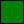

Green = "\#008000"


Silver = "\#C0C0C0"

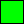

Lime = "\#00FF00"


Gray = "\#808080"

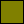

Olive = "\#808000"


White = "\#FFFFFF"

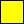

Yellow = "\#FFFF00"

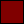

Maroon = "\#800000"

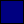

Navy = "\#000080"

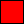

Red = "\#FF0000"

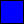

Blue = "\#0000FF"

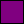

Purple = "\#800080"


Teal = "\#008080"

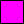

Fuchsia = "\#FF00FF"

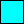

Aqua = "\#00FFFF"


 

[ Back to top](#top)

### Scheme colors

The scheme colors referenced by scheme are defined at the document level using the meta tag with a name attribute of "Theme Color Scheme".


```HTML
<meta name="Theme Color Scheme"
  content="rrggbb, rrggbb, rrggbb, rrggbb, rrggbb, rrggbb, rrggbb, rrggbb">
```


This tag allows up to eight scheme colors to be defined. Undefined colors should default to black. The scheme colors allow the color scheme used for a complete document to be changed just by altering the Theme Color Scheme contents. To ensure that graphics imported from different authoring applications make consistent use of the scheme colors, the following interpretations are defined. The "usage" is a short description of the purpose, and the "description" column provides additional details.


| Index | Name              | Usage                         | Description                                                                                                              |
|-------|-------------------|-------------------------------|--------------------------------------------------------------------------------------------------------------------------|
| 0     | scheme.background | Background                    | The color used for the background of a graphic (and, frequently, for the whole page).                                    |
| 1     | scheme.text       | Text and lines                | The color for text attached to a shape and the standard line color.                                                      |
| 2     | scheme.shadow     | Shadows                       | Standard shadow color -- the color typically used for shape shadows.                                                     |
| 3     | scheme.title      | Title text                    | The color to use for heading or title text.                                                                              |
| 4     | scheme.fill       | Fills                         | Standard fill color -- the color typically used to fill shapes.                                                          |
| 5     | scheme.accent     | Accent                        | Normal "highlight" color used to emphasis an important element of a graphic.                                             |
| 6     | scheme.hyperlink  | Accent and hyperlink          | Highlight color used for hyperlinks. May be used for other purposes where the color denotes a link to other information. |
| 7     | scheme.followed   | Accent and followed hyperlink | Highlight color for followed hyperlinks; also appropriate for "backwards" links.                                         |


 

A scheme color may be referred to either by name or by index, thus scheme.fill and scheme(4) are the same color.

Scheme colors do not participate in the defaulting scheme if a color is not specified. An unspecified fill color must always be interpreted as white, regardless of the color of scheme color 4. The "accent" colors should contrast with both the background (0) and the fill (4) colors, and text and title text colors should have the same property. One standard technique is to make the accents colored and the standard text uncolored (typically black or white).

[ Back to top](#top)

### System colors

Applications sometimes record colors based on operating system settings within graphics. Normally these are transient and need not be written out; thesystemcolor definitions exist solely to support this. A system color is introduced by defining an appropriate tag in a new namespace and inserting the appropriate information in the element content.

This proposal defines such a tag to encode the Windows user interface colors defined in the winuser.h header file.


```HTML
win.color
<!element win.color #pcdata>
```


The content of the element is a single integer which contains the value of the relevant COLOR\_ define from winuser.h. A similar technique can be adopted for any system- or application-specific color specification. It is strongly recommended that this feature be used only for backward compatibility.

[ Back to top](#top)

### Pure colors


```HTML
pure
<!elementpure empty>
```


If the element &lt;pure/&gt; appears in a color value, it is a hint that the color should not be approximated by a dither pattern. This is a level 1 feature, and a conforming implementation need not honor it. The designation is important for graphics displayed on medium-resolution devices, such as video displays, where small features (such as lines) may cause bad aliasing with dithered colors. On devices such as printers, which normally dither all colors except for the few fully saturated colors, the dithering is normally sufficiently fine to avoid this problem.

[ Back to top](#top)

### Color adjustments

The base color may be adjusted by arithmetic operations on the RGB value. These operations are defined using additional elements within the color value. Such adjustments are useful only when applied to colors derived from other elements. It is valid to specify such an adjustment on a fixed color value; however, an implementation is permitted to reduce this to the corresponding RGB value and store that instead of the original.

All the color adjustment features described in this section are level 1 features.


```HTML
color.adjustment
<!entity % color.adjustment  -- change to make to a color --
  "( %color.op; )?, ( %color.adj; )*"
>

color.op
<!entity % color.op          -- arithmetic operation --
  "( darken | lighten | add | subtract | reverseSubtract |
  blackWhite )"
>
<!element   darken           %color.parameter;>
<!element   lighten          %color.parameter;>
<!element   add              %color.parameter;>
<!element   subtract         %color.parameter;>
<!element   reversesubtract  %color.parameter;>
<!element   blackwhite       %color.parameter;>

color.parameter
<!entity % color.parameter  "#pcdata" >

color.adj
<!entity % color.adj          -- additional adjustment to color --
  "invert | invert128 | gray"
>
<!element   invert       empty>
<!element   INVERT128    empty>
<!element   gray         empty>
```


The parameter of the first six operations is a single integral numeric value in the range 0 to 255. The adjustment is performed on the 3x8bit RGB value as follows:

1.  If &lt;gray/&gt; is specified, the RGB value is replaced by yyy, where y is the luminance (y') value calculated from the sRGB value in following the ITU-r BT.709. This calculation is:
    ```HTML
    y = 0 2125xr + 0 7154xg + 0 0721xb
    ```

    

2.  If a color.op modification is given, each component is separately adjusted according to the table below. c is the component value, and p is the color.parameter value.

    | Operation       | Formula                            |
    |-----------------|------------------------------------|
    | darken          | c := cxp/255                       |
    | lighten         | c := 255 - (255-c)xp/255           |
    | add             | c := c + p                         |
    | subtract        | c := c - p                         |
    | reversesubtract | c := p - c                         |
    | blackwhite      | if c < p thenc := 0elsec := 255 |

    

     

    In each case, if the calculated component value, c, exceeds 255, then 255 is used, and if it is less than 0, then 0 is used.

3.  If &lt;INVERT128/&gt; is given, the value 128 is subtracted or added to each component according to whether the component is less than 128 or not.
    ```HTML
    if c < 128
        then
       c := c + 128
    else
       c := c - 128
    ```

    

4.  If &lt;invert/&gt; is given, each component is replaced by 255 minus the value of the component.
    ```HTML
    c := 255-c
    ```

    

[ Back to top](#top)

## font


```HTML
font
<!element font any>
<!attlist font 
   style     cdata  #implied>
```


A font is identified using a style attribute as defined in [CSS1 section 5.2 (font properties)](https://www.w3.org/pub/WWW/TR/REC-CSS1#font-properties) . The body of the font element is, at present, undefined but may be used in the future to encode standard font information. Initial implementations of this proposal should preserve but not interpret the information.

It is conceivable that support will be added in the future for out-of-line font information (downloadable fonts, or shared font resources). This will be done by an XML-link element within the content of the font element, ensuring backward compatbility with initial implementations.

[ Back to top](#top)

## bitmap


```HTML
bitmap
<!element   bitmap   empty>
<!attlist   bitmap
   XML-link    cdata               #fixed "simple"
   href        cdata               #REQUIRED
   title       cdata               #implied
   behavior    cdata               #implied
   show        (embed|replace|new) #fixed "embed"
   inline      (true|false)        #fixed "true"
   actuate     (auto|user)         #fixed "auto"
>
```


The bitmap element allows a reference to an out-of-line picture resource (normally a bitmap) to be included in a graphic.

bitmap is a level 1 feature.

The behavior attribute may be used to indicate how the bitmap should be handled by an editing application. The value may be one or both of the following tokens.


| Token    | Description                                                                                                                                                                                                                                                                             |
|----------|-----------------------------------------------------------------------------------------------------------------------------------------------------------------------------------------------------------------------------------------------------------------------------------------|
| separate | Marks the bitmap as a separate entity, which should not be regarded as an integral part of the document. The bitmap should not be kept with the document. If the document is copied, the bitmap should not be copied; if the document is moved, the bitmap should not be moved with it. |
| original | The title attribute identifies the original location of the bitmap as a URL; otherwise, the meaning of title is not specified.                                                                                                                                                          |


 

These values are both hints as to the expected behavior. The separate option refers to the behavior of the data referred to by href. If both separate and original are given, the application is expected to disregard the href URI and regenerate the bitmap from the original data. If only original is given, the application is expected to use the href URI to find the bitmap but may give the user the option of regenerating it.

It is valid to make the href URI and the title attribute the same (lexical) value -- this is appropriate if the referenced bitmap is not "stored with" the document. It is intended (though not required) that href be used for the document's own copy of the bitmap -- which may be deleted if the referencing shapes are deleted -- and that title be used to indicate a shared copy. Thus, if both contain the same value there is no document-specific copy.

Applications may disregard the hint if it does not fit in with the actual storage model of the XML data.

[ Back to top](#top)

### Picture file formats

Within the context of this proposal, external data is invariably either a bitmap or a file which is used to produce a bitmap. At render level 0, no external bitmap format need be supported -- paths may only be filled with solid colors. To render the full set of render level 1 fills, bitmaps need to be supported. Render level 1 includes (only) the following formats:

1.  JFIF, i.e. ISO/IEC 10918 format data embedded within a file with the JFIF header (which may be regarded as a particular APP0 marker after the SOI maker) and including (only) the range of JPEG formats supported by the IJG v6 code.
2.  PNG, as defined by the PNG version 1.0 specification.

Render level 2 also includes support for the following:

-   GIF, as defined by the GIF specification published by CompuServ in 1987 (normally referred to as "GIF87a"). GIF89a must also be supported at this level, subject to the restriction that the data must not contain any extension blocks that need interpretation to display the bitmap other than graphics control extensionswithouta requirement for user input or a delay time. This allows comments to be included, but not the plain text extension. An application may insert application (0x21, 0xFF) extensions but, using the terminology of this proposal, these must contain only editing, not rendering, data.

Any other data format used in the graphic forces that graphic to be at least editing level 3 and possibly rendering level 3 (if the data is necessary to render the graphic). An application is encouraged to publish the formats which it supports. For example, Microsoft Office supports the following additional formats natively and may therefore write editing data in this form:

1.  WMF -- Windows metafile (Win 3.1 format)
2.  EMF -- Windows "enhanced" metafile (Win32 format)
3.  PICT -- Mac OS QuickDraw PICT file (all versions but with no QuickTime records or other extensions)
4.  BMP -- Windows bitmap file format, "os/2" (BITMAPCORE), BITMAPINFO, BITMAPV4, and BITMAPV5 formats

[ Back to top](#top)

## vector


```HTML
v
<!element v "( #pcdata | p )*">
```


A vector graphic path is encoded as pcdata. The content of the v element is mixed, containing a vector path description optionally parameterized with p elements.

[Back to the VML overview](web-workshop---specs---standards----how-to-use-vml-on-web-pages.md)

 

