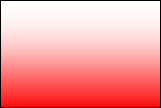
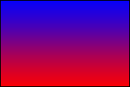
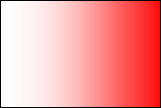
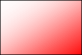
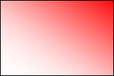
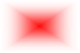
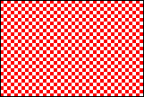
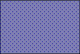
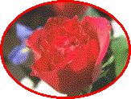

# Using the Fill Element

This topic describes VML, a feature that is deprecated as of Windows Internet Explorer 9. Webpages and applications that rely on VML should be migrated to SVG or other widely supported standards.

> [!Note]  
> As of December 2011, this topic has been archived. As a result, it is no longer actively maintained. For more information, see [Archived Content](/previous-versions/windows/internet-explorer/ie-developer/). For information, recommendations, and guidance regarding the current version of Windows Internet Explorer, see [Internet Explorer Developer Center](https://msdn.microsoft.com/ie/).

 

As you've learned, you can use the **fillcolor** property attribute of a predefined shape element -- such as `<oval>` , `<line>`, `<polyline>`, `<curve>`, `<rect>`, `<roundrect>`, `<arc>` -- to specify the color that is used to fill the shape. In this topic, we will illustrate how to draw a shape that is filled with more advanced effects.

You can place the `<fill>` sub-element inside the `<shape>`, or `<shapetype>`, or any predefined shape element to describe how to fill the shape. You can then use the property attributes of the `<fill>` sub-element to customize the fill effect, such as [gradient fill](#gradient-fill), [pattern fill](#pattern-fill), [picture fill](#picture-fill).

In this topic:

-   [Gradient Fill](#gradient-fill)
-   [Pattern Fill](#pattern-fill)
-   [Picture Fill](#picture-fill)

## Gradient Fill

To draw a gradient-filled shape, you can set the **type** property attribute of the `<fill>` sub-element to "gradient" or "gradientRadial", and then specify other property attributes of the `<fill>` sub-element, such as **method**, **color2**, **focus**, and **angle**.

**Examples:**

To create a shape that is gradient-filled horizontally, you can set the **type** property attribute to "gradient", as shown in the following VML representation:




```HTML
<v:rect style='width:120pt;height:80pt' fillcolor="red">
<v:fill type="gradient" />
</v:rect>
```


If you change the **fillcolor** property attribute of the shape, the shape is then gradient-filled with a different color. You can add a second color by specifying the **color2** property attribute of the `<fill>` sub-element. For example, to create a shape that is gradient-filled in two colors, you can add a second color by specifying the **color2** property attribute of the `<fill>` sub-element, as shown in the following VML representation:




```HTML
<v:rect style='width:120pt;height:80pt' fillcolor="red">
<v:fill color2="blue" type="gradient" />
</v:rect>
```


You can set the **method** property attribute to "linear" or "sigma" or "any" or "none". The effect of the gradient is slightly different. Also, you can use the **angle**,**focus**,**focussize**, or **focusposition** property attribute to change how the gradient goes.

**Examples:**

 

To create a shape that is gradient-filled vertically, you can set the angle property attribute to angle="-90", as shown in the following VML representation:




```HTML
<v:rect style='width:120pt;height:80pt' fillcolor="red">
<v:fill method="linear sigma" angle="-90"
type="gradient" />
</v:rect>
```


To create a shape that is gradient-filled from diagonal moving up, you can set the **angle** property attribute to angle="-135", as shown in the following VML representation:




```HTML
<v:rect style='width:120pt;height:80pt' fillcolor="red">
<v:fill method="linear sigma" angle="-135"
type="gradient" />
</v:rect>
```


To create a shape that is gradient-filled from diagonal moving down, you can set the **angle** property attribute to angle="-45", as shown in the following VML representation:




```HTML
<v:rect style='width:120pt;height:80pt' fillcolor="red">
<v:fill method="linear sigma" angle="-45"
type="gradient" />
</v:rect>
```


To create a shape that is gradient-filled from the center, you can specify `angle="-45" focus="100%" focusposition=".5, .5" focussize="0, 0" type="gradientRadial"`, as shown in the following VML representation:




```HTML
<v:rect style='width:120pt;height:80pt' fillcolor="red">
<v:fill method="linear sigma" angle="-45"
focus="100%" focusposition=".5,.5" focussize="0,0"
type="gradientRadial" />
</v:rect>
```


[ Back to top](#top)

## Pattern Fill

To draw a pattern-filled shape, you can set the **type** property attribute of the `<fill>` sub-element to "pattern", and then specify other property attributes of the `<fill>` sub-element, such as **src** and **color2**.

**Examples:**

To create a shape that is filled with a pattern image, you can specify the **type** property attribute to "pattern", and point the **src** property attribute to the location of the pattern image file, as shown in the following VML representation:




```HTML
<v:rect style='width:120pt;height:80pt' fillcolor="red">
<v:fill type="pattern" src="image1.gif"/>
</v:rect>
```


If you point the **src** property attribute to a different pattern file, you can create a shape that is filled with a different pattern. Also, you can change the color by specifying a different value for the **fillcolor** or **color2** property attribute, as shown in the following VML representation:




```HTML
<v:rect style='width:120pt;height:80pt' fillcolor="white">
<v:fill type="pattern" src="image2.gif"
color2="blue" />
</v:rect>
```


[ Back to top](#top)

## Picture Fill

To draw a picture-filled shape, you can set the **type** property attribute of the `<fill>` sub-element to "frame", and then specify other property attributes of the `<fill>` sub-element, such as **src** and **color2**.

**Examples:**

To create a shape that is filled with a picture file, you can specify the **type** property attribute to "frame", and then point the **src** property attribute to the location of the picture file, as shown in the following VML representation:




```HTML
<v:oval style='width:120pt;height:90pt' strokecolor="red"
strokeweight="2.5pt">
<v:fill type="frame" src="image1.jpg" />
</v:oval>
```


You can easily create a shape that is filled with a different picture by pointing the **src** property attribute to another file.

For more information about this element, see the [VML specification](https://www.w3.org/TR/NOTE-VML#-toc416858394) .

 

 