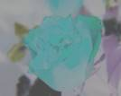

# Using the Image Element

This topic describes VML, a feature that is deprecated as of Windows Internet Explorer 9. Webpages and applications that rely on VML should be migrated to SVG or other widely supported standards.

> [!Note]  
> As of December 2011, this topic has been archived. As a result, it is no longer actively maintained. For more information, see [Archived Content](/previous-versions/windows/internet-explorer/ie-developer/). For information, recommendations, and guidance regarding the current version of Windows Internet Explorer, see [Internet Explorer Developer Center](https://msdn.microsoft.com/ie/).

 

Using `<image>`

In this topic, we will illustrate how to use the `<image>` element to display pictures with various special effects.

If you wanted to display a picture that was loaded from an external source, you would usually use the `` element provided in HTML, and then point the **src** property attribute to the location of the image file.

Alternatively you can use the `<image>` element provided in VML. When you use the `<image>` element, you can create only one image file and then display the image differently by altering the property attributes of the `<image>` element. Also, the `<image>` element provides several special effects that you can't do by simply using the `` element of HTML, such as [cropping](#crop), [contrast](#contrast), [brightness](#brightness), [gamma](#gamma), and [grayscale](#grayscale).

[ Back to top](#top)

## crop

You can use the **cropbottom**, **croptop**, **cropleft**, and **cropright** property attributes of the `<image>` element to display different pictures that are cropped from the same image file.

The value of these crop attributes represents the percentage cut from the edge of the picture. The value can be any number between 0 to 1. By default, the value is set to 0, indicating no crop from the edge. The value 0.1 indicates a cropping of 10 percent from the edge, The value 0.15 indicates a cropping of 15 percent from the edge, and so on.

For example, to display five pictures that are all cropped from the same image file, you can use the `<image>` element and specify different crop values, as shown in the following VML representation:


```HTML
<v:image style='width:100pt;height:80pt' src="image1.jpg" />
<v:image style='width:85pt;height:64pt' src="image1.jpg"
cropbottom="0.2" cropright="0.15"/>
<v:image style='width:50pt;height:44pt' src="image1.jpg"
cropbottom="0.45" cropleft="0.5"/>
<v:image style='width:80pt;height:56pt' src="image1.jpg"
croptop="0.3" cropright="0.2"/>
<v:image style='width:70pt;height:48pt' src="image1.jpg"
croptop="0.4" cropleft="0.3"/>
```


The first image, `<v:image style='width:100pt;height:80pt' src="image1.jpg" />`, doesn't have any crop value. Therefore, 100 percent of the original image is displayed at a size of 100 points by 80 points.

The second image, `<v:image style='width:85pt;height:64pt' src="image1.jpg" cropbottom="0.2" cropright="0.15"/>`, has some crop values. `cropbottom="0.2"` indicates that 20 percent of the picture will be cropped from the bottom; `cropright="0.15"` indicates that 15 percent of the picture will be cropped from the right edge. The remaining picture is then displayed at a size of 85 points by 64 points.

Similarly the third, fourth, and fifth images have some crop values. The original picture is cropped according to the crop values, and is then displayed according to the value of width and height.

[ Back to top](#top)

## contrast

You can use the **gain** property attribute of the `<image>` element to display various pictures that have different contrast settings.

The value of the **gain** property attribute can be any number. By default, the value is 1, indicating the use of the same contrast as the original image. The value 0 indicates no contrast. The larger the number, the higher the contrast.

For example, to display five pictures that have different contrast settings, you can use the `<image>` element and set a different value for the **gain** property attribute, as shown in the following VML representation:




```HTML
<v:image style='width:100pt;height:80pt' src="image1.jpg" />
<v:image style='width:100pt;height:80pt' src="image1.jpg" gain=0 />
<v:image style='width:100pt;height:80pt' src="image1.jpg" gain=0.5 />
<v:image style='width:100pt;height:80pt' src="image1.jpg" gain=3 />
<v:image style='width:100pt;height:80pt' src="image1.jpg" gain=-0.4 />
```


When the **gain** property attribute is set to 0, the entire image becomes gray because there is no contrast. The contrast is more noticeable when the **gain** property attribute is set to 3 than when it is set to 0.5. The contrast is reversed when the **gain** property attribute is set to a negative value such as -0.4.

[ Back to top](#top)

## brightness

You can use the **blacklevel** property attribute of the `<image>` element to display various pictures that have different brightness settings.

The value of the **blacklevel** property attribute can be any value between 0 to 1. By default, the value is 0, indicating that the level of brightness in the original image is preserved. The value 1 indicates the highest level of brightness.

For example, to display five pictures that have different brightness settings, you can use the `<image>` element and set a different value for the **blacklevel** property attribute, as shown in the following VML representation:


```HTML
<v:image style='width:100pt;height:80pt' src="image1.jpg" />
<v:image style='width:100pt;height:80pt' src="image1.jpg" blacklevel=0.1 />
<v:image style='width:100pt;height:80pt' src="image1.jpg" blacklevel=0.2 />
<v:image style='width:100pt;height:80pt' src="image1.jpg" blacklevel=-0.05 />
<v:image style='width:100pt;height:80pt' src="image1.jpg" blacklevel=-0.15 />
```


[ Back to top](#top)

## grayscale

You can use the **grayscale** property attribute of the `<image>` element to display pictures with or without grayscale.

The value of the **grayscale** property attribute can be either true or false. By default, the value is set to false so that the image will be displayed in color. If the value is set to true, the image will be displayed in grayscale.

For example, as shown in the following picture, the first image uses the default setting (false)of the grayscale attribute (`<v:image style='width:100pt;height:80pt' src="image1.jpg" />` ). Therefore, the picture is displayed in color.

The second image sets the grayscale attribute to true (`<v:image style='width:100pt;height:80pt' src="image1.jpg" grayscale=true />` ). Therefore, the picture is displayed in grayscale, as shown in the following VML representation:


```HTML
<v:image style='width:100pt;height:80pt' src="image1.jpg" />
<v:image style='width:100pt;height:80pt' src="image1.jpg"
grayscale=true />
```


[ Back to top](#top)

## gamma

You can use the **gamma** property attribute of the `<image>` element to display pictures that have different gamma settings.

The value of the gamma property attribute can be any value between 0 and 1. By default, the value is set to 1.

For example, to display three pictures that have different gamma settings, you can use the `<image>` element and set a different value of the **gamma** property attribute, as shown in the following VML representation:


```HTML
<v:image style='width:100pt;height:80pt' src="image1.jpg" />
<v:image style='width:100pt;height:80pt' src="image1.jpg" gamma=0 />
<v:image style='width:100pt;height:80pt' src="image1.jpg" gamma=0.5 />
```


For more information about this element, see the [VML specification](https://www.w3.org/TR/NOTE-VML#-toc416858408) .

 

 