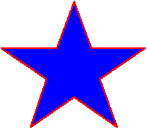

# Using the Path Element

This topic describes VML, a feature that is deprecated as of Windows Internet Explorer 9. Webpages and applications that rely on VML should be migrated to SVG or other widely supported standards.

> [!Note]  
> As of December 2011, this topic has been archived. As a result, it is no longer actively maintained. For more information, see [Archived Content](/previous-versions/windows/internet-explorer/ie-developer/). For information, recommendations, and guidance regarding the current version of Windows Internet Explorer, see [Internet Explorer Developer Center](https://msdn.microsoft.com/ie/).

 

You've learned that you can use the VML predefined shape elements -- such as `<oval>` , `<line>`, `<polyline>`, `<curve>`, `<rect>`, `<roundrect>`, and `<arc>` -- to draw a shape. In this topic, we will illustrate how to use the `<path>` sub-element to customize the outline of a shape.

You can place the `<path>` sub-element inside the `<shape>` or `<shapetype>` element. You can then use the property attributes of the `<path>` sub-element to customize the outline of the shape.

For example, to draw the customized shape illustrated in the following picture, you can use the `<path>` sub-element to define the outline of the shape, as shown in the following VML representation:




```HTML
<body>
<v:shape style='width:250;height:250' strokecolor="red" strokeweight="1.5pt"
fillcolor="blue" coordorigin="0 0" coordsize="200 200">
<v:path v="m 8,65 l 72,65, 92,11, 112,65, 174,65, 122,100, 142,155,
92,121, 42,155, 60,100 x e"/>
</v:shape>
</body>
```


-   The values `m 8,65` indicate that the drawing starts at the point (8,65).
-   The values `l 72,65, 92,11, 112,65, 174,65, 122,100, 142,155, 92,121, 42,155, 60,100` indicate that a straight line begins at the current point (8, 65) and ends at the given point (72, 65), which becomes the new current point. A new line begins at the current point (72, 65) and ends at the given point, which becomes the new current point, and so on, to the final point (60, 100).
-   `x` indicates that the path will close by a straight line that starts at the current point (60, 100) and ends at the original point (8, 65).
-   `e` indicates stop drawing.

For more information about this element, see the [VML specification](https://www.w3.org/TR/NOTE-VML#-toc416858391) .

 

 