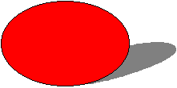

# Using the Shadow Element

This topic describes VML, a feature that is deprecated as of Windows Internet Explorer 9. Webpages and applications that rely on VML should be migrated to SVG or other widely supported standards.

> [!Note]  
> As of December 2011, this topic has been archived. As a result, it is no longer actively maintained. For more information, see [Archived Content](/previous-versions/windows/internet-explorer/ie-developer/). For information, recommendations, and guidance regarding the current version of Windows Internet Explorer, see [Internet Explorer Developer Center](https://msdn.microsoft.com/ie/).

 

In this topic, we will illustrate how to use the `<shadow>` sub-element to draw a shape that has various shadow effects.

You can place the `<shadow>` sub-element inside the `<shape>`, `<shapetype>`, or any predefined shape element to draw a shape with a shadow. You can then use the property attributes of the `<shadow>` sub-element to customize the shadow.

For example, to create a shape with a shadow, as shown in the following picture, you can type the following lines in the `<BODY>` region of your Web page:




```HTML
<v:oval style='width:120pt;height:80pt;' fillcolor="red">
<v:shadow on="t" type="perspective"
origin=".5,.5" offset="0,0"
matrix=",-92680f,,,,-95367431641e-17"/>
</v:oval>
```


-   `on="t"` and `type="perspective"` indicate to turn on the shadow using the perspective type.
-   The **origin** and **offset** indicate where to draw the shadow.
-   `matrix="..."` specifies the perspective transform matrix.

For more information about this element, see the [VML specification](https://www.w3.org/TR/NOTE-VML#-toc416858396) .

 

 