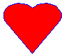

# Using the Shapetype Element

This topic describes VML, a feature that is deprecated as of Windows Internet Explorer 9. Webpages and applications that rely on VML should be migrated to SVG or other widely supported standards.

> [!Note]  
> As of December 2011, this topic has been archived. As a result, it is no longer actively maintained. For more information, see [Archived Content](/previous-versions/windows/internet-explorer/ie-developer/). For information, recommendations, and guidance regarding the current version of Windows Internet Explorer, see [Internet Explorer Developer Center](https://msdn.microsoft.com/ie/).

 

In this topic, we will illustrate how to use the `<shapetype>` element to define your own frequently-used shapes and then instantiate, or create, shapes from the shapetype.

If you wanted to draw many shapes that have the same or similar properties, it would be tedious if you had to repeatedly type the same property attributes for each shape. VML provides the `<shapetype>` element so that you can define a prototype of a shape. You can then use the `<shape>` element to instantiate many copies of shapes from the same shapetype.

You can follow the three steps to define a shapetype, and then instantiate a shape from the shapetype:

1.  Type a `<shapetype>` element and give it a name by specifying the id attribute.
2.  Describe the shapetype by using its property attributes or sub-elements.
3.  Instantiate a shape by typing a `<shape>` element, and refer the type attribute of the shape to the id attribute of the shapetype.

For example, you type the following lines to create a shapetype called "MyShape":


```HTML
<v:shapetype id="MyShape" >
</v:shapetype>
```


Then, you alter the shapetype by setting some property attributes, such as `fillcolor="red" strokecolor="blue"`. Or, you can use sub-elements inside the shapetype, such as `<path>`, `<fill>`, `<stroke>` (we will talk about those sub-elements in later topics).


```HTML
<v:shapetype id="MyShape" fillcolor="red" strokecolor="blue"...>
</v:shapetype>
```


Then, you instantiate a shape from the shapetype "MyShape" by specifying `type="#MyShape"`, as shown in the following VML representation. This shape inherits all properties from the shapetype "MyShape", and is displayed within its containing box at a size of 100 by 80.


```HTML
<v:shape type="#MyShape" style='width:100;height:80'/>
```


You can instantiate another shape from the shapetype "MyShape" by specifying `type="#MyShape"` and overwrite some properties, such as `fillcolor="maroon"`, as shown in the following VML representation. This shape inherits all properties from the shapetype "MyShape" except the fillcolor property, and is displayed within its containing box at a size of 70 by 90.


```HTML
<v:shape type="#MyShape" fillcolor="maroon"
style='width:70; height:90'/>
```


Here is the complete VML representation for the preceding example:




```HTML
<body>
<v:shapetype id="MyShape" fillcolor="red" strokecolor="blue" coordsize="21600,21600"
path="m10860,2187c10451,1746,9529,1018,9015,730,7865,152,6685,,5415,,4175,
152,2995,575,1967,1305,1150,2187,575,3222,242,4220,,5410,242,6560,575,7597l10860,
21600,20995,7597c21480,6560,21600,5410,21480,4220,21115,3222,20420,2187,19632,
1305,18575,575,17425,152,16275,,15005,,13735,152,12705,730,12176,1018,11254,1746,
10860,2187xe">
</v:shapetype>
<v:shape type="#MyShape" style='width:100;height:80;'/>
<v:shape type="#MyShape" style='width:70;height:90;' fillcolor="maroon"/>
</body>
```


As you've learned, when a shape is instantiated from a shapetype, it inherits all of the property attributes from the shapetype. You can overwrite some or all of the inherited attributes by redefining attributes inside the `<shape>` element. Be aware that the inheritance is only one level. This is because only a `<shape>` element can reference a `<shapetype>` element. A `<shapetype>` element cannot reference another `<shapetype>` element.

Also, a shapetype doesn't belong to any group. Therefore, the `<shapetype>` element can appear by itself or inside a `<group>` element. You can have many shapes inside different groups that reference the same shapetype. If a shapetype appears inside a group, a shape living in another group can still reference this shapetype.

For example, in the following VML representation, Rect1 and Rect2 are in GroupA, and Rect3 is in GroupB. All three rectangles are instantiated from MyShape shapetype.


```HTML
<body>
...
<v:shapetype id="MyShape" fillcolor="blue" strokecolor="red"...>
</v:shapetype>

<v:group id="GroupA"...>
<v:shape id="Rect1" type="#MyShape" .../>
<v:shape id="Rect2" type="#MyShape" strokecolor="black".../>
</v:group>

<v:group id="GroupB"...>
<v:shape id="Rect3" type="#MyShape" fillcolor="green".../>
</v:group>
...
</body>
```


For more information about this element, see the [VML specification](https://www.w3.org/TR/NOTE-VML#-toc416858387) .

 

 