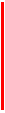

# Using the Stroke Element

This topic describes VML, a feature that is deprecated as of Windows Internet Explorer 9. Webpages and applications that rely on VML should be migrated to SVG or other widely supported standards.

> [!Note]  
> As of December 2011, this topic has been archived. As a result, it is no longer actively maintained. For more information, see [Archived Content](/previous-versions/windows/internet-explorer/ie-developer/). For information, recommendations, and guidance regarding the current version of Windows Internet Explorer, see [Internet Explorer Developer Center](https://msdn.microsoft.com/ie/).

 

Using `<stroke>`

As you've learned, you can use the **strokecolor** and **strokeweight** property attributes of a predefined shape -- such as `<oval>` , `<line>`, `<polyline>`, `<curve>`, `<rect>`, `<roundrect>`, `<arc>` -- to specify the color and weight of a shape's outline. In this topic, we will illustrate how to draw a shape that has a more advanced outline.

You can place the `<stroke>` sub-element inside the `<shape>`, or `<shapetype>`, or any predefined shape element to describe how to draw the outline of the shape. You can then use the property attributes -- for example, [dashstyle](#dashstyle), [opacity](#opacity), [linestyle](#linestyle), [joinstyle](#joinstyle), [filltype](#filltype) -- of the `<stroke>` sub-element to customize the outline.

[ Back to top](#top)

## dashstyle

You can use the **dashstyle** property attribute of the `<stroke>` sub-element to draw an outline with various dash styles.

**Examples:**

If you specify `<v:stroke dashstyle="solid" />` inside the `<line>` element, you can create a solid line, as shown in the following VML representation:


```HTML
<v:line style='position:relative;' from="20pt,20pt" to="200pt,20pt"
strokecolor="red" strokeweight="2pt">
<v:stroke dashstyle="solid" />
</v:line>
```


If you change the **dashstyle** property attribute to "dot", you can create a dotted line, as shown in the following VML representation:


```HTML
<v:line style='position:relative;' from="20pt,20pt" to="200pt,20pt"
strokecolor="red" strokeweight="2pt">
<v:stroke dashstyle="dot" />
</v:line>
```


If you change the **dashstyle** property attribute to "dash", you can create a dash line, as shown in the following VML representation:


```HTML
<v:line style='position:relative;' from="20pt,20pt" to="200pt,20pt"
strokecolor="red" strokeweight="2pt">
<v:stroke dashstyle="dash" />
</v:line>
```


If you change the **dashstyle** property attribute to "dashdot", you can create a line with a dashed and dotted style, as shown in the following VML representation:


```HTML
<v:line style='position:relative;' from="20pt,20pt" to="200pt,20pt"
strokecolor="red" strokeweight="2pt">
<v:stroke dashstyle="dashdot" />
</v:line>
```


If you change the **dashstyle** property attribute to "longdash", you can create a line with a long dashed style, as shown in the following VML representation:


```HTML
<v:line style='position:relative;' from="20pt,20pt" to="200pt,20pt"
strokecolor="red" strokeweight="2pt">
<v:stroke dashstyle="longdash" />
</v:line>
```


If you change the **dashstyle** property attribute to "longdashdot", you can create a line with a long dashed and dotted style, as shown in the following VML representation:


```HTML
<v:line style='position:relative;' from="20pt,20pt" to="200pt,20pt"
strokecolor="red" strokeweight="2pt">
<v:stroke dashstyle="longdashdot" />
</v:line>
```


If you place `<v:stroke dashstyle="dashdot" />` inside the `<rect>` element, you can create a rectangle that has a dashed and dotted outline, as shown in the following VML representation:


```HTML
<v:rect style='width:100pt;height:80pt' strokecolor="red" strokeweight="2pt"/>
<v:stroke dashstyle="dashdot" />
</v:rect>
```


[ Back to top](#top)

## opacity

You can use the **opacity** property attribute of the `<stroke>` sub-element to draw an outline with various opacity styles. The value for the **opacity** property attribute can be any number between 0 to 1. By default, it is 1, indicating full opacity.

**Examples:**

The following VML representation creates a line with full opacity:


```HTML
<v:line style='position:relative;' from="20pt,50pt" to="200pt,50pt" strokecolor="red"
strokeweight="2pt">
</v:line>
```


If you add `<v:stroke opacity="0.5" />` inside the `<line>` element, you can create a line with 50% opacity, as shown in the following VML representation:




```HTML
<v:line style='position:relative;' from="20pt,50pt" to="200pt,50pt" strokecolor="red"
strokeweight="2pt">
<v:stroke opacity="0.5" />
</v:line>
```


[ Back to top](#top)

## linestyle

You can use the **linestyle** property attribute of the `<stroke>` sub-element to draw an outline with various line styles.

**Examples:**

If you specify `<v:stroke linestyle="single" />` inside the `<rect>` element, you can create a rectangle with a single outline, as shown in the following VML representation:


```HTML
<v:rect style='width:120pt;height:80pt' strokecolor="red" strokeweight="10pt">
<v:stroke linestyle="single" />
</v:rect>
```


If you change the **linestyle** property attribute to "thinthin", you can create a rectangle with the outline (1:1:1), as shown in the following VML representation:


```HTML
<v:rect style='width:120pt;height:80pt' strokecolor="red"
strokeweight="10pt">
<v:stroke linestyle="thinthin" />
</v:rect>
```


If you change the **linestyle** property attribute to "thinthick", you can create a rectangle with the outline (1:1:2), as shown in the following VML representation:


```HTML
<v:rect style='width:120pt;height:80pt' strokecolor="red"
strokeweight="10pt">
<v:stroke linestyle="thinthick" />
</v:rect>
```


If you change the **linestyle** property attribute to "thickthin", you can create a rectangle with the outline (2:1:1), as shown in the following VML representation:


```HTML
<v:rect style='width:120pt;height:80pt' strokecolor="red"
strokeweight="10pt">
<v:stroke linestyle="thickthin" />
</v:rect>
```


If you change the **linestyle** property attribute to "thickbetweenthin", you can create a rectangle with the outline (1:1:2:1:1), as shown in the following VML representation:


```HTML
<v:rect style='width:120pt;height:80pt' strokecolor="red"
strokeweight="10pt">
<v:stroke linestyle="thickbetweenthin" />
</v:rect>
```


[ Back to top](#top)

## joinstyle

You can use the **joinstyle** attribute of the `<stroke>` sub-element to define how lines are joined together.

For example, to create a shape that has the round-join outline, as shown in the following illustration, you can specify `<v:stroke joinstyle="round" />` inside the `<polyline>` element, as shown in the following VML representation:


```HTML
<v:polyline
points="81pt,54pt,126pt,54pt,126pt,27pt,180pt,63pt,126pt,90pt,126pt,1in,81pt,1in"
strokecolor="red" strokeweight="20pt">
<v:stroke joinstyle="round" />
</v:polyline>
```


If you change the **joinstyle** property attribute to "bevel", you can create a shape that has the bevel-join outline, as shown in the following VML representation:


```HTML
<v:polyline
points="81pt,54pt,126pt,54pt,126pt,27pt,180pt,63pt,126pt,90pt,126pt,1in,81pt,1in"
strokecolor="red" strokeweight="20pt">
<v:stroke joinstyle="bevel" />
</v:polyline>
```


If you change the **joinstyle** property attribute to "miter", you can create a shape that has the miter-join outline, as shown in the following VML representation:


```HTML
<v:polyline
points="81pt,54pt,126pt,54pt,126pt,27pt,180pt,63pt,126pt,90pt,126pt,1in,81pt,1in"
strokecolor="red" strokeweight="20pt">
<v:stroke joinstyle="miter" />
</v:polyline>
```


[ Back to top](#top)

## filltype

You can use the **filltype** property attribute of the `<stroke>` sub-element to draw an outline with various fill effects.

**Examples:**

If you specify `<v:stroke filltype="solid" />` inside the `<roundrect>` element, you can create a rounded rectangle with the solid-filled outline, as shown in the following VML representation:


```HTML
<v:roundrect style='width:120pt;height:80pt' strokecolor="red"
strokeweight="15pt">
<v:stroke filltype="solid" />
</v:roundrect>
```


If you change the **filltype** property attribute to "pattern", point the **src** property attribute to the location of the pattern image file, and set the **color2** property attribute to the second pattern color, you can create a rounded rectangle with a pattern outline, as shown in the following VML representation:


```HTML
<v:roundrect style='width:120pt;height:80pt' strokecolor="red"
strokeweight="15pt">
<v:stroke filltype="pattern" src="image.gif"
color2="green" />
</v:roundrect>
```


If you change the **filltype** property attribute to "tile" and point the **src** property attribute to the location of the image file, you can create a rounded rectangle with a tiled outline, as shown in the following VML representation:


```HTML
<v:roundrect style='width:120pt;height:80pt' strokecolor="red"
strokeweight="15pt">
<v:stroke filltype="tile" src="image2.gif" />
</v:roundrect>
```


If you change the **filltype** property attribute to "frame" and point the **src** property attribute to the location of the image file, you can create a rounded rectangle with a picture outline, as shown in the following VML representation:


```HTML
<v:roundrect style='width:120pt;height:80pt' strokecolor="red"
strokeweight="15pt">
<v:stroke filltype="frame" src="image2.gif" />
</v:roundrect>
```


For more information about this element, see the [VML specification](https://www.w3.org/TR/NOTE-VML#-toc416858395) .

 

 