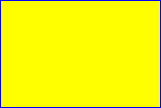
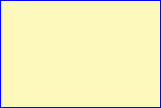

# Coloring Shapes

This topic describes VML, a feature that is deprecated as of Windows Internet Explorer 9. Webpages and applications that rely on VML should be migrated to SVG or other widely supported standards.

> [!Note]  
> As of December 2011, this topic has been archived. As a result, it is no longer actively maintained. For more information, see [Archived Content](/previous-versions/windows/internet-explorer/ie-developer/). For information, recommendations, and guidance regarding the current version of Windows Internet Explorer, see [Internet Explorer Developer Center](https://msdn.microsoft.com/ie/).

 

As we mentioned in earlier sections, you can use "red" to represent a color in red, "blue" to represent a color in blue, and so on. In this topic, we will illustrate how to draw shapes in any color you want.

VML extends HTML and CSS color syntax. When the attribute type of a VML element is color -- such as **fillcolor** and **strokecolor** -- you can express the color by using either a [keyword color name](#keyword-color-name) or an [RGB triplet](#rgb-triplet).

[ Back to top](#top)

## Keyword Color Name

HTML 4.0 defines a list of keyword color names. They are aqua, black, blue, fuchsia, gray, green, lime, maroon, navy, olive, purple, red, silver, teal, white, and yellow. The RGB value for these 16 colors are defined in [HTML 4.0 specification](https://www.w3.org/TR/2018/SPSD-html401-20180327/types.html#h-6.5) .

For example, you can draw a rectangle filled with yellow by specifying `fillcolor="yellow"`, and give it a blue outline by specifying `strokecolor="blue"`, as shown in the following VML representation:




```HTML
<v:rect style='width:120pt;height:80pt;'
fillcolor="yellow" strokecolor="blue"/>
```


[ Back to top](#top)

## RGB Triplet

If the color is not a [keyword color name](#keyword-color-name), you can express the color as either an RGB decimal triplet or an RGB hexadecimal triplet. With RGB triplets, you can specify values for the red, green, and blue components of the color, setting each component to a value ranging from 0 through 255 in decimal, or 00 through FF in hexadecimal.

For example, you can create a rectangle that is filled with a customized color with an RGB value of 253, 249, 186 in decimal by specifying either `fillcolor="rgb(253,249, 186)"` or `fillcolor="#FDF9BA"`, as shown in the following VML representation. In hexadecimal, the value 253 becomes FD, 249 becomes F9, and 186 becomes BA.




```HTML
<v:rect style='width:120pt;height:80pt;'
fillcolor="#FDF9BA" strokecolor="blue"/>
```


If the RGB in hexadecimal has a pattern such as XXYYZZ, you can abbreviate it to XYZ. For example, "\#66FF99" can be written out as "\#6F9".

[ Back to top](#top)

## Summary

In VML, you can represent a color in one of the following formats:

1.  fillcolor="blue"
2.  fillcolor="rgb(0,0,255)"
3.  fillcolor="\#0000ff"

 

 
