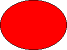

# Drawing Basic Shapes

This topic describes VML, a feature that is deprecated as of Windows Internet Explorer 9. Webpages and applications that rely on VML should be migrated to SVG or other widely supported standards.

> [!Note]  
> As of December 2011, this topic has been archived. As a result, it is no longer actively maintained. For more information, see [Archived Content](/previous-versions/windows/internet-explorer/ie-developer/). For information, recommendations, and guidance regarding the current version of Windows Internet Explorer, see [Internet Explorer Developer Center](https://msdn.microsoft.com/ie/).

 

In this topic, we will illustrate how easy it is to draw a shape using VML.

To create a red oval on a Web page, as shown in the following picture, you can draw the oval by using a graphic edit tool, save your drawing as a bitmap, and then insert the bitmap on your Web page:



Alternatively, you can use VML to draw graphics. In the preceding example, you can type the following lines in the `<BODY>` region of your Web page to draw the red oval:


```HTML
<v:oval style='width:100pt;height:75pt' fillcolor="red"> </v:oval>
```


`<v:...>` and `</v:...>` are the start tag and end tag in [XML syntax](#xml-structure).`style='width:100pt; height:75pt'` provides [CSS information](#css-information). **oval** and **fillcolor**="red" are [VML elements](#vml-elements).

You can alter the graphics by simply changing their property attributes in VML. In the preceding example, if you change `fillcolor="red"` to `fillcolor="blue"`, as shown in the following VML representation, the red oval will change to blue:


```HTML
<v:oval style='width:100pt;height:75pt' fillcolor="blue"> </v:oval>
```


Browsers that support VML can render and display the graphics represented in VML without having to download separate image files. Most graphics represented in VML are rendered faster in browsers, and require less disk space and download time.

[ Back to top](#top)

## XML Structure

VML is formatted according to the rules of Extensible Markup Language (XML). Any standard XML parser can parse VML and hand off the resulting data to a VML-specific processor. To let the browsers know how to hand off data to a VML-specific processor, you need to type some information such as [namespaces](web-workshop---how-to-use-vml-on-web-pages----appendix.md) and [embedded custom objects](web-workshop---how-to-use-vml-on-web-pages----appendix.md). You can then use VML to type graphics in the `<BODY>` region just as you did in the preceding example.

The `"v:"` prefix on each XML tag identifies the tag as VML. The `"v:"` prefix in the `<BODY>` region should be consistent with `<html xmlns:v="...">`.

[ Back to top](#top)

## CSS Information

VML uses [Cascading Style Sheets, Level 2 (CSS2)](https://www.w3.org/TR/PR-CSS2/) to determine the size of the graphics and to position the graphics on a Web page. In the preceding example, we specified the size of the oval as 100 points (width) by 75 points (height) (`style='width:100pt;height:75pt'` ).

[ Back to top](#top)

## VML Elements

In the preceding example, we used a VML predefined `<oval>` element to draw an oval. We then used the **fillcolor** property attribute of the `<oval>` element to fill the oval with red.

Based upon the [Start-Tags, End-Tags, and Empty-Element Tags](https://www.w3.org/TR/REC-xml#sec-starttags) section of [XML 1.0 specification](https://www.w3.org/TR/REC-xml), empty-element tags may be used for any element that has no content. For example, as shown in the following VML representation, there is no content (sub-element) within the `<oval>` element. (Note that the **style** and **fillcolor** are the attributes of the `<oval>` element; they are not sub-elements.)


```HTML
<v:oval style='width:100pt;height:75pt' fillcolor="red"> </v:oval>
```


Therefore, you can use the empty-element tag, as shown in the following VML representation, to represent the same thing as the above line.


```HTML
<v:oval style='width:100pt;height:75pt' fillcolor="red" />
```


[ Back to top](#top)

## Summary

You can use VML to draw graphics on a Web page, and then customize those graphics by simply changing their property attributes. Also, most graphics represented in VML are rendered faster in browsers, and take less download time and disk space.

 

 