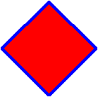
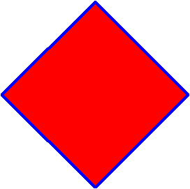
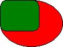
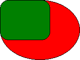

# Using Local Coordinate Space

This topic describes VML, a feature that is deprecated as of Windows Internet Explorer 9. Webpages and applications that rely on VML should be migrated to SVG or other widely supported standards.

> [!Note]  
> As of December 2011, this topic has been archived. As a result, it is no longer actively maintained. For more information, see [Archived Content](/previous-versions/windows/internet-explorer/ie-developer/). For information, recommendations, and guidance regarding the current version of Windows Internet Explorer, see [Internet Explorer Developer Center](https://msdn.microsoft.com/ie/).

 

As you've learned, you can specify the **width** and **height** style attributes to define the size of a containing box within which the contents of a shape or group will be rendered. In this topic, we will explain what Local Coordinate Space is, and how it is used in VML to scale shapes.

If you were asked to draw a one-inch by two-inch rectangle on a piece of grid paper, the first thing you would figure out is where to start (the originating point). Then, you would figure out how to map one inch to the cells of the grid paper (the coordinate).

Similarly, when the contents of a shape or group are rendered inside its containing box on a Web page, the originating point and the coordinate must be defined. VML provides Local Coordinate Space to allow each shape or group to define its own originating point and coordinate. If you don't specify a coordinate space, the default one will be used. By default, the origination starts at the top-left corner of the containing box.

For example, the VML representation for the red oval shown below doesn't specify the **coordsize** and **coordorigin** property attributes. Therefore, a default local coordinate space is used. The size of the oval is 100 points (width) by 75 points (height). You can resize the oval by specifying a different width or height, as you've learned in the [Scale Shapes](web-workshop---how-to-use-vml-on-web-pages----scaling-shapes.md) topic.


```HTML
<v:oval style='width:100pt;height:75pt' fillcolor="red">
</v:oval>
```


When the shape becomes more complicated, or when you would like to group several shapes and scale them together, you should use the Local Coordinate Space feature provided in VML.

For each shape or group, you can use the **coordsize** and **coordorigin** property attributes to define the shape's or group's local coordinate space. The **coordsize** attribute specifies the number of units along the width and the height of the containing box. The **coordorigin** attribute defines the coordinate at the top left corner of the containing box. All position-related information (such as width, height, left, top, path, etc.) is expressed in terms of the unit in Local Coordinate Space.

For example, as shown in the following VML representation, `width: 100pt; height: 100pt;` defines the size of the containing box for the shape to be 100 points by 100 points.




```HTML
<v:shape style='position:relative;left:10pt;top:5pt; width:100pt; height:100pt;'
coordsize="21600,21600" path="m10800,0l0,10800,10800,21600,21600,10800xe"
fillcolor="red" strokecolor="blue" strokeweight="2pt">
</v:shape>
```


-   `coordsize="21600,21600"` defines the size of the Local Coordinate Space for the shape to be 21600 units by 21600 units. Therefore, one unit in the Local Coordinate Space is equivalent to 1/216 point.
-   `path="m10800,0l0,10800,10800,21600,21600,10800xe"` defines the outline of the shape as a diamond shape. As we've learned, all position-related information (such as width, height, left, top, path, etc.) is expressed in terms of the unit in Local Coordinate Space. Therefore, 10800 in the `<path>` means 10800 units, which is equivalent to 50 points.

When you want to resize this diamond shape, simply specify a different width or height -- that's it; you don't have to change any value in the `<path>`. For this complicated shape, if you didn't use the Local Coordinate Space feature, you would have to change every value in the `<path>` whenever you wanted to resize it.

For example, you can scale the diamond shape by simply specifying a different width or height, as shown in the following VML representation:




```HTML
<v:shape style='position:relative;left:10pt;top:5pt;width:200pt; height:200pt;'
coordsize="21600,21600" path="m10800,0l0,10800,10800,21600,21600,10800xe"
fillcolor="red" strokecolor="blue" strokeweight="2pt">
</v:shape>
```


You can also use Local Coordinate Space in the `<group>` element so that the contents of all shapes within the group are scaled together according to the same coordinate. Then, whenever you want to scale or move a group of shapes, simply change the width and height, or **coordsize** and **coordorigin** settings, of the group.

For example, in the following VML representation, `<v:group style='... width:200pt;height:200pt;'>` defines the size of the containing box for the group to be 200 points by 200 points.




```HTML
<v:group style='position:relative;left:1pt;top:2pt;width:200pt; height:200pt;'
coordsize="1000,1000" coordorigin="-500,-500">
<v:oval style='position:relative;left:0;top:0;width:400;height:300;' fillcolor="red" />
<v:roundrect style='position:relative;left:0;top:0;width:250;height:200;' fillcolor="green" />
</v:group>
```


-   `coordsize="1000,1000"` defines the size of the Local Coordinate Space for the group to be 1000 units by 1000 units. Therefore, 1 unit in the Local Coordinate Space is equivalent to 1/5 point.
-   `coordorigin="-500,-500"` defines the top left corner of the containing box to be "-500, -500". Therefore, the coordinate system inside the containing box ranges from -500 to 500 along the x-axis, and -500 to 500 along the y-axis. In other words, the center of the containing box is "0, 0".
-   `<v:oval style='... width:400;height:300;'>` defines the size of the containing box for the red oval to be 400 units (width) by 300 units (height). Because one unit in the Local Coordinate Space is equivalent to 1/5 point, the size of the containing box for the red oval is 80 points (width) by 60 points (height).

Similarly, the size of the containing box for the green roundrect is 50 points (width) by 40 points (height).

When you want to to resize both the red oval and the green roundrect, simply change `<v:group style='... width:200pt;height:200pt;'>`. That's it -- you don't have to individually change the size of the two shapes.

For example, if you change `<v:group style='... width:200pt;height:200pt;'>` to `<v:group style='... width:300pt;height:300pt;'>`, the shapes become larger, as shown in the following picture:




You'd also notice that the shapes are located differently. This is because the shapes are drawn from "0, 0" which is located at the center of the containing box. Because you make the containing box bigger, the center of the containing box is also moved.

If you change `coordorigin="-500,-500"` to `coordorigin="0,0"`, as shown in the following picture, you'll notice that the red oval and the green roundrect are both shifted up to the new location. This is because "0, 0" now locates at the top left corner of the containing box.


It is also important to note that the containing box does not establish a clipping region. Graphics may be drawn outside the boundaries of the containing box. The containing box merely serves to map the local coordinate space to the page space.

For more information about this element, see the [VML specification](https://www.w3.org/TR/NOTE-VML#-toc416858382) .

 

 