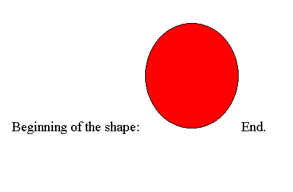
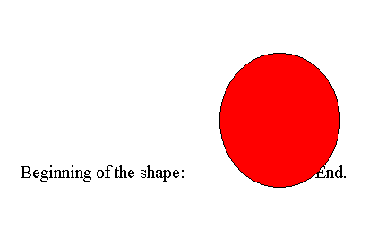
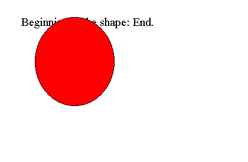
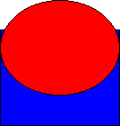
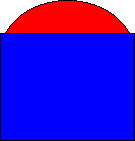
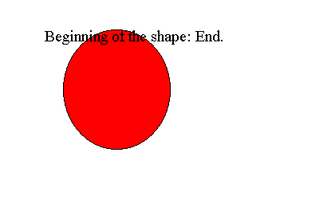

# Positioning Shapes

This topic describes VML, a feature that is deprecated as of Windows Internet Explorer 9. Webpages and applications that rely on VML should be migrated to SVG or other widely supported standards.

> [!Note]  
> As of December 2011, this topic has been archived. As a result, it is no longer actively maintained. For more information, see [Archived Content](/previous-versions/windows/internet-explorer/ie-developer/). For information, recommendations, and guidance regarding the current version of Windows Internet Explorer, see [Internet Explorer Developer Center](https://msdn.microsoft.com/ie/).

 

You've learned how to draw and color shapes on a Web page using VML. In this topic, you'll use VML to precisely position graphics on a Web page.

VML uses the same syntax defined in the [Box Model](https://www.w3.org/TR/CSS2/box.html) and [Visual Rendering Model](https://www.w3.org/TR/CSS2/visuren.html) sections of [CSS2](https://www.w3.org/TR/PR-CSS2/) to position shapes on a Web page. You can use [static](#static), [relative](#relative), or [absolute](#absolute) to determine where the base point is located on a Web page. You can then use the **top** and **left** style attributes to specify the offset from the base point at which the containing box for the shape will be positioned.

You can also use [z-index](#z-index) to specify the z-order of shapes on a Web page.

In addition, VML provides [rotation](#rotation) and [flip](#flip) to rotate or flip shapes.

In this topic:

-   [static](#static)
-   [relative](#relative)
-   [absolute](#absolute)
-   [z-index](#z-index)
-   [rotation](#rotation)
-   [flip](#flip)
-   [Summary](#summary)

## static

The default position style is static, which instructs browsers to position the shape at the current point (the base point) in the text flow and ignore the settings in the **top** and **left** style attributes.

For example, in the following VML representation, the red oval is positioned immediately after the text "Beginning of the shape:", as shown in the following picture:




```HTML
<body>
Beginning of the shape:
<v:oval style='width:80pt;height:90pt' fillcolor="red" />
End.
</body>
```


[ Back to top](#top)

## relative

Setting the position style attribute to "relative" allows you to place the containing box with an offset from the current point (the base point) in the text flow. The offset is determined by the settings in the **top** and **left** style attributes. Be aware that the containing box that is positioned as relative takes up space in the text flow.

For example, in the following VML representation, the red oval is positioned 20 points from the left and 10 points from the top relative to the current point in the text flow, as shown in the following picture:




```HTML
<body>
Beginning of the shape:
<v:oval style='position:relative;left:20pt;top:10pt;width:80pt;
height:90pt;' fillcolor="red" />
End.
</body>
```


[ Back to top](#top)

## absolute

Setting the position style attribute to "absolute" allows you to place the containing box an exact distance from the top left corner (the base point) of its parent element (the positioned element that contains the shape). Be aware that the containing box that is positioned as absolute doesn't take up space in the text flow.

For example, in the following VML representation, the red oval is contained within the `<body>` element (the entire Web page); therefore, the base point is at the top left corner of the Web page. The containing box for the oval is positioned exactly 20 points from the left and 10 points from the top, relative to the top left corner of the Web page, as shown in the following picture:




```HTML
<body>
Beginning of the shape:
<v:oval style='position:relative;left:20pt;top:10pt
width:80pt; height:90pt;' fillcolor="red" />
End.
</body>
```


[ Back to top](#top)

## z-index

It is possible to position a shape that overlaps another shape. Normally, the graphic that is listed last in the HTML code appears on top.

In VML, you can control the z-order by using the **z-index** style attribute. The value of this attribute can be zero, a positive integer, or a negative integer. The graphic that has a larger z-index value is displayed on top of the graphic that has a smaller z-index value. When both graphics have the same z-index value, the graphic that is listed last in the HTML code appears on top.

For example, in the following VML representation, the red oval is displayed on top of the blue rectangle. This is because the z-index value of the red oval is greater than the z-index value of the blue rectangle.




```HTML
<v:oval
style='position:relative;left:10pt;top:20pt;width:100pt; height:80pt;z-index: 1'
fillcolor="red" />
<v:rect style='position:relative;left:10pt;top:45pt;width:100pt; height:80pt; z-index:0' fillcolor="blue" />
```


If you change the z-index, as shown in the following VML representation, the red oval would move behind the blue rectangle.




```HTML
<v:oval
style='position:relative;left:10pt;top:20pt;width:100pt; height:80pt;z-index:0'
fillcolor="red" />
<v:rect style='position:relative;left:10pt;top:45pt;width:100pt; height:80pt;z-index:1'
fillcolor="blue" />
```


If you supply a negative integer, you can use z-index to position graphics behind the normal text flow, as shown in the following VML representation.




```HTML
<body>
Beginning of the shape:
<v:oval style='position:relative;left:20pt;top:10pt;z-index:-1;
width:80pt;height:90pt;' fillcolor="red" />
End.
</body>
```


[ Back to top](#top)

## rotation

You can use the **rotation** style attribute to specify how many degrees you want a shape to turn on its axis. A positive value indicates a clockwise rotation; a negative value indicates a counter-clockwise rotation.

For example, if you specify **style**='... rotation:90', you can rotate the shape 90 degrees clockwise.

[ Back to top](#top)

## flip

You can use the **flip** style attribute to flip a shape on its x or y axis according to the following table:


| Value | Description                                                  |
|-------|--------------------------------------------------------------|
| x     | Flip the rotated shape about the y axis (invert x ordinates) |
| y     | Flip the rotated shape about the x axis (invert y ordinates) |


 

Both x and y may be specified in the flip property.

For example, if you type **style**='... flip:x y', you will flip the shape on both its x and y axis.

[ Back to top](#top)

## Summary

Based on what you've learned, you can precisely position a shape on a Web page by following these steps:

1.  Decide where you want the shape to appear on a Web page, and the size of the shape.
2.  Specify **style**='position:relative (or relative)' to determine the base point.
3.  Use **left** and **top** to specify the offset from the base point.
4.  Use **width** and **height** to specify the size of the containing box for the shape.
5.  Use **z-index** to specify the z-order of the shape.

 

 
