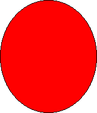

# Scaling Shapes

This topic describes VML, a feature that is deprecated as of Windows Internet Explorer 9. Webpages and applications that rely on VML should be [migrated to SVG](http://go.microsoft.com/fwlink/p/?LinkID=236964) or other widely supported standards.

> [!Note]  
> As of December 2011, this topic has been archived. As a result, it is no longer actively maintained. For more information, see [Archived Content](https://msdn.microsoft.com/library/hh772377). For information, recommendations, and guidance regarding the current version of Windows Internet Explorer, see [Internet Explorer Developer Center](http://go.microsoft.com/fwlink/p/?linkid=204313).

 

You've learned how to draw and color shapes on a Web page using VML. In this topic, we will illustrate how to scale shapes to any size you want.

VML uses the same syntax defined in the [Visual Rendering Model Details](http://www.w3.org/TR/PR-CSS2/visudet.mdl) section of the [CSS2 specification](http://www.w3.org/TR/PR-CSS2/) to specify the size of the containing box so that the contents of a shape will be rendered (drawn) within the containing box. You can use the **width** and **height** style attributes to define the size of the containing box.

For example, if you draw an oval and specify **style**='width:75pt;height:100pt', the oval will be drawn within a containing box at a size of 75 points (width) by 100 points (height), as shown in the following picture:


```HTML
<v:oval style='width:75pt;height:100pt'
fillcolor="red" />
```


[Show Me](http://samples.msdn.microsoft.com/workshop/samples/vml/examples/SacleShape/Oval1.md)

If you change the size to **style**='width:120pt;height:140pt', the oval becomes larger because it is scaled within the new containing box at a size of 120 points (width) by 140 points (height), as shown in the following picture:




```HTML
<v:oval style='width:120pt;height:140pt'
fillcolor="red" />
```


[Show Me](http://samples.msdn.microsoft.com/workshop/samples/vml/examples/SacleShape/Oval2.md)

If you change the size to **style**='width:60pt;height:40pt', the oval becomes smaller because it is scaled within the new containing box at a size of 60 points (width) by 40 points (height), as shown in the following picture:


```HTML
<v:oval style='width:60pt;height:40pt'
fillcolor="red" />
```


[Show Me](http://samples.msdn.microsoft.com/workshop/samples/vml/examples/SacleShape/Oval3.md)

 

 


