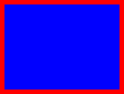
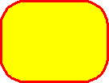
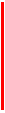
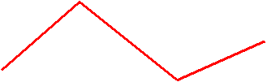
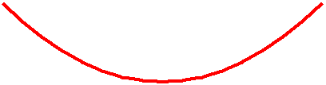
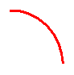
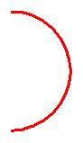

# Using Predefined Shapes

This topic describes VML, a feature that is deprecated as of Windows Internet Explorer 9. Webpages and applications that rely on VML should be migrated to SVG or other widely supported standards.

> [!Note]  
> As of December 2011, this topic has been archived. As a result, it is no longer actively maintained. For more information, see [Archived Content](/previous-versions/windows/internet-explorer/ie-developer/). For information, recommendations, and guidance regarding the current version of Windows Internet Explorer, see [Internet Explorer Developer Center](https://msdn.microsoft.com/ie/).

 

As you've learned, you can use the `<oval>` element of VML to create a simple oval. VML provides several other predefined elements. In this topic, we will illustrate how to draw graphics by using these elements.

In this topic:

-   [rect](#roundrect)
-   [roundrect](#roundrect)
-   [line](#polyline)
-   [polyline](#polyline)
-   [curve](#curve)
-   [arc](#arc)
-   [Summary](#summary)

## rect

You can use the `<rect>` element to draw a rectangle. You can then customize the rectangle by specifying different property attributes.

For example, you can draw a rectangle that is filled with blue by specifying **fillcolor**="blue", and give it a 3.5-point red outline by specifying **strokecolor**="red" **strokeweight**="3.5pt", as shown in the following VML representation:




```HTML
<v:rect style='width:100pt;height:75pt' fillcolor="blue"
strokecolor="red" strokeweight="3.5pt"/>
```


For more information about this element, see the [VML specification](https://WWW.w3.org/TR/NOTE-VML#-toc416858405) . (Note: The VML specification doesn't have a bookmark for the `<rect>` element.)

[ Back to top](#top)

## roundrect

You can use the `<roundrect>` element to draw a rectangle with rounded corners. You can then customize the rounded rectangle by specifying different property attributes.

For example, you can draw a rectangle that has rounded corners 30% of half the smaller dimension of the rectangle by specifying **arcsize**="0.3", fill it with yellow by specifying **fillcolor**="yellow", and give it a 2-point red outline by specifying **strokecolor**="red" **strokeweight**="2pt", as shown in the following VML representation:




```HTML
<v:roundrect style='width:100pt;height:75pt"
arcsize="0.3" fillcolor="yellow"
strokecolor="red" strokeweight="2pt"/>
```


For more information about this element, see the [VML specification](https://WWW.w3.org/TR/NOTE-VML#-toc416858405) .

[ Back to top](#top)

## line

You can use the `<line>` element to create a straight line. You can then customize the line by specifying different property attributes.

For example, you can draw a horizontal line by specifying **from**="20pt,20pt" **to**="100pt,20pt", and make it 2-point and red by specifying **strokecolor**="red" **strokeweight**="2pt", as shown in the following VML representation:


```HTML
<v:line from="20pt,20pt" to="100pt,20pt" '
strokecolor="red" strokeweight="2pt">
```


You can draw a vertical or diagonal line by simply specifying different values for the **from** and **to** property attributes, as shown in the following VML representation:




```HTML
<v:line from="20pt,20pt" to="20pt,100pt"
strokecolor="red" strokeweight="2pt">
```


For more information about this element, see the [VML specification](https://WWW.w3.org/TR/NOTE-VML#-toc416858402) .

[ Back to top](#top)

## polyline

You can use the `<polyline>` element to define shapes that are created from connected line segments. You can then customize the shape by specifying different property attributes.

For example, to draw the shape shown in the following picture, you can type the following VML representation:




```HTML
<v:polyline points="18pt,54pt,90pt,-9pt,180pt,63pt,261pt,27pt"
strokecolor="red" strokeweight="2pt"/>
```


For more information about this element, see the [VML specification](https://WWW.w3.org/TR/NOTE-VML#-toc416858403) .

[ Back to top](#top)

## curve

You can use the `<curve>` element to draw a cubic bézier curve. You can then customize the curve by specifying different property attributes.

For example, to draw a curve as shown in the following picture, you can type the following VML representation:




```HTML
<v:curve style='position:relative'
from="0,0" control1="100pt,100pt" control2="200pt,100pt"
to="300pt,0" strokecolor="red" strokeweight="3pt"/>
```


For more information about this element, see the [VML specification](https://WWW.w3.org/TR/NOTE-VML#-toc416858404) .

[ Back to top](#top)

## arc

You can use the `<arc>` element to draw an arc that is defined as a segment of an oval. The arc is defined by the intersection of the oval with the start and end radius vectors given by the angles. The angles are calculated by using the properties of a circle (width equal to height), then scaled anisotropically to the desired width and height.

For example, you can draw an arc that starts at 0 degrees and ends at 90 degrees by specifying **startangle**="0" **endangle**="90", as shown in the following VML representation:




```HTML
<v:arc style='width:100pt;height:100pt'
startangle="0" endangle="90"
strokecolor="red" strokeweight="2pt"/>
```


You can change the arc by specifying different **startangle** and **endangle** values, as shown in the following VML representation:




```HTML
<v:arc style='width:100pt;height:100pt'
startangle="0" endangle="180"
strokecolor="red" strokeweight="2pt"/>
```


```HTML
<v:arc style='width:100pt;height:100pt'
startangle="0" endangle="270"
strokecolor="red" strokeweight="2pt"/>
```


For more information about this element, see the [VML specification](https://WWW.w3.org/TR/NOTE-VML#-toc416858407) .

[ Back to top](#top)

## Summary

You can use VML predefined elements such as `<oval>`, `<line>`, `<polyline>`, `<curve>`, `<rect>`, `<roundrect>`, and `<arc>` to easily draw graphics on a Web page, and then customize those graphics by simply changing their property attributes.

 

 