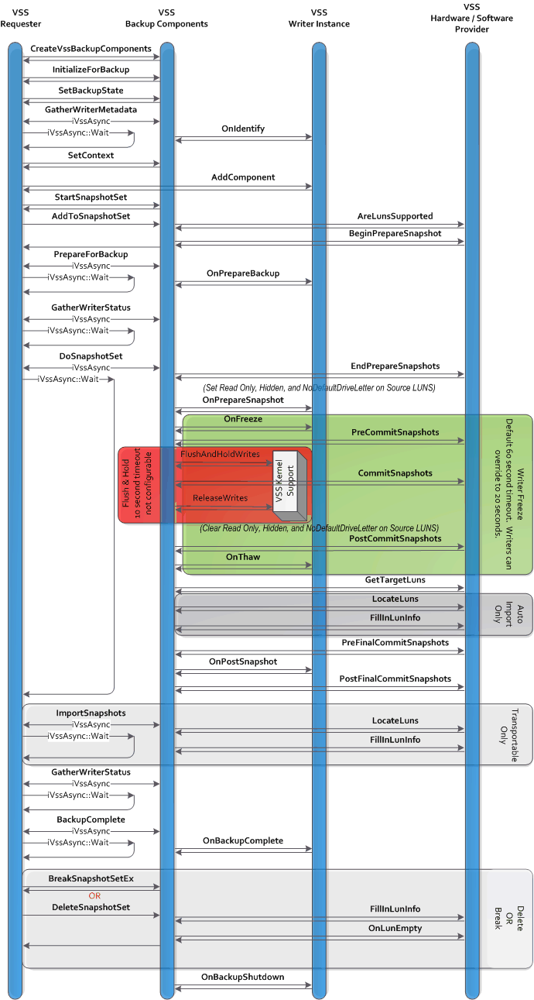

# Overview of Processing a Backup Under VSS

In processing a backup, requester and writers coordinate to provide a stable system image from which to back up data (the shadow copied volume), to group files together on the basis of their usage, and to store information on the saved data. This must all be done while creating only minimal interruption to the writer's normal work flow.

A requester queries writers for their metadata, processes this data, notifies the writers prior to the beginning of the shadow copy and of the backup operations, and then notifies the writers again after the shadow copy and backup operations end.

In response to these notifications, the writer provides information about files to be backed up—including specifying groups of files to coordinate ([*components*](vssgloss-c.md))—pauses in its I/O operations prior to a shadow copy, and then returns to normal operation following the completion of a shadow copy or at the end of the backup.

In the course of processing the backup, a writer specifies the files it is responsible for through its read-only metadata—the Writer Metadata Document (see [VSS Metadata: Working with the Writer Metadata Document](working-with-the-writer-metadata-document.md)). The requester then interprets this metadata, chooses what to back up, and stores these decisions in its own metadata object, the Backup Components Document (see [VSS Metadata: Working with the Backup Components Document](working-with-the-backup-components-document.md)). This Backup Components Document is available for writer inspection and modification during both the backup and restore operations.

This diagram shows the interactions between the requester, the VSS service, the VSS kernel support, any VSS writers involved, and any VSS hardware providers.

To more fully understand the basic tasks involved in performing a backup, it is useful to break down this overview into the following topics:

-   [Overview of Backup Initialization](overview-of-backup-initialization.md)
-   [Overview of the Backup Discovery Phase](overview-of-the-backup-discovery-phase.md)
-   [Overview of Pre-Backup Tasks](overview-of-pre-backup-tasks.md)
-   [Overview of Actual Backup Of Files](overview-of-actual-backup-of-files.md)
-   [Overview of Backup Termination](overview-of-backup-termination.md)

 

 

