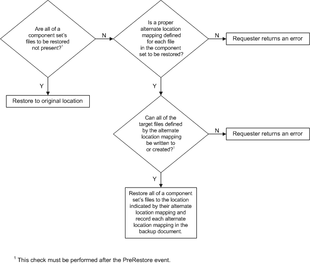
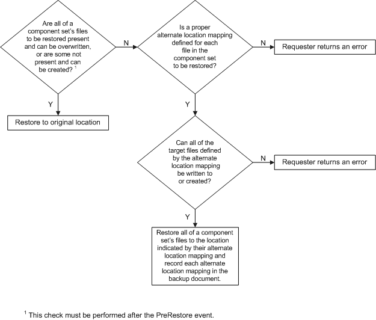
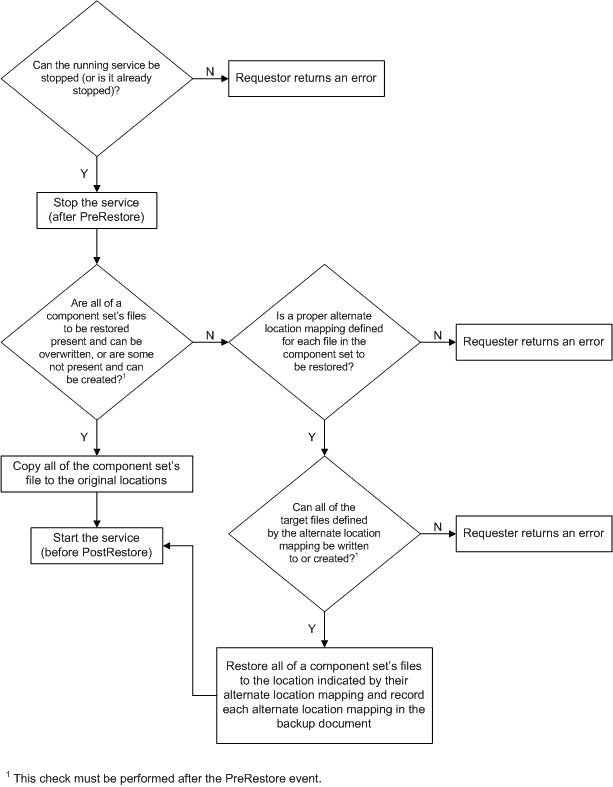
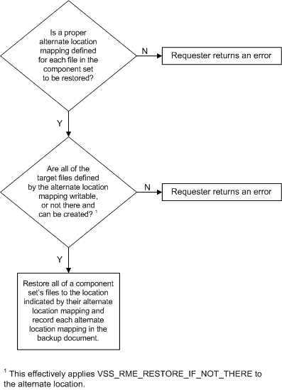
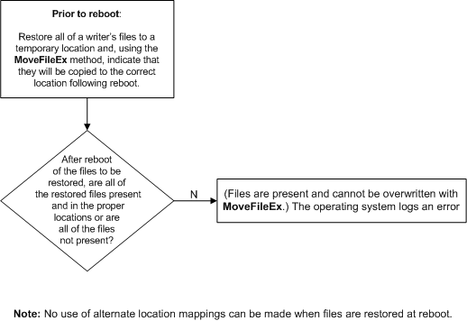
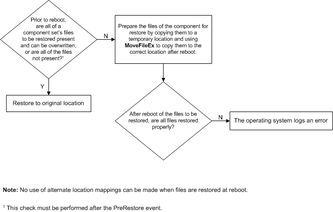

# Setting VSS Restore Methods

The configuration of restore operations actually begins during data backup, when writers specify, in their Writer Metadata Documents, how their data should be restored.

These specifications, referred to either as [*restore methods*](vssgloss-r.md) or original [*restore targets*](vssgloss-r.md), can be modified during restore by writers setting new restore targets or by requesters restoring to new locations (see [Non-Default Backup and Restore Locations](non-default-backup-and-restore-locations.md)).

By calling [**IVssCreateWriterMetadata::SetRestoreMethod**](/windows/desktop/api/VsWriter/nf-vswriter-ivsscreatewritermetadata-setrestoremethod), a writer indicates which restore method should be used in its Writer Metadata Document. The restore method is set writer wide and applied to all files in all components that a writer manages.

A requester obtains (and must respect) this information by calling [**IVssExamineWriterMetadata::GetRestoreMethod**](/windows/desktop/api/VsBackup/nf-vsbackup-ivssexaminewritermetadata-getrestoremethod).

The restore method is defined by a [**VSS\_RESTOREMETHOD\_ENUM**](/windows/desktop/api/VsWriter/ne-vswriter-vss_restoremethod_enum) enumeration, which is passed to [**IVssCreateWriterMetadata::SetRestoreMethod**](/windows/desktop/api/VsWriter/nf-vswriter-ivsscreatewritermetadata-setrestoremethod) and returned from [**IVssExamineWriterMetadata::GetRestoreMethod**](/windows/desktop/api/VsBackup/nf-vsbackup-ivssexaminewritermetadata-getrestoremethod).

The Writer Metadata Document supports the following valid restore methods (a restore method of VSS\_RME\_UNDEFINED indicates a writer error). The figures summarize how the various supported and defined restore methods should be implemented (VSS\_RME\_CUSTOM has no figure associated with it, because by definition it is specific to the writer and must follow the specific writer APIs and documentation):

-   VSS\_RME\_RESTORE\_IF\_NOT\_THERE. Restore component files to disk if none of the files are on the disk already. Target file status should be checked after a [**PreRestore**](/windows/desktop/api/VsBackup/nf-vsbackup-ivssbackupcomponents-prerestore) event.
    
-   VSS\_RME\_RESTORE\_IF\_CAN\_REPLACE. Restore files to disk if all the files can be replaced. Target file status should be checked after a [**PreRestore**](/windows/desktop/api/VsBackup/nf-vsbackup-ivssbackupcomponents-prerestore) event.
    
-   VSS\_RME\_STOP\_RESTORE\_START. A service will be stopped prior to restoring the files.
    
-   VSS\_RME\_RESTORE\_TO\_ALTERNATE\_LOCATION. Restore files to disk in an alternate location. The alternate location mappings are specified in the Writer Metadata Document.
    
-   VSS\_RME\_RESTORE\_AT\_REBOOT. Cause files to be restored (overwritten) when the computer is rebooted.
    
-   VSS\_RME\_RESTORE\_AT\_REBOOT\_IF\_CANNOT\_REPLACE. If a file could not be restored to disk on a running system, then it is restored (overwritten) when the computer is rebooted.
    
-   VSS\_RME\_CUSTOM. None of the predefined methods will work; the backup application must use specialized APIs to perform the restore operation. For this backup method, the requester must completely understand the writer in question. See [Special VSS Usage Cases](special-vss-usage-cases.md) for currently supported instances.

 

 

