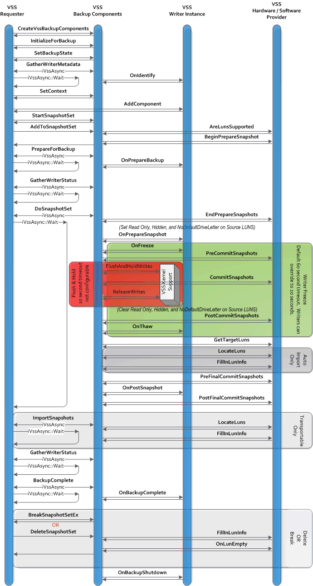

# Shadow Copy Creation for Providers

## The Shadow Copy Creation Process

A requester is the application that initiates the request to create a shadow copy. Typically the requester is a backup application. As necessary, VSS will call the providers involved. Most providers are interested in three specific requests from the requester.

1.  The requester begins the shadow copy creation activity with a call to [**IVssBackupComponents::StartSnapshotSet**](/windows/desktop/api/VsBackup/nf-vsbackup-ivssbackupcomponents-startsnapshotset). This generates a **GUID** of type **VSS\_ID** that uniquely identifies this specific shadow copy set - the SnapshotSetId. The provider is not involved in this step, but the SnapshotSetId is used extensively in all subsequent steps.
2.  For each volume it wishes to include in this shadow copy set, the requester calls [**IVssBackupComponents::AddToSnapshotSet**](/windows/desktop/api/VsBackup/nf-vsbackup-ivssbackupcomponents-addtosnapshotset). VSS determines which provider will be used to shadow copy the volume.
    -   Multiple providers may participate in a shadow copy set. For example, if the system volume and a data volume are part of the same shadow copy set, the system provider may serve as the shadow copy provider for the system volume while a hardware provider may serve as the shadow copy provider for the data volume. Both providers would be part of the same shadow copy set and the user would expect the same point-in-time consistency across both volumes.
    -   For a hardware provider to be selected, the hardware provider must be able to support all LUNs contributing to the specified volume.
    -   All registered providers are given the opportunity to indicate support for a given volume during shadow copy creation. If more than one provider indicates support, VSS will first default to hardware providers, then software providers, and finally the system provider (if no other provider indicates support for that volume).
    -   A requester may override this default order by explicitly indicating the provider it requires to create the shadow copy.
    -   If there are multiple hardware providers that support a given volume, there is no guarantee to the order in which the hardware providers will be called.
3.  After one or more calls to [**AddToSnapshotSet**](/windows/desktop/api/VsBackup/nf-vsbackup-ivssbackupcomponents-addtosnapshotset), the requester can ask for the shadow copy to be created by using the [**IVssBackupComponents::DoSnapshotSet**](/windows/desktop/api/VsBackup/nf-vsbackup-ivssbackupcomponents-dosnapshotset) method. VSS then works with the system to create the shadow copy. The **DoSnapshotSet** method performs this work asynchronously, and the requester can either poll or wait for the shadow copy creation process to complete.

This diagram shows the interactions between the requester, the VSS service, the VSS kernel support, any VSS writers involved, and any VSS hardware providers. See [The Shadow Copy Creation Process](the-shadow-copy-creation-process.md) for a detailed description of these interactions.

When the shadow copy creation process is complete, the requester can determine if the shadow copy creation was successful, and if not, determine the source of the failure.

The time interval between the freeze and thaw of the writer applications must be minimized. Provider must asynchronously start all preparation work related to the shadow copy (such as a hardware provider that uses plexes starting the synchronization) in the [**IVssHardwareSnapshotProvider::BeginPrepareSnapshot**](/windows/desktop/api/VsProv/nf-vsprov-ivsshardwaresnapshotprovider-beginpreparesnapshot) method, and then wait for the completions in the [**IVssProviderCreateSnapshotSet::EndPrepareSnapshots**](/windows/desktop/api/VsProv/nf-vsprov-ivssprovidercreatesnapshotset-endpreparesnapshots) method.

There are multiple timing limit windows that providers must follow. As a result, well-behaved providers will perform all unnecessary processing before [**IVssProviderCreateSnapshotSet::PreCommitSnapshots**](/windows/desktop/api/VsProv/nf-vsprov-ivssprovidercreatesnapshotset-precommitsnapshots) and after [**IVssProviderCreateSnapshotSet::PostCommitSnapshots**](/windows/desktop/api/VsProv/nf-vsprov-ivssprovidercreatesnapshotset-postcommitsnapshots).

The shadow copy set is fixed when [**DoSnapshotSet**](/windows/desktop/api/VsBackup/nf-vsbackup-ivssbackupcomponents-dosnapshotset) is called. Additional volumes cannot be added later because the additional volumes would not share the same point-in-time.

There is a limit of 64 volumes in the shadow copy set. A specific volume may map to an entire LUN, a portion of a LUN, or portions of multiple LUNs. Most configurations will have one volume per LUN, although arbitrary mappings are possible.

There is no limit on the number of shadow copy sets or the number of shadow copy sets of an original volume. A provider may define specific limits, or dynamically limit based on hardware resources available.

### Point-in-time for Writerless Applications

VSS includes special support that defines the point-in-time that is common for all volumes in a shadow copy set. Hardware providers do not need to directly interface with these kernel technologies, since they are invoked as part of the normal shadow copy commit processing. However, it is useful to understand the mechanisms used because it explains the definition of 'point-in-time' for writerless applications (applications that have not exposed a VSS Writer interface and therefore do not participate in the volume shadow copy creation process.)

This VSS kernel support for common point-in-time is distributed between the VolSnap.sys driver, the file systems, and VSS.

1.  Before the VSS kernel support is invoked, VSS has already:
    1.  Determined which volumes are to be involved in the shadow copy.
    2.  Determined which provider is to be used on each volume.
    3.  Frozen applications that are accepting freeze/thaw messages.
    4.  Prepared the providers for the shadow copy by calling the [**PreCommitSnapshots**](/windows/desktop/api/VsProv/nf-vsprov-ivssprovidercreatesnapshotset-precommitsnapshots) methods. All providers are now waiting to do the actual shadow copy creation.
2.  The point-in-time is then created. VSS concurrently flushes the file systems on all of the volumes that are to be shadow copied.
    1.  VSS issues an IOCTL\_VOLSNAP\_FLUSH\_AND\_HOLD\_WRITES control command on each volume that flushes the file systems. That IOCTL is passed down the storage stack to VolSnap.sys. VolSnap.sys then holds all write IRPs until step 4 below. Any file system (such as RAW) without support for this new IOCTL passes the unknown IOCTL down—where it is again held by VolSnap.sys. On NTFS volumes, the flush also commits the NTFS log.
    2.  This suspends all NTFS/FAT metadata activity; the file system metadata is cleanly committed.
    3.  The shadow copy instant: VolSnap.sys causes all subsequent write IRPs to be queued on all of the volumes that are to be shadow copied.
    4.  VolSnap.sys waits for all pending writes on the shadow copied volumes to complete. The volumes are now quiescent with respect to writes, and were quiescent at exactly the same moment on each volume. There are no guarantees about writes to user mapped sections or writes issued between (a) and (b) on file systems that do not implement the flush IOCTL (e.g. RAW).
3.  VSS instructs each provider to take in the shadow copy by calling the [**IVssProviderCreateSnapshotSet::CommitSnapshots**](/windows/desktop/api/VsProv/nf-vsprov-ivssprovidercreatesnapshotset-commitsnapshots) methods. The providers should have all preparation done so that this is a quick operation.

    Note that the I/O system is quiescent only while these [**CommitSnapshots**](/windows/desktop/api/VsProv/nf-vsprov-ivssprovidercreatesnapshotset-commitsnapshots) methods are executing. If a provider performs any synchronization of the source and shadow copy LUNs, this synchronization must be completed before the provider's **CommitSnapshots** method returns. It cannot be performed asynchronously.

4.  Immediately after the last provider's [**CommitSnapshots**](/windows/desktop/api/VsProv/nf-vsprov-ivssprovidercreatesnapshotset-commitsnapshots) method returns, VSS releases all pending write IRPs (including the IRPs that were blocking the file systems at the conclusion of their commit paths) by invoking another IRP passed to VolSnap.sys.
5.  If the shadow copy process was successful, then VSS now:
    1.  Calls [**PostCommitSnapshots**](/windows/desktop/api/VsProv/nf-vsprov-ivssprovidercreatesnapshotset-postcommitsnapshots) for the providers involved.
    2.  Calls [**CVssWriter::OnThaw**](/windows/desktop/api/VsWriter/nf-vswriter-cvsswriter-onthaw) for the writers involved.
    3.  Informs the requester that the shadow copy process has completed.

[**PreCommitSnapshots**](/windows/desktop/api/VsProv/nf-vsprov-ivssprovidercreatesnapshotset-precommitsnapshots), [**CommitSnapshots**](/windows/desktop/api/VsProv/nf-vsprov-ivssprovidercreatesnapshotset-commitsnapshots), to [**PostCommitSnapshots**](/windows/desktop/api/VsProv/nf-vsprov-ivssprovidercreatesnapshotset-postcommitsnapshots) are all time critical. All I/O from applications with writers is frozen from **PreCommitSnapshots** to **PostCommitSnapshots**; any delays affect application availability. All file I/O, including writerless application I/O, is suspended during **CommitSnapshots**.

Providers should complete all time-critical work prior to returning from [**EndPrepareSnapshots**](/windows/desktop/api/VsProv/nf-vsprov-ivssprovidercreatesnapshotset-endpreparesnapshots).

-   [**CommitSnapshots**](/windows/desktop/api/VsProv/nf-vsprov-ivssprovidercreatesnapshotset-commitsnapshots) should be returned within seconds. The **CommitSnapshots** phase is located within the Flush and Hold window. VSS kernel support will cancel the Flush and Hold that is holding the I/O if the subsequent release is not received within 10 seconds, and VSS will fail the shadow copy creation process. Other activities will be happening on the system, so a provider should not rely on having the full 10 seconds. The provider should not call Win32 APIs during commit as many will result in unexpected writes and block. If the provider takes more than a few seconds to complete the call, there is a high probability that this will fail.
-   The full sequence from [**PreCommitSnapshots**](/windows/desktop/api/VsProv/nf-vsprov-ivssprovidercreatesnapshotset-precommitsnapshots) to the return of [**PostCommitSnapshots**](/windows/desktop/api/VsProv/nf-vsprov-ivssprovidercreatesnapshotset-postcommitsnapshots) maps to the window between writers receiving the Freeze and Thaw events. The writer default for this window is 60 seconds, but a writer may override this value with a smaller timeout. For example, the Microsoft Exchange Server writer changes the timeout to 20 seconds. Providers should not spend more than a second or two in this method.

During [**CommitSnapshots**](/windows/desktop/api/VsProv/nf-vsprov-ivssprovidercreatesnapshotset-commitsnapshots) the provider must avoid any non-paging file I/O; such I/O has a very high probability of deadlocking. In particular, the provider should not synchronously write any debug or trace logs.

 

 

