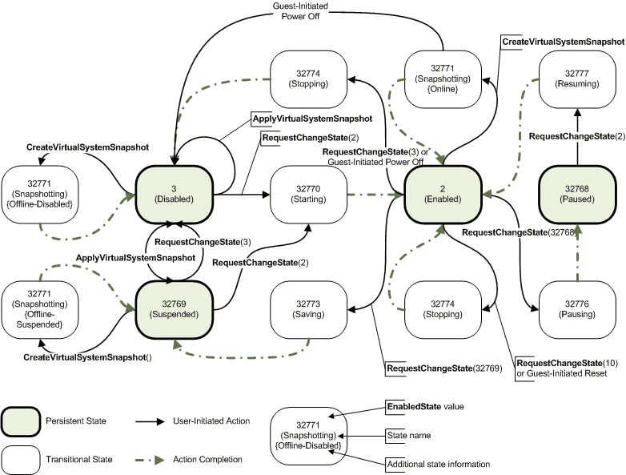

# Msvm\_ComputerSystem class

Represents a physical computer system or virtual computer system (VM).

To retrieve information for the VMMS, use [**Msvm\_VirtualSystemManagementService**](msvm-virtualsystemmanagementservice.md).

The following syntax is simplified Managed Object Format (MOF) code, and it includes all of the inherited properties.

## Syntax

``` syntax
[Dynamic, Provider("VmmsWmiInstanceAndMethodProvider"), AMENDMENT]
class Msvm_ComputerSystem : CIM_ComputerSystem
{
  string   Caption;
  string   Description;
  string   ElementName;
  datetime InstallDate;
  uint16   OperationalStatus[];
  string   StatusDescriptions[];
  string   Status;
  uint16   HealthState = 0;
  uint16   EnabledState = 5;
  string   OtherEnabledState;
  uint16   RequestedState;
  datetime TimeOfLastStateChange;
  string   Name = "GUID";
  string   PrimaryOwnerName;
  string   PrimaryOwnerContact;
  string   IdentifyingDescriptions[];
  string   OtherIdentifyingInfo[];
  uint16   Dedicated[] = 0;
  string   OtherDedicatedDescriptions[];
  uint16   ResetCapability = 1;
  uint16   PowerManagementCapabilities[];
  uint16   EnabledDefault;
  string   CreationClassName;
  string   Roles[];
  string   NameFormat;
  uint64   OnTimeInMilliseconds;
  datetime TimeOfLastConfigurationChange;
  uint32   ProcessID;
  uint16   AssignedNumaNodeList[];
};
```

## Members

The **Msvm\_ComputerSystem** class has these types of members:

-   [Methods](#methods)
-   [Properties](#properties)

### Methods

The **Msvm\_ComputerSystem** class has these methods.


| Method                                                               | Description                                                                                                                                                                                                                                                   |
|:---------------------------------------------------------------------|:--------------------------------------------------------------------------------------------------------------------------------------------------------------------------------------------------------------------------------------------------------------|
| [**RequestStateChange**](requeststatechange-msvm-computersystem.md) | Requests that the state of the computer system be changed. This method is only valid for instances of **Msvm\_ComputerSystem** that represent a VM. This method is inherited from [**CIM\_EnabledLogicalElement**](https://msdn.microsoft.com/library/mt446063).<br/> |
| **SetPowerState**                                                    | This method is not supported.<br/>                                                                                                                                                                                                                      |


 

### Properties

The **Msvm\_ComputerSystem** class has these properties.

<dl> <dt>

**AssignedNumaNodeList**
</dt> <dd> <dl> <dt>

Data type: **uint16** array
</dt> <dt>

Access type: Read-only
</dt> <dt>

Qualifiers: [**ArrayType**](https://msdn.microsoft.com/library/aa393650) ("Indexed")
</dt> </dl>

An array of NUMA nodes that are currently assigned to the VM.

</dd> <dt>

**Caption**
</dt> <dd> <dl> <dt>

Data type: **string**
</dt> <dt>

Access type: Read-only
</dt> <dt>

Qualifiers: [**MaxLen**](https://msdn.microsoft.com/library/aa393650) (64)
</dt> </dl>

A short textual description (one-line string) of the object. This property is inherited from [**CIM\_ManagedElement**](https://msdn.microsoft.com/library/cc136871) and it is set to "Virtual Machine" if the instance represents a VM or "Hosting Computer System" if the instance represents the management operating system.

</dd> <dt>

**CreationClassName**
</dt> <dd> <dl> <dt>

Data type: **string**
</dt> <dt>

Access type: Read-only
</dt> <dt>

Qualifiers: [**Key**](https://msdn.microsoft.com/library/aa392157), [**MaxLen**](https://msdn.microsoft.com/library/aa393650) (256)
</dt> </dl>

The name of the class or subclass that is used in the creation of an instance. This property is inherited from [**CIM\_System**](https://msdn.microsoft.com/library/aa388503) and it is set to "Msvm\_ComputerSystem".

</dd> <dt>

**Dedicated**
</dt> <dd> <dl> <dt>

Data type: **uint16** array
</dt> <dt>

Access type: Read-only
</dt> <dt>

Qualifiers: [**MappingStrings**](https://msdn.microsoft.com/library/aa393650) ("MIB.IETF\|MIB-II.sysServices", "FC-GS.INCITS-T11 \| Platform \| PlatformType"), [**ArrayType**](https://msdn.microsoft.com/library/aa393650) ("Indexed"), [**ModelCorrespondence**](https://msdn.microsoft.com/library/aa393650) ("[**CIM\_ComputerSystem**](cim-computersystem.md).**OtherDedicatedDescriptions**")
</dt> </dl>

Indicates whether the computer system is a special-purpose system (dedicated to a particular use), versus being a general-purpose system. This property is inherited from [**CIM\_ComputerSystem**](https://msdn.microsoft.com/library/aa387219) and it is set to 0 (Not Dedicated).

</dd> <dt>

**Description**
</dt> <dd> <dl> <dt>

Data type: **string**
</dt> <dt>

Access type: Read-only
</dt> </dl>

A textual description of the object. This property is inherited from [**CIM\_ManagedElement**](https://msdn.microsoft.com/library/cc136871) and it is set to "Microsoft Virtual Computer System" if the instance represents a VM or "Microsoft Hosting Computer System" if the instance represents the management operating system.

</dd> <dt>

**ElementName**
</dt> <dd> <dl> <dt>

Data type: **string**
</dt> <dt>

Access type: Read-only
</dt> </dl>

A user-friendly name for the object. This property is inherited from [**CIM\_ManagedElement**](https://msdn.microsoft.com/library/cc136871) and it is set to the display name of the computer for a VM or the NetBIOS name of the management operating system.

</dd> <dt>

**EnabledDefault**
</dt> <dd> <dl> <dt>

Data type: **uint16**
</dt> <dt>

Access type: Read/write
</dt> </dl>

An administrator's default or startup configuration for the enabled state of an element. This property is inherited from [**CIM\_EnabledLogicalElement**](https://msdn.microsoft.com/library/mt446063) and it is always set to 2 (Enabled).

</dd> <dt>

**EnabledState**
</dt> <dd> <dl> <dt>

Data type: **uint16**
</dt> <dt>

Access type: Read-only
</dt> <dt>

Qualifiers: [**ModelCorrespondence**](https://msdn.microsoft.com/library/aa393650) ("[**CIM\_EnabledLogicalElement**](cim-enabledlogicalelement.md).**OtherEnabledState**")
</dt> </dl>

The enabled and disabled states of an element. It can also indicate the transitions between these requested states. This property is inherited from [**CIM\_EnabledLogicalElement**](https://msdn.microsoft.com/library/mt446063) and it is set to 2 (Enabled) for a physical computer or one of the following values for a VM. For a graphical view of these states, please see the Remarks section.

The possible values are.

<dt>

<span id="Unknown"></span><span id="unknown"></span><span id="UNKNOWN"></span>

<span id="Unknown"></span><span id="unknown"></span><span id="UNKNOWN"></span>**Unknown** (0)


</dt> <dd>

Indicates that the state of the VM cannot be determined.

</dd> <dt>

<span id="Other"></span><span id="other"></span><span id="OTHER"></span>

<span id="Other"></span><span id="other"></span><span id="OTHER"></span>**Other** (1)


</dt> <dd>

Indicates that the state of the VM is described in the **OtherEnabledState** property.

</dd> <dt>

<span id="Enabled"></span><span id="enabled"></span><span id="ENABLED"></span>

<span id="Enabled"></span><span id="enabled"></span><span id="ENABLED"></span>**Enabled** (2)


</dt> <dd>

Indicates that the VM is running.

</dd> <dt>

<span id="Disabled"></span><span id="disabled"></span><span id="DISABLED"></span>

<span id="Disabled"></span><span id="disabled"></span><span id="DISABLED"></span>**Disabled** (3)


</dt> <dd>

Indicates that the VM is turned off

</dd> <dt>

<span id="Shutting_Down"></span><span id="shutting_down"></span><span id="SHUTTING_DOWN"></span>

<span id="Shutting_Down"></span><span id="shutting_down"></span><span id="SHUTTING_DOWN"></span>**Shutting Down** (4)


</dt> <dd>

Indicates that the VM is in the process of changing to a **Disabled** state.

</dd> <dt>

<span id="Not_Applicable"></span><span id="not_applicable"></span><span id="NOT_APPLICABLE"></span>

<span id="Not_Applicable"></span><span id="not_applicable"></span><span id="NOT_APPLICABLE"></span>**Not Applicable** (5)


</dt> <dd>

Indicates the VM does not support to be enabled or disabled.

</dd> <dt>

<span id="Enabled_but_Offline"></span><span id="enabled_but_offline"></span><span id="ENABLED_BUT_OFFLINE"></span>

<span id="Enabled_but_Offline"></span><span id="enabled_but_offline"></span><span id="ENABLED_BUT_OFFLINE"></span>**Enabled but Offline** (6)


</dt> <dd>

Indicates that the VM might be completing commands and that it drops any new requests.

</dd> <dt>

<span id="In_Test"></span><span id="in_test"></span><span id="IN_TEST"></span>

<span id="In_Test"></span><span id="in_test"></span><span id="IN_TEST"></span>**In Test** (7)


</dt> <dd>

Indicates that the VM is in a saved state.

</dd> <dt>

<span id="Deferred"></span><span id="deferred"></span><span id="DEFERRED"></span>

<span id="Deferred"></span><span id="deferred"></span><span id="DEFERRED"></span>**Deferred** (8)


</dt> <dd>

Indicates that the VM might be completing commands, but that it queues any new requests.

</dd> <dt>

<span id="Quiesce"></span><span id="quiesce"></span><span id="QUIESCE"></span>

<span id="Quiesce"></span><span id="quiesce"></span><span id="QUIESCE"></span>**Quiesce** (9)


</dt> <dd>

Indicates that the VM is enabled but is in a restricted mode.

</dd> <dt>

<span id="Starting"></span><span id="starting"></span><span id="STARTING"></span>

<span id="Starting"></span><span id="starting"></span><span id="STARTING"></span>**Starting** (10)


</dt> <dd>

The VM is starting. This is a transitional state between 3 (Disabled) and 2 (Enabled) initiated by a call to the [**RequestStateChange**](requeststatechange-msvm-computersystem.md) method with a *RequestedState* parameter of 2 (Enabled).

</dd> <dt>

<span id="DMTF_Reserved"></span><span id="dmtf_reserved"></span><span id="DMTF_RESERVED"></span>

<span id="DMTF_Reserved"></span><span id="dmtf_reserved"></span><span id="DMTF_RESERVED"></span>**DMTF Reserved**


</dt> <dd>

Reserved.

</dd> <dt>

<span id="Vendor_Reserved"></span><span id="vendor_reserved"></span><span id="VENDOR_RESERVED"></span>

<span id="Vendor_Reserved"></span><span id="vendor_reserved"></span><span id="VENDOR_RESERVED"></span>**Vendor Reserved**


</dt> <dd>

Reserved.

</dd> </dl>

</dd> <dt>

**HealthState**
</dt> <dd> <dl> <dt>

Data type: **uint16**
</dt> <dt>

Access type: Read-only
</dt> </dl>

The current health of the element. This attribute expresses the health of this element but not necessarily that of its subcomponents. The possible values are 5 and 25, where 5 means the element is entirely healthy and 25 means there is a critical error.

When a critical error occurs, check the event log for details. The **EnabledState** property can also contain more information. For example, when disk space is critically low, **HealthState** is set to 25, the VM pauses, and **EnabledState** is set to 32768 (Paused).

This property is inherited from [**CIM\_ManagedSystemElement**](https://msdn.microsoft.com/library/aa387898).

<dt>

<span id="Unknown"></span><span id="unknown"></span><span id="UNKNOWN"></span>

<span id="Unknown"></span><span id="unknown"></span><span id="UNKNOWN"></span>**Unknown** (0)


</dt> <dd>

The implementation cannot report on **HealthState** at this time.

</dd> <dt>

<span id="OK"></span><span id="ok"></span>

<span id="OK"></span><span id="ok"></span>**OK** (5)


</dt> <dd>

The VM is fully functional and is operating within normal operational parameters and without error.

</dd> <dt>

<span id="Critical_failure"></span><span id="critical_failure"></span><span id="CRITICAL_FAILURE"></span>

<span id="Critical_failure"></span><span id="critical_failure"></span><span id="CRITICAL_FAILURE"></span>**Critical failure** (25)


</dt> <dd>

The element is nonfunctional, and recovery might not be possible. This can indicate that the worker process for the VM (Vmwp.exe) is not responding to control or information requests, or that one or more disks containing the VHDs for the VM are low on disk space.

</dd> </dl>

</dd> <dt>

**IdentifyingDescriptions**
</dt> <dd> <dl> <dt>

Data type: **string** array
</dt> <dt>

Access type: Read-only
</dt> <dt>

Qualifiers: [**ArrayType**](https://msdn.microsoft.com/library/aa393650) ("Indexed"), [**ModelCorrespondence**](https://msdn.microsoft.com/library/aa393650) ("[**CIM\_ComputerSystem**](cim-computersystem.md).**OtherIdentifyingInfo**")
</dt> </dl>

This property is inherited from [**CIM\_ComputerSystem**](https://msdn.microsoft.com/library/aa387219) and it is set to **NULL**.

</dd> <dt>

**InstallDate**
</dt> <dd> <dl> <dt>

Data type: **datetime**
</dt> <dt>

Access type: Read-only
</dt> <dt>

Qualifiers: [**MappingStrings**](https://msdn.microsoft.com/library/aa393650) ("MIF.DMTF\|ComponentID\|001.5")
</dt> </dl>

The date and time the VM configuration was created for a VM or **NULL** for a management operating system. This property is inherited from [**CIM\_ManagedSystemElement**](https://msdn.microsoft.com/library/aa387898).

</dd> <dt>

**Name**
</dt> <dd> <dl> <dt>

Data type: **string**
</dt> <dt>

Access type: Read-only
</dt> <dt>

Qualifiers: [**Key**](https://msdn.microsoft.com/library/aa392157), [**MaxLen**](https://msdn.microsoft.com/library/aa393650) (256)
</dt> </dl>

The label by which the object is known. This property is inherited from [**CIM\_System**](https://msdn.microsoft.com/library/aa388503) and it is set to "*GUID*". This corresponds to the **SystemName** properties of the [**Msvm\_VirtualSystemGlobalSettingData**](msvm-virtualsystemglobalsettingdata.md) and [**Msvm\_VirtualSystemSettingData**](msvm-virtualsystemsettingdata.md) classes.

</dd> <dt>

**NameFormat**
</dt> <dd> <dl> <dt>

Data type: **string**
</dt> <dt>

Access type: Read-only
</dt> </dl>

A string that identifies how the system name was generated, using the subclass heuristic. This property is inherited from [**CIM\_ComputerSystem**](https://msdn.microsoft.com/library/aa387219) and it is set to **NULL**.

</dd> <dt>

**OnTimeInMilliseconds**
</dt> <dd> <dl> <dt>

Data type: **uint64**
</dt> <dt>

Access type: Read-only
</dt> <dt>

Qualifiers: [**Units**](https://msdn.microsoft.com/library/aa393650) ("MilliSeconds")
</dt> </dl>

For the VM, this property describes the total up time, in milliseconds, since the machine was last turned on, reset, or restored. This time excludes the time the VM was in the paused state. For the management operating system, this property is set to **NULL**.

</dd> <dt>

**OperationalStatus**
</dt> <dd> <dl> <dt>

Data type: **uint16** array
</dt> <dt>

Access type: Read-only
</dt> <dt>

Qualifiers: [**ArrayType**](https://msdn.microsoft.com/library/aa393650) ("Indexed"), [**ModelCorrespondence**](https://msdn.microsoft.com/library/aa393650) ("[**CIM\_ManagedSystemElement**](cim-managedsystemelement.md).**StatusDescriptions**")
</dt> </dl>

An array containing the current statuses of the object. This property is inherited from [**CIM\_ManagedSystemElement**](https://msdn.microsoft.com/library/aa387898). The value at index zero (0) is one of the following values.

The possible values are.

<dt>

<span id="OK"></span><span id="ok"></span>

<span id="OK"></span><span id="ok"></span>**OK** (2)


</dt> <dd>

The VM is functional and operating normally.

</dd> <dt>

<span id="Degraded"></span><span id="degraded"></span><span id="DEGRADED"></span>

<span id="Degraded"></span><span id="degraded"></span><span id="DEGRADED"></span>**Degraded** (3)


</dt> <dd>

The VM is only partially functional. This indicates that the storage containing the configuration is not accessible. A VM in this state may only be turned off or deleted.

**Windows Server 2008:  **

This value is not supported before Windows Server 2008 R2.

</dd> <dt>

<span id="Predictive_Failure"></span><span id="predictive_failure"></span><span id="PREDICTIVE_FAILURE"></span>

<span id="Predictive_Failure"></span><span id="predictive_failure"></span><span id="PREDICTIVE_FAILURE"></span>**Predictive Failure** (5)


</dt> <dd>

The VM is functional but may fail in the future. This indicates that the storage containing the VM's virtual hard disks is low on free space. The VM will be paused if more disk space is not made available.

**Windows Server 2008:  **

This value is not supported before Windows Server 2008 R2.

</dd> <dt>

<span id="Stopped"></span><span id="stopped"></span><span id="STOPPED"></span>

<span id="Stopped"></span><span id="stopped"></span><span id="STOPPED"></span>**Stopped** (10)


</dt> <dd>

This value is not supported. If the VM is stopped, the **EnabledState** property will have a value of 3 (Disabled).

**Windows Server 2008:  **

This value is supported and indicates that the virtual machine is stopped.

</dd> <dt>

<span id="In_Service"></span><span id="in_service"></span><span id="IN_SERVICE"></span>

<span id="In_Service"></span><span id="in_service"></span><span id="IN_SERVICE"></span>**In Service** (11)


</dt> <dd>

The VM is processing a request.

</dd> <dt>

<span id="Dormant"></span><span id="dormant"></span><span id="DORMANT"></span>

<span id="Dormant"></span><span id="dormant"></span><span id="DORMANT"></span>**Dormant** (15)


</dt> <dd>

This value is not supported. If the VM is suspended or paused, the **EnabledState** property will have a value of 32769 (Suspended) or 32768 (Paused).

**Windows Server 2008:  **

This value is supported and indicates that the VM is suspended or paused.

</dd> </dl>

The value at index one (1) is optional and contains secondary status information. A client should use the primary status from index zero (0) to determine whether a new request can be issued to the VM. If **OperationalStatus**\[0\] is 2 (OK), then the operation indicated by **OperationalStatus**\[1\] can be interrupted.

**Windows Server 2008:  **

This value at index one (1) is not supported before Windows Server 2008 R2.

The values at **OperationalStatus**\[1\] is one of the following values.


| Value                                                                                                                                                                                                                                                                                                   | Meaning                                                                                                                                                                                                                                           |
|---------------------------------------------------------------------------------------------------------------------------------------------------------------------------------------------------------------------------------------------------------------------------------------------------------|---------------------------------------------------------------------------------------------------------------------------------------------------------------------------------------------------------------------------------------------------|
| <span id="Creating_Snapshot"></span><span id="creating_snapshot"></span><span id="CREATING_SNAPSHOT"></span><dl> <dt>**Creating Snapshot**</dt> <dt>32768</dt> </dl>                                 | A snapshot is in the process of being created for the VM.<br/>                                                                                                                                                                              |
| <span id="Applying_Snapshot"></span><span id="applying_snapshot"></span><span id="APPLYING_SNAPSHOT"></span><dl> <dt>**Applying Snapshot**</dt> <dt>32769</dt> </dl>                                 | A snapshot is in the process of being applied to the VM.<br/>                                                                                                                                                                               |
| <span id="Deleting_Snapshot"></span><span id="deleting_snapshot"></span><span id="DELETING_SNAPSHOT"></span><dl> <dt>**Deleting Snapshot**</dt> <dt>32770</dt> </dl>                                 | A snapshot is in the process of being deleted from the VM.<br/>                                                                                                                                                                             |
| <span id="Waiting_to_Start"></span><span id="waiting_to_start"></span><span id="WAITING_TO_START"></span><dl> <dt>**Waiting to Start**</dt> <dt>32771</dt> </dl>                                     | The VM will be started after the automatic startup delay configured through the **AutomaticStartupActionDelay** property of the [**Msvm\_VirtualSystemGlobalSettingData**](msvm-virtualsystemglobalsettingdata.md) class has elapsed.<br/> |
| <span id="Merging_Disks"></span><span id="merging_disks"></span><span id="MERGING_DISKS"></span><dl> <dt>**Merging Disks**</dt> <dt>32772</dt> </dl>                                                 | Virtual hard disks from previously deleted snapshots are being merged.<br/>                                                                                                                                                                 |
| <span id="Exporting_Virtual_Machine"></span><span id="exporting_virtual_machine"></span><span id="EXPORTING_VIRTUAL_MACHINE"></span><dl> <dt>**Exporting Virtual Machine**</dt> <dt>32773</dt> </dl> | The VM is being exported.<br/>                                                                                                                                                                                                              |
| <span id="Migrating_Virtual_Machine"></span><span id="migrating_virtual_machine"></span><span id="MIGRATING_VIRTUAL_MACHINE"></span><dl> <dt>**Migrating Virtual Machine**</dt> <dt>32774</dt> </dl> | The VM is being migrated live from one physical computer to another.<br/>                                                                                                                                                                   |


 

</dd> <dt>

**OtherDedicatedDescriptions**
</dt> <dd> <dl> <dt>

Data type: **string** array
</dt> <dt>

Access type: Read-only
</dt> <dt>

Qualifiers: [**ArrayType**](https://msdn.microsoft.com/library/aa393650) ("Indexed"), [**ModelCorrespondence**](https://msdn.microsoft.com/library/aa393650) ("[**CIM\_ComputerSystem**](cim-computersystem.md).**Dedicated**")
</dt> </dl>

A string that describes how or why the system is dedicated when the **Dedicated** array includes the value 2 (Other). This property is inherited from [**CIM\_ComputerSystem**](https://msdn.microsoft.com/library/aa387219) and it is set to **NULL**.

</dd> <dt>

**OtherEnabledState**
</dt> <dd> <dl> <dt>

Data type: **string**
</dt> <dt>

Access type: Read-only
</dt> <dt>

Qualifiers: [**ModelCorrespondence**](https://msdn.microsoft.com/library/aa393650) ("[**CIM\_EnabledLogicalElement**](cim-enabledlogicalelement.md).**EnabledState**")
</dt> </dl>

The enabled or disabled state of the VM when the **EnabledState** property is set to 1 (Other). This property must be set to **NULL** when **EnabledState** is any value other than 1. This property is inherited from [**CIM\_EnabledLogicalElement**](https://msdn.microsoft.com/library/mt446063) and it is always set to **NULL**.

</dd> <dt>

**OtherIdentifyingInfo**
</dt> <dd> <dl> <dt>

Data type: **string** array
</dt> <dt>

Access type: Read-only
</dt> <dt>

Qualifiers: [**MaxLen**](https://msdn.microsoft.com/library/aa393650) (256), [**ArrayType**](https://msdn.microsoft.com/library/aa393650) ("Indexed"), [**ModelCorrespondence**](https://msdn.microsoft.com/library/aa393650) ("[**CIM\_ComputerSystem**](cim-computersystem.md).**IdentifyingDescriptions**")
</dt> </dl>

This property is inherited from [**CIM\_ComputerSystem**](https://msdn.microsoft.com/library/aa387219) and it is set to **NULL**.

</dd> <dt>

**PowerManagementCapabilities**
</dt> <dd> <dl> <dt>

Data type: **uint16** array
</dt> <dt>

Access type: Read-only
</dt> <dt>

Qualifiers: [**Deprecated**](https://msdn.microsoft.com/library/aa393651) ("CIM\_PowerManagementCapabilities.PowerCapabilities"), [**MappingStrings**](https://msdn.microsoft.com/library/aa393650) ("MIF.DMTF\|System Power Controls\|001.2")
</dt> </dl>

This property is inherited from [**CIM\_ComputerSystem**](https://msdn.microsoft.com/library/aa387219) but it is not used.

</dd> <dt>

**PrimaryOwnerContact**
</dt> <dd> <dl> <dt>

Data type: **string**
</dt> <dt>

Access type: Read/write
</dt> <dt>

Qualifiers: [**MaxLen**](https://msdn.microsoft.com/library/aa393650) (256), [**MappingStrings**](https://msdn.microsoft.com/library/aa393650) ("MIF.DMTF\|General Information\|001.4")
</dt> </dl>

A string that indicates how the primary system owner can be reached (for example, a phone number or an email address). This property is inherited from [**CIM\_System**](https://msdn.microsoft.com/library/aa388503) and it is set to **NULL**.

</dd> <dt>

**PrimaryOwnerName**
</dt> <dd> <dl> <dt>

Data type: **string**
</dt> <dt>

Access type: Read/write
</dt> <dt>

Qualifiers: [**MaxLen**](https://msdn.microsoft.com/library/aa393650) (64), [**MappingStrings**](https://msdn.microsoft.com/library/aa393650) ("MIF.DMTF\|General Information\|001.3")
</dt> </dl>

The name of the primary system owner. This property is inherited from [**CIM\_System**](https://msdn.microsoft.com/library/aa388503) and it is set to **NULL**.

</dd> <dt>

**ProcessID**
</dt> <dd> <dl> <dt>

Data type: **uint32**
</dt> <dt>

Access type: Read-only
</dt> </dl>

The identifier of the process under which this VM is running. This value can be used to uniquely identify the instance of Vmwp.exe on the system that is running the VM.

</dd> <dt>

**RequestedState**
</dt> <dd> <dl> <dt>

Data type: **uint16**
</dt> <dt>

Access type: Read-only
</dt> <dt>

Qualifiers: [**ModelCorrespondence**](https://msdn.microsoft.com/library/aa393650) ("[**CIM\_EnabledLogicalElement**](cim-enabledlogicalelement.md).**EnabledState**")
</dt> </dl>

The last requested or desired state for the VM as passed to the [**RequestStateChange**](requeststatechange-msvm-computersystem.md) method, or 12 (Not Applicable) if no state change is in progress. The actual state of the element is represented by **EnabledState**. This property is provided to compare the last requested and current enabled or disabled states. This property is inherited from [**CIM\_EnabledLogicalElement**](https://msdn.microsoft.com/library/mt446063).

**Windows Server 2008:  **

This property is not supported before Windows Server 2008 R2 and is always set to 12 (Not Applicable).

</dd> <dt>

**ResetCapability**
</dt> <dd> <dl> <dt>

Data type: **uint16**
</dt> <dt>

Access type: Read-only
</dt> <dt>

Qualifiers: [**MappingStrings**](https://msdn.microsoft.com/library/aa393650) ("MIF.DMTF\|System Hardware Security\|001.4")
</dt> </dl>

This property is inherited from [**CIM\_ComputerSystem**](https://msdn.microsoft.com/library/aa387219) and it is set to 1 (Other).

<dt>

<span id="Other"></span><span id="other"></span><span id="OTHER"></span>

<span id="Other"></span><span id="other"></span><span id="OTHER"></span>**Other** (1)


</dt> <dd>

Other.

</dd> </dl>

</dd> <dt>

**Roles**
</dt> <dd> <dl> <dt>

Data type: **string** array
</dt> <dt>

Access type: Read/write
</dt> </dl>

An array of strings that describe the roles the system plays in the information technology environment. This property is inherited from [**CIM\_System**](https://msdn.microsoft.com/library/aa388503) and it is set to **NULL**.

</dd> <dt>

**Status**
</dt> <dd> <dl> <dt>

Data type: **string**
</dt> <dt>

Access type: Read-only
</dt> <dt>

Qualifiers: [**Deprecated**](https://msdn.microsoft.com/library/aa393651) ("[**CIM\_ManagedSystemElement**](cim-managedsystemelement.md).**OperationalStatus**"), [**MaxLen**](https://msdn.microsoft.com/library/aa393650) (10)
</dt> </dl>

This property is inherited from [**CIM\_ManagedSystemElement**](https://msdn.microsoft.com/library/aa387898) but it is not used.

</dd> <dt>

**StatusDescriptions**
</dt> <dd> <dl> <dt>

Data type: **string** array
</dt> <dt>

Access type: Read-only
</dt> <dt>

Qualifiers: [**ArrayType**](https://msdn.microsoft.com/library/aa393650) ("Indexed"), [**ModelCorrespondence**](https://msdn.microsoft.com/library/aa393650) ("[**CIM\_ManagedSystemElement**](cim-managedsystemelement.md).**OperationalStatus**")
</dt> </dl>

An array containing strings that describe the corresponding **OperationalStatus** array values. For example, if 11 (In Service) is the value assigned to **OperationalStatus**\[0\], then **StatusDescriptions**\[0\] may contain an explanation as to why the VM is processing a request. This property is inherited from [**CIM\_ManagedSystemElement**](https://msdn.microsoft.com/library/aa387898).

</dd> <dt>

**TimeOfLastConfigurationChange**
</dt> <dd> <dl> <dt>

Data type: **datetime**
</dt> <dt>

Access type: Read-only
</dt> </dl>

The date and time when the VM configuration file was last modified. The configuration file is modified during certain VM operations, as well as when any of the VM or device settings are added, modified, or removed.

</dd> <dt>

**TimeOfLastStateChange**
</dt> <dd> <dl> <dt>

Data type: **datetime**
</dt> <dt>

Access type: Read-only
</dt> </dl>

The date or time when the enabled state of the element last changed. This property is inherited from [**CIM\_EnabledLogicalElement**](https://msdn.microsoft.com/library/mt446063).

</dd> </dl>

## Remarks

The following illustration shows the **EnabledState** values for Windows Server 2008 R2.


**Windows Server 2008:  **

The following illustration shows the **EnabledState** values for Windows Server 2008.



When a property of the **Msvm\_ComputerSystem** class changes, the WMI provider indicates an [**\_\_InstanceModificationEvent**](https://msdn.microsoft.com/library/aa394651) event that describes the changes. The previous state is contained in the **PreviousInstance** property, and the new state is contained in the **TargetInstance** property. This event is asynchronous; by the time the **\_\_InstanceModificationEvent** event is processed, the **TargetInstance** property may not reflect the current state.

Access to the **Msvm\_ComputerSystem** class might be restricted by UAC Filtering. For more information, see [User Account Control and WMI](https://msdn.microsoft.com/library/aa826699).

## Examples

See [Querying Networking Objects](querying-networking-objects.md).

## Requirements


|                                     |                                                                                                      |
|-------------------------------------|------------------------------------------------------------------------------------------------------|
| Minimum supported client<br/> | None supported<br/>                                                                            |
| Minimum supported server<br/> | Windows Server 2008<br/>                                                                       |
| End of client support<br/>    | None supported<br/>                                                                            |
| End of server support<br/>    | Windows Server 2012 R2<br/>                                                                    |
| Namespace<br/>                | Root\\Virtualization<br/>                                                                      |
| MOF<br/>                      | <dl> <dt>WindowsVirtualization.mof</dt> </dl> |


## See also

<dl> <dt>

[**CIM\_ComputerSystem**](cim-computersystem.md)
</dt> <dt>

[**CIM\_ComputerSystem**](https://msdn.microsoft.com/library/aa387219)
</dt> <dt>

[**\_\_InstanceModificationEvent**](https://msdn.microsoft.com/library/aa394651)
</dt> <dt>

[**Msvm\_ComputerSystem (V2)**](https://msdn.microsoft.com/library/windows/desktop/hh850116)
</dt> <dt>

[Virtual System Classes](virtual-system-classes.md)
</dt> </dl>

 

 


