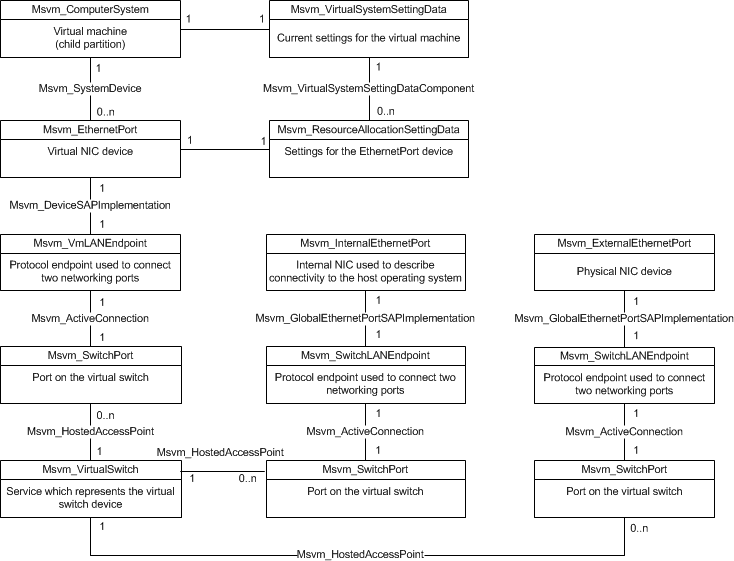

# Networking

The networking profile describes the objects used for configuring the system to allow virtual machines to communicate over the network. The global networking objects, used to configure the network switch in the management operating system, include the [**Msvm\_VirtualSwitchManagementService**](msvm-virtualswitchmanagementservice.md), [**Msvm\_VirtualSwitch**](msvm-virtualswitch.md), and [**Msvm\_SwitchPort**](msvm-switchport.md) classes. The virtual machine networking objects, used to configure the network interface card (NIC) in the virtual machine, include the [**Msvm\_EmulatedEthernetPort**](msvm-emulatedethernetport.md), [**Msvm\_ResourceAllocationSettingData**](msvm-resourceallocationsettingdata.md), [**Msvm\_VmLANEndpoint**](msvm-vmlanendpoint.md) and [**Msvm\_SwitchLANEndpoint**](msvm-switchlanendpoint.md) classes. The following illustration shows the Virtual Networking Profile.

The root of the global networking profile is the [**Msvm\_VirtualSwitch**](msvm-virtualswitch.md) class. This class represents a virtual switch device in the management operating system. **Msvm\_VirtualSwitch** is associated with instances of the [**Msvm\_SwitchPort**](msvm-switchport.md) class, which represents the ports on the virtual switch. Instances of the **Msvm\_VirtualSwitch** and **Msvm\_SwitchPort** classes are created, deleted, and connected via the [**Msvm\_VirtualSwitchManagementService**](msvm-virtualswitchmanagementservice.md) class (not shown in the illustration earlier).

Virtual Switch Management Service (VSMS) represents the networking service present on a single Hyper-V host and contains methods for [**Msvm\_VirtualSwitchManagementService**](msvm-virtualswitchmanagementservice.md) used to control the definition, modification, and destruction of global networking resources such as virtual switches, switch ports and internal Ethernet ports.

The representation of the Ethernet NIC device in the virtual machine looks very similar to that of any other device, as described in the [**Virtual System Management Service**](virtual-system-management-service.md). The [**Msvm\_EmulatedEthernetPort**](msvm-emulatedethernetport.md) and [**Msvm\_SyntheticEthernetPort**](msvm-syntheticethernetport.md) classes represent the virtual NIC device, and are configured via an associated Resource Allocation Setting Data (RASD) instance. The only unusual characteristic of this representation is that, when the virtual machine is instantiated and in turn creates the **Msvm\_EmulatedEthernetPort** and **Msvm\_SyntheticEthernetPort** devices, it also creates an associated [**Msvm\_VmLANEndpoint**](msvm-vmlanendpoint.md) instance for the virtual NIC. Similarly, when the virtual machine is saved or turned off and the **Msvm\_EmulatedEthernetPort** and **Msvm\_SyntheticEthernetPort** instances are destroyed, the associated **Msvm\_VmLANEndpoint** instance is also destroyed. The purpose of the **Msvm\_VmLANEndpoint** is to serve as a bridge for connecting two networking ports to each other. In this case, it is used to connect a virtual NIC to a port on the virtual switch device. In other words, it connects the **Msvm\_EmulatedEthernetPort** and **Msvm\_SyntheticEthernetPort** instances on the virtual machine to a particular [**Msvm\_SwitchPort**](msvm-switchport.md) instance on the virtual switch. To connect a switch to the outside, you must bind the physical Ethernet port to the [**Msvm\_VirtualSwitch**](msvm-virtualswitch.md) through [**BindExternalEthernetPort**](bindexternalethernetport-msvm-virtualswitchmanagementservice.md). Adversely, when connecting a switch to the host networking stack, or internal NIC, use ConnectInternal to have a virtual machine talk to the host and not the outside world. [**Msvm\_ActiveConnection**](msvm-activeconnection.md) connects a switch port to the [**Msvm\_SwitchLANEndpoint**](msvm-switchlanendpoint.md) to which the port is connected inside of Hyper-V. The existence of this object means that the switch port and the **Msvm\_SwitchLANEndpoint** are actively connected and the Ethernet port associated with **Msvm\_VmLANEndpoint** can communicate with the network through the switch port.

 

 

