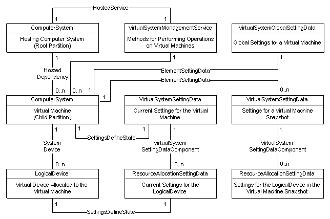

# Virtual System Management Service

The Virtual System Profile describes the objects which make up a virtual machine. These objects include the base system, the devices that make up the system, the settings for the system and its devices, and the management service that performs operations on the system. The following illustration shows the Virtual System Profile.

The physical computer and its hosted virtual machines are each represented by the [**Msvm\_ComputerSystem**](msvm-computersystem.md) class. The **Msvm\_ComputerSystem** instance representing the physical computer is associated, via the [**Msvm\_HostedDependency**](msvm-hosteddependency.md) association, to the **Msvm\_ComputerSystem** instances representing the virtual machines on the physical computer.

Each virtual machine is associated with a [**Msvm\_VirtualSystemGlobalSettingData**](msvm-virtualsystemglobalsettingdata.md) (VSGSD) instances and one or more [**Msvm\_VirtualSystemSettingData**](msvm-virtualsystemsettingdata.md) (VSSD) instances. For each VSSD there is a series of [**Msvm\_ResourceAllocationSettingData**](msvm-resourceallocationsettingdata.md) (RASD) objects. The RASD objects describe the settings for each device in a virtual machine. Together, the VSGSD, VSSDs and RASDs describe the configuration of the virtual machine.

The VSGSD represents the global settings for a virtual machine. These settings are independent of those described in the VSSD, and thus do not change if a snapshot is applied to the virtual machine. The VSSD is used to describe the virtualization-specific settings of a virtual machine. An instance of the VSSD may describe either the current settings for the virtual machine, or the settings of the virtual machine at the time of a snapshot.

None of the objects in the model support direct creation, modification or deletion through intrinsic Put or Delete operations. Instead, the [**Msvm\_VirtualSystemManagementService**](msvm-virtualsystemmanagementservice.md) (VSMS) contains methods to manipulate the objects.

 

 

