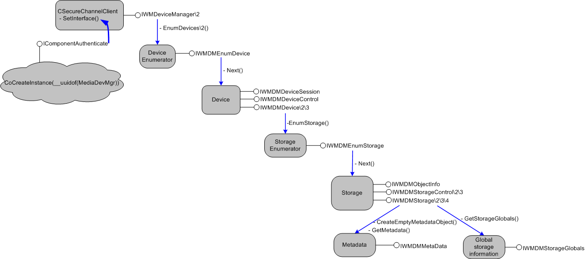

# Interfaces for Applications

This section describes interfaces used or implemented by applications using the Windows Media Device Manager SDK to communicate with devices. The term "application" used here means any executable, plug-in, or COM object that exists on a desktop computer and needs high-level communication with a connected portable device. This can include a media player application, a Windows Media Player plug-in (if it needs direct access to a portable device), or a play-count metering COM object.

Some of these interfaces are implemented by the application, while others are called by the application. The documentation for each interface indicates whether it is implemented or called (and if implemented, whether it is optional or required).

The following interfaces or classes are used by applications.

| Interface or class                                           | Description                                                                                                                                                                                                         |
|--------------------------------------------------------------|---------------------------------------------------------------------------------------------------------------------------------------------------------------------------------------------------------------------|
| [CSecureChannelClient Class](csecurechannelclient-class.md) | A helper class that enables applications to authenticate themselves, encrypt and decrypt data, and create MACs.                                                                                                     |
| [**IWMDeviceManager**](iwmdevicemanager.md)                 | The top level Windows Media Device Manager interface for applications.                                                                                                                                              |
| [**IWMDeviceManager2**](iwmdevicemanager2.md)               | Extends **IWMDeviceManager** by providing advanced enumeration methods and other methods.                                                                                                                           |
| [**IWMDeviceManager3**](iwmdevicemanager3.md)               | Extends the **IWMDeviceManager2** interface by providing a method that sets the device enumeration preference.                                                                                                      |
| [**IWMDMDevice**](iwmdmdevice.md)                           | Provides methods to examine and explore a single portable device.                                                                                                                                                   |
| [**IWMDMDevice2**](iwmdmdevice2.md)                         | Extends **IWMDMDevice** by making it possible to get the video formats supported by a device, find a storage by name, and use property pages.                                                                       |
| [**IWMDMDevice3**](iwmdmdevice3.md)                         | Extends **IWMDMDevice2** by providing methods to query a device for properties, send device I/O controle codes, and also providing upgraded methods to search for storages and retrieve device format capabilities. |
| [**IWMDMDeviceControl**](iwmdmdevicecontrol.md)             | Provides methods for controlling devices.                                                                                                                                                                           |
| [**IWMDMDeviceSession**](iwmdmdevicesession.md)             | Improves the efficiency of device operations by bundling multiple operations into one session                                                                                                                       |
| [**IWMDMEnumDevice**](iwmdmenumdevice.md)                   | Enumerates portable devices attached to a computer.                                                                                                                                                                 |
| [**IWMDMEnumStorage**](iwmdmenumstorage.md)                 | Enumerates storages on a device.                                                                                                                                                                                    |
| [**IWMDMMetaData**](iwmdmmetadata.md)                       | Sets and retrieves metadata properties (such as artist, album, genre, and so on) of a storage.                                                                                                                      |
| [**IWMDMObjectInfo**](iwmdmobjectinfo.md)                   | Gets and sets information that controls how playable files on device are handled by the **IWMDMDeviceControl** interface                                                                                            |
| [**IWMDMRevoked**](iwmdmrevoked.md)                         | Retrieves the URL from which updated components can be downloaded, if a transfer fails with a revocation error.                                                                                                     |
| [**IWMDMStorage**](iwmdmstorage.md)                         | Provides methods to examine and explore a storage (file, folder, playlist) on a device.                                                                                                                             |
| [**IWMDMStorage2**](iwmdmstorage2.md)                       | Extends **IWMDMStorage** by making it possible to get a child storage by name, and to get and set extended attributes.                                                                                              |
| [**IWMDMStorage3**](iwmdmstorage3.md)                       | Extends **IWMDMStorage2** by exposing metadata.                                                                                                                                                                     |
| [**IWMDMStorage4**](iwmdmstorage4.md)                       | Extends **IWMDMStorage3** by providing methods for retrieving a subset of available metadata for a storage, and for setting and retrieving a list of references to other storages.                                  |
| [**IWMDMStorageControl**](iwmdmstoragecontrol.md)           | Used to insert, delete, or move files within a device, or between a device and the computer.                                                                                                                        |
| [**IWMDMStorageControl2**](iwmdmstoragecontrol2.md)         | Extends **IWMDMStorageControl** by making it possible to set the name of the destination file when inserting content into a storage.                                                                                |
| [**IWMDMStorageControl3**](iwmdmstoragecontrol3.md)         | Extends **IWMDMStorageControl2** by making it possible to pass in an **IWMDMMetaData** interface pointer.                                                                                                           |
| [**IWMDMStorageGlobals**](iwmdmstorageglobals.md)           | Provides methods for retrieving global information about a storage medium (such as a flash ROM card) on a device.                                                                                                   |
| [**IWMDRMDeviceApp**](iwmdrmdeviceapp.md)                   | Enables an application to perform metering, license synchronization, and update of a device's DRM components.                                                                                                       |
| [**IWMDRMDeviceApp2**](iwmdrmdeviceapp2.md)                 | Extends **IWMDRMDeviceApp** by providing a new version of the **QueryDeviceStatus** method.                                                                                                                         |

 

Callback Interfaces

The following optional interfaces are implemented by an application in order to track the progress of an asynchronous request, such as a read or write request.

| Interface                                      | Description                                                                                                                                                             |
|------------------------------------------------|-------------------------------------------------------------------------------------------------------------------------------------------------------------------------|
| [**IWMDMNotification**](iwmdmnotification.md) | Allows applications and service providers to receive notifications when devices or memory storages (such as RAM cards) are connected or disconnected from the computer. |
| [**IWMDMOperation2**](iwmdmoperation2.md)     | Extends **IWMDMOperation** by providing methods to get and set extended attributes.                                                                                     |
| [**IWMDMOperation3**](iwmdmoperation3.md)     | Extends **IWMDMOperation** by providing a new method for transferring data unencrypted for added efficiency.                                                            |
| [**IWMDMOperation**](iwmdmoperation.md)       | Allows an application to control how data is read from or written to the computer during a file transfer.                                                               |
| [**IWMDMProgress2**](iwmdmprogress2.md)       | Extends the **IWMDMProgress::End** method by providing a status indicator.                                                                                              |
| [**IWMDMProgress3**](iwmdmprogress3.md)       | Extends **IWMDMProgress2** by providing additional input parameters to specify the event ID and context-specific information.                                           |
| [**IWMDMProgress**](iwmdmprogress.md)         | Allows an application to track the progress of operations, such as formatting media or file transfers.                                                                  |

 

The following diagram shows how most of the important application interfaces are acquired from the root **IWMDeviceManager** interface. An application gets this root interface by cocreating the MediaDevMgr object, requesting the **IComponentAuthenticate** interface, authenticating the component, and then requesting the **IWMDeviceManager** (these steps are described in [Authenticating the Application](authenticating-the-application.md)). Once this root interface has been acquired, [**IWMDeviceManager::EnumDevices**](iwmdevicemanager-enumdevices.md) is called to create an object that implements [**IWMDMEnumDevice**](iwmdmenumdevice.md). Other interfaces are obtained by calling methods on interfaces in the order shown. Derived interfaces such as [**IWMDMDevice2**](iwmdmdevice2.md) are obtained by calling **QueryInterface** on the base interface.

In the following diagram, derived interfaces are labeled by slash marks, so "IWMDMStorage/2/3" would indicate **IWMDMStorage**, **IWMDMStorage2**, and **IWMDMStorage3**.

## Related topics

<dl> <dt>

[**Programming Reference**](programming-reference.md)
</dt> </dl>

 

 

