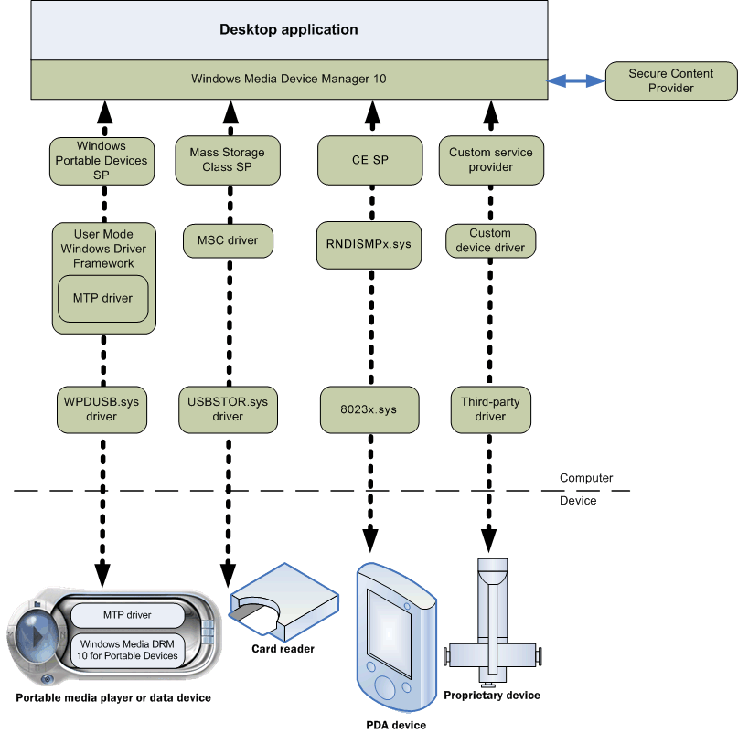
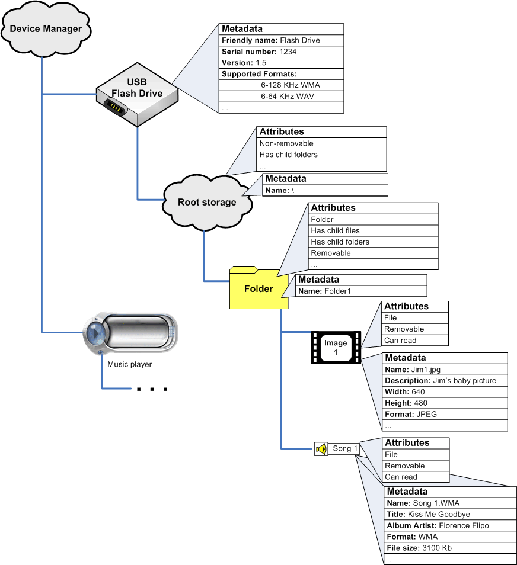
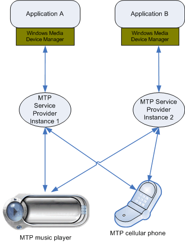

# Windows Media Device Manager Architecture

Windows Media Device Manager enables an application or plug-in to communicate with a device. Applications can request device metadata, enumerate and explore attached devices, and send or receive objects (folders, files, playlists, and so on). Windows Media Device Manager provides a single API to the calling application, no matter what type of device is being called (MTP or Mass Storage Class, service providers built on version 10 or service providers built on earlier versions of Windows Media Device Manager).

Windows Media Device Manager acts as a go-between for the three major components of the system: the application, which makes requests (for information, to read or write data, and so on); a secure content provider, which is a component that handles communication with DRM-protected files; and a service provider, which receives requests from the application and communicates with the device to perform these requests. Both the application and the service provider are built on the Windows Media Device Manager SDK.

The following diagram shows how a desktop application communicates with a device using Windows Media Device Manager 11.

The preceding diagram shows an application communicating with four different types of devices, each with its own service provider. Every service provider is designed to communicate with a specific type of device; this diagram shows the three Microsoft-provided service providers (generic class drivers for Mass Storage Class devices, RAPI devices, and MTP devices), as well as a custom service provider for a proprietary device built by a third party. When a device connects, Windows Media Device Manager instantiates an instance of the service provider registered for that device. The service providers get requests from the application through Windows Media Device Manager interfaces that they implement, use appropriate drivers to communicate with the device, and return appropriate results. Communication between the service provider and the device is outside the domain of Windows Media Device Manager.

Service providers are invisible to the application; an application sees only a list of "devices" because Windows Media Device Manager exposes a standard set of methods and interfaces for all devices. If a manufacturer creates a custom service provider, it must handle all the standard Windows Media Device Manager methods if applications are to be able to use the device.

This diagram also shows a secure content provider (SCP) module. This module is responsible for handling digital rights management (DRM) protected content. Microsoft provides an SCP module that can handle DRM-protected WMA and WMV files. If an application or device intends to handle other protected formats, it must provide its own SCP module. Neither the application nor the service provider deals with the SCP directly.

Both the application and the service provider are built on Windows Media Device Manager, which routes calls between the application and the appropriate service provider for a device; the service provider is responsible for communicating directly with the device. Windows Media Device Manager does perform some actions itself (such as enumerating connected devices, routing calls, and handling component verification); however, most of the work is done by the service provider, which receives requests from the application and communicates with the device.

An application built on Windows Media Device Manager can communicate with devices and service providers built on earlier versions of Windows Media Device Manager; however, these older devices will be run through 9 Series components (not shown), and will not support the newest features, particularly the more advanced digital rights management technology.

Architecture of a Device

The following diagram shows a simplified hierarchy of devices and storages as seen by an application using Windows Media Device Manager.

The preceding diagram shows a simplified version of a connected flash drive, as seen by a Windows Media Device Manager application. The flash drive has attributes and properties, such as a serial number and supported format configurations. An immediate child of the flash device is the root storage object, which contains a folder, which itself contains an image and a song.

An application enumerates the list of attached devices by calling an enumeration method exposed by the root [**IWMDeviceManager**](/windows/desktop/api/mswmdm/nn-mswmdm-iwmdevicemanager) interface. Devices are represented by an [**IWMDMDevice**](/windows/desktop/api/mswmdm/nn-mswmdm-iwmdmdevice) (or a derived) interface. This interface exposes methods to retrieve the device name, format capabilities, serial number, and so on, as well as a method that enumerates *storages* on the device. In Windows Media Device Manager, a storage is any kind of object on the device, whether or not it is an actual blob of data. For example: audio files, text files, folders, playlists stored as files, and playlists stored as metadata are all considered storages, even though folders and metadata items probably do not represent a physical file. The type (or format) of a storage can be retrieved by calling [**GetAttributes**](/windows/desktop/api/mswmdm/nf-mswmdm-iwmdmstorage-getattributes) (or [**GetMetadata**](/windows/desktop/api/mswmdm/nf-mswmdm-iwmdmstorage3-getmetadata), requesting the format of the storage).

Storages on a device are stored hierarchically, and all devices have a root storage. Each storage can hold zero or more child objects, enumerated by calling that storage's [**IWMDMStorage::EnumStorage**](/windows/desktop/api/mswmdm/nf-mswmdm-iwmdmstorage-enumstorage) method.

Note that each storage in the diagram has attributes and metadata associated with it (not all values are shown). Attributes are simple, Boolean information often describing management or navigational information (such as "has folders" or "can delete"), whereas metadata can be string values, numbers, or complex information (such as rendering capabilities). Attributes are described by a fairly limited set of flags defined by the SDK and retrieved by calling [**IWMDMStorage::GetAttributes**](/windows/desktop/api/mswmdm/nf-mswmdm-iwmdmstorage-getattributes) or [**IWMDMStorage2::GetAttributes2**](/windows/desktop/api/mswmdm/nf-mswmdm-iwmdmstorage2-getattributes2). Metadata values are retrieved by a unique name; the SDK defines a number of metadata values that devices should support, but devices can define their own [metadata constants](metadata-constants.md). However, if a device or service provider defines a new metadata constant, applications won't be able to request or set this value unless the application developers were aware of this new constant. A service provider must support [**IWMDMStorage3**](/windows/desktop/api/mswmdm/nn-mswmdm-iwmdmstorage3) or later to support retrieving or setting metadata. For more information, see [Getting and Setting Metadata and Attributes](getting-and-setting-metadata-and-attributes.md).

Service Providers

The service provider acts as a middleman between the application and the device. The service provider is invisible to the application developer, so an application developer does not need to know anything about developing a service provider. However, it is the service provider that does the work of communicating with a device.

A service provider is a COM DLL built on Windows Media Device Manager that receives requests from an application and communicates with the device to perform them. Communication with the desktop application is mediated by Windows Media Device Manager; communication with the device is under the control of the service provider.

A service provider receives requests from the application to enumerate device content, requests for device capabilities, requests to read or write data, and so on. It must know the design of a device well enough that it can send commands in the proper format and protocol. It should also be able to hide device-specific requirements, such as a required file extension for playlists, so that applications do not need to know these requirements in order to use the device.

Microsoft provides a number of service providers for standard device types, including generic MTP devices, Mass Storage Class devices, and RAPI devices. The only reason a device designer should need to create a custom service provider is if a device has some specific or unusual data storage requirements that the standard service providers do not handle—for instance, if files must be stored in specific locations and the device operating system does not handle this automatically.

When a device is connected to the computer, the operating system creates one instance of the appropriate service provider for each Windows Media Device Manager application. If a second Windows Media Device Manager application starts, a second instance of the service provider will be loaded. However, each service provider can handle multiple devices. The following diagram illustrates this.

The preceding diagram shows two different applications communicating with two MTP devices. The devices use the same service provider class, but each application has its own instance of the same service provider. Each service provider instance is communicating with devices. The different instances of the service provider are not aware of each other.

Many application methods have a correspondingly named service provider method. When the application calls a method, Windows Media Device Manager routes the call to the corresponding method on the service provider (though it might perform some additional internal actions first). For example, when the application calls [**IWMDMDevice3::GetProperty**](/windows/desktop/api/mswmdm/nf-mswmdm-iwmdmdevice3-getproperty), Windows Media Device Manager routes this call to the service provider's implementation of [**IMDSPDevice3::GetProperty**](/windows/desktop/api/mswmdm/nf-mswmdm-imdspdevice3-getproperty). (Most application interfaces begin with IWMDM, and the corresponding service provider interface begins with IMDSP). The service provider is expected to handle this method call and return an appropriate result.

An application never explores or communicates with a device directly (unless it calls [**IWMDMDevice3::DeviceIoControl**](/windows/desktop/api/mswmdm/nf-mswmdm-iwmdmdevice3-deviceiocontrol) or [**IWMDMStorage::SendOpaqueCommand**](/windows/desktop/api/mswmdm/nf-mswmdm-iwmdmstorage-sendopaquecommand)); the application communicates with the service provider, which must represent a device in the most logical and simple manner possible. When the application requests information about the device, or enumerates objects on the device, the service provider queries the device in an appropriate manner and acquires and returns the appropriate information. It may expose the file organization on the device differently from how it is physically stored on the device, if that is appropriate. However it exposes the device, it should be in a consistent, logical manner, to enable the application to find what it needs and handle the commands it sends. A good service provider will hide device-specific peculiarities—for example, if the device physically stores a playlist as a file with a custom file extension, the service provider should add that extension automatically when the application creates a playlist on the device; it should not expect the application to know the proper extension when creating a playlist object.

Service providers run inside the process of the calling application. The only exception to this is the MTP service provider, which runs in its own process. Because of this, there is some risk that a blocked service provider will cause the calling application to block. Therefore, service providers should be designed to be robust and prevent blocking, and applications should be designed to avoid stalling if a particular method call does not return quickly.

## Related topics

<dl> <dt>

[**Getting Started**](getting-started.md)
</dt> </dl>

 

 

