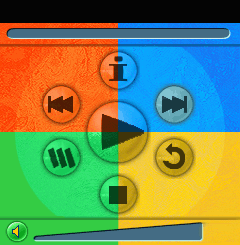

# Background File

Every skin needs a Background file, which contains the image that the user will see when the skin is first displayed. This file is defined as the Background file in the skin definition file.

The following image is a typical Background file.

This is the background image that users will see at first. However, they will also see the two thumb images at the appropriate locations on the trackbars for Seek (above) and Volume (below). In addition, any buttons that are disabled will be displayed using their Disabled images instead.

## Related topics

<dl> <dt>

[**Art Files**](art-files.md)
</dt> </dl>

 

 

