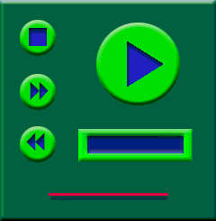

# Creating the Background

\[The feature associated with this page, [Windows Media Player SDK](/windows/win32/wmp/windows-media-player-sdk), is a legacy feature. It has been superseded by [MediaPlayer](/uwp/api/Windows.Media.Playback.MediaPlayer). **MediaPlayer** has been optimized for Windows 10 and Windows 11. Microsoft strongly recommends that new code use **MediaPlayer** instead of **Windows Media Player SDK**, when possible. Microsoft suggests that existing code that uses the legacy APIs be rewritten to use the new APIs if possible.\]

Now you are ready to create the Background image. Keep the rectangle layer visible, but keep it behind the layer you are drawing on, and use it as a guide to create the images for your skin. You will want to assemble each element in one or more layers to make it easy to copy over to another file later. For example, the PlayPause button will need to be copied to and recolored in the Paused file, the Disabled file, and the Region file. When you move art to the Region file, be sure that the art you copy does not have any complex edge effects such as shadows or bevels.

When you have finished creating the image you want, make visible all the layers you want to use and hide the other ones (such as sketch and rectangle). Then use the Save a Copy command to save the artwork to a .bmp file.

The following diagram is the Background image.

Bevels, embossing, and shadows were used to create the visual effects for the various elements. Note that there is no button for the volume thumb image. It will be created later.

Photoshop has several visual effects you can apply to images, making it easy to create more interesting artwork. For example, the PlayPause button was created with a simple circle. Then a bevel and emboss with shadow effect was created. The solid arrow was a simple triangle created with three clicks of the pen tool. The arrow was then given an embossed look by using an effect. When using a program like Photoshop, you do not have to be able to draw. You can just create simple images and apply effects. You can also import your own photos or scanned artwork.

## Related topics

<dl> <dt>

[**Creating the Art**](creating-the-art.md)
</dt> </dl>

 

 

