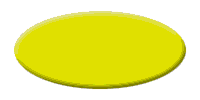
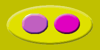

# Creating the Primary Art File

\[The feature associated with this page, [Windows Media Player SDK](/windows/win32/wmp/windows-media-player-sdk), is a legacy feature. It has been superseded by [MediaPlayer](/uwp/api/Windows.Media.Playback.MediaPlayer). **MediaPlayer** has been optimized for Windows 10 and Windows 11. Microsoft strongly recommends that new code use **MediaPlayer** instead of **Windows Media Player SDK**, when possible. Microsoft suggests that existing code that uses the legacy APIs be rewritten to use the new APIs if possible.\]

The primary art file will contain the art that the user of your skin first sees. In this case, you will be creating images in different layers of your art program. The reason for using layers is that you will copy specific layers later to create map files and alternate art files.

To create the primary art file, you will create the following layers in the following order:

Skin background layer

This is the color that will be transparent when the skin is displayed. Create a layer for this first, but choose the final color of this layer after you chose a color for the skin container layer. This color should be similar to, but not the same as, the skin container layer, to hide any anti-aliasing effects.

Skin container layer

This is the image that will form the outline of your skin and will be what the user sees. It also will be the container for the two buttons in this example. Think of your skin as a container for user interface controls such as buttons, sliders, and so on. In this example, the container is a yellow oval.

Play and Close button layers

These are the two user interface controls that this example uses. You will put them in separate layers so that you can easily adjust them or copy them later.

Before you create your layers, you must create the file that will hold your layers. Start up Photoshop and create a new file that is 100 pixels high and 200 pixels wide. The file used to create the art for this sample is called tiny.psd and is included with the SDK.

All instructions are given in terms of Photoshop, but any other art program can be used to create skins as long as you can save to one of the file formats supported by the Windows Media Player (BMP, GIF, JPG, and PNG). You will find skin creation easier if you use an art program that has layers, such as Adobe Photoshop, Jasc Paint Shop Pro, or Jedor Viscosity. Layers are extremely useful because images must be properly aligned for image mapping and display of alternative images.

## Skin Background Layer

Create a new layer and name it "Skin background". This will become the transparency color you will define in the skin definition file. Wait until the color for the skin container is chosen before filling the skin background layer with a specific color.

## Skin Container Layer

Next create a new layer and call it "Skin container". This will define the edges of your skin and will be the container for the buttons.

Choose a foreground color for the shape, using the Web color sliders. In this example, the color "\#DBDD11" was chosen.

Next create an oval shape. The easiest way is to use the Eliptical Marquee tool and create an oval selection. When you have created an oval selection that is the size and shape you want, fill the selection with the foreground color and cancel the selection.

Finally, to make this look a bit more interesting, apply the layer effect of Bevel and Emboss with the default values.

Your skin container layer should look like the following illustration.

## Background Skin Color

Now that you have chosen a foreground color for your skin container shape, you can choose a similar color for your skin background layer. You do not want the exact same color, or your skin container will be transparent also. In fact, be sure you do not use this exact color anywhere else in your skin, even in photographs, because wherever this color appears, the desktop image will appear instead.

You want a color close to the skin container color to avoid anti-aliasing effects. For example, if you have a black background, some bits of black may show up around the edge of your skin. By choosing a color close to the color of the skin container, any stray pixels that show up in the anti-aliasing process will be unnoticed.

Anti-aliasing is the process of smoothing the edges of slanted or curved shapes. Anti-aliasing creates new colors, for pixels along the edges of a shape, that are a blend of the foreground color and the background color. Some of these in-between colors can cause pixels to be missed when the background color is made transparent.

Your skin background layer should look like the following illustration.

## Play and Close Button Layers

Create a new layer and name it "Close button". Using the Eliptical Marquee selection tool again, create a circle and position it on the left side of the overall image. Turn on the visibility of the skin container file to help place the selection.

When you are satisfied with the placement, fill the selection with any color (except the color of the skin container or the skin background). In this example, a purple color was chosen. You do not need to remember the number of the color. Then cancel the selection and apply another default Bevel and Emboss layer effect. If you want to apply non-layer effects to your button, make a copy of the original for later use in mapping.

Your Close button should look like the following illustration.

Create a new layer and name it "Play button". Use the same techniques you did for the Close button, but give it a different color. In this case, a pink button color was chosen, but any color can be used as long as it is not the same color as the skin container (because it would blend into the container) or the skin background color (because it would become transparent).

Your Play button should look like the following illustration.

## Combine Layers and Save

You are now ready to create the primary art file. Hide all layers and then show only the following layers, in this order (top to bottom):

Play button

Close button

Skin container

Skin background

Save to a new file using the Save a Copy command from the File menu. Select the BMP option in the Save As portion of the Save a Copy dialog box and type a file name that you will refer to later in your skin definition file. Ideally you should save this in the same directory as your skin definition file. For example, you could call this background.bmp. Choose the default settings and save the file.

Your primary art file should look like this:

You will use this file name as the value for the **backgroundImage** attribute of the **VIEW** element in your skin definition file.

## Related topics

<dl> <dt>

[**Building Your First Skin**](building-your-first-skin.md)
</dt> </dl>

 

 

