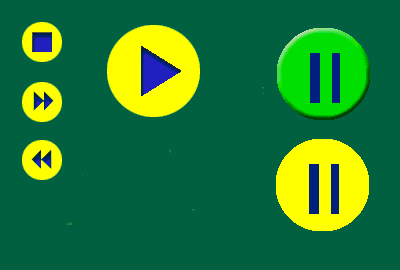

# Creating the Pushed File

\[The feature associated with this page, [Windows Media Player SDK](/windows/win32/wmp/windows-media-player-sdk), is a legacy feature. It has been superseded by [MediaPlayer](/uwp/api/Windows.Media.Playback.MediaPlayer). **MediaPlayer** has been optimized for Windows 10 and Windows 11. Microsoft strongly recommends that new code use **MediaPlayer** instead of **Windows Media Player SDK**, when possible. Microsoft suggests that existing code that uses the legacy APIs be rewritten to use the new APIs if possible.\]

You can take the elements you created and reuse them to create the other images you need. By combining layers and coloring the results, you can create a Pushed bitmap that contains the images you want to be seen when the user pushes a button. This file also contains the secondary image for the paused state of the PlayPause button.

The following image is the Pushed file.

The two buttons on the right are for the normal paused state and the pushed paused state of the PlayPause button. The color of the buttons is yellow, except for the normal paused state of the PlayPause button, as a good contrast to the green color used for the normal state of all buttons.

## Related topics

<dl> <dt>

[**Creating the Art**](creating-the-art.md)
</dt> </dl>

 

 

