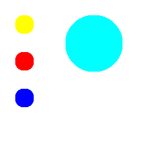

# Creating the Region File

You will want to create a Region file that shows what areas respond to taps. You can simply copy the base layers of each element to a new layer, and color them to correspond to the color numbers you will use in the skin definition file. Be sure that the images you create in this layer are solid and that no effects are applied. You will probably want to write down the color numbers for each image. You can get the color numbers from the Photoshop Color Picker. You want the RGB numbers, which are three decimal numbers. Each number ranges from 0 to 255. For example, a solid red would be 255, 0, 0.

> [!Note]  
> Region files are not used in Windows Media Player 10 Mobile skins because button types are not supported in Windows Media Player 10 Mobile or later.

 

The following image is the Region file.

There are only four images in this file because only the PlayPause, Stop, Next, and Prev buttons are hit-type buttons.

## Related topics

<dl> <dt>

[**Creating the Art**](creating-the-art.md)
</dt> </dl>

 

 

