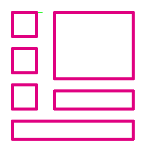

# Define the Rectangles

\[The feature associated with this page, [Windows Media Player SDK](/windows/win32/wmp/windows-media-player-sdk), is a legacy feature. It has been superseded by [MediaPlayer](/uwp/api/Windows.Media.Playback.MediaPlayer). **MediaPlayer** has been optimized for Windows 10 and Windows 11. Microsoft strongly recommends that new code use **MediaPlayer** instead of **Windows Media Player SDK**, when possible. Microsoft suggests that existing code that uses the legacy APIs be rewritten to use the new APIs if possible.\]

Because no user interface elements can overlap, it is useful to define the rectangles that each element will be drawn inside. Also, creating rectangles will be helpful when you have to write down the coordinates.

Turn on the Photoshop grid with grid lines every ten pixels. Turn on snap-to-grid to make rectangle drawing easy.

Create a new layer and draw rectangles. By having the sketch layer underneath, you know the general location where you want the user interface element to be, but you can now fine-tune the exact location. You can always change things later, but it will help to get as close as you can now. The following illustration shows several rectangles in a layer.

Now that the rectangles are defined, you can turn off the sketch layer.

## Related topics

<dl> <dt>

[**Creating the Art**](creating-the-art.md)
</dt> </dl>

 

 

