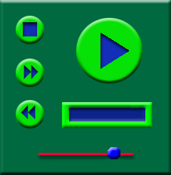

# Designing the Interface

Once the functions have been chosen, the interface can be designed. A simple interface was chosen to match the functionality. Symbols for the controls were chosen from standard VCR controls.

The following image shows what the interface will look like.

-   **PlayPause or PlayPauseStop button.** The user will be tapping this the most, so you might consider a larger button. The upper-right corner makes a good location that the user can find quickly. A solid arrow is used to indicate play and two vertical bars (not shown here) will be used to indicate pause.
    > [!Note]  
    > The PlayPauseStop button can only be used when creating a skin for Windows Media Player 10 Mobile or later.

     

-   **Stop button.** To make this easy to find, it is placed at the upper-left corner. A square is used to indicate stop. If you are creating a skin for Windows Media Player 10 Mobile or later, the PlayPauseStop button already provides this functionality.
-   **Next and Prev buttons.** Since these will not be used as often, they are placed on the left. The Next is above the Prev button because people will more likely want to move forward in a playlist. The double-arrow symbols are used because they are similar in function to a fast-forward control.
-   **Volume trackbar.** This is placed at the bottom of the screen and is a simple line with a thumb button on top of it.
-   **Marquee text box.** This is placed under the PlayPause or PlayPauseStop button so that it is easy to see.

You may want to sketch this first and experiment with the placement of each user interface element. The design shown here was chosen for simplicity and ease of use.

## Related topics

<dl> <dt>

[**Skin Guide**](skin-guide.md)
</dt> </dl>

 

 

