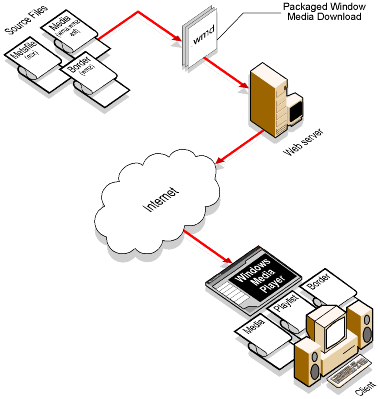

# How Windows Media Download Packages Work (deprecated)

This page documents a feature that may be unavailable in future versions of Windows Media Player and the Windows Media Player SDK.

A Windows Media Download package is launched from a website when a user clicks a link in a Web browser, such as Microsoft Internet Explorer. This action opens Windows Media Player and then downloads and un-packages the Windows Media Download package on the user's hard disk in a default folder.

Once the files have been extracted from the Windows Media Download package, Windows Media Player locates a Windows Media metafile playlist with an .asx file name extension among the packaged files. If it finds one, the Player creates a playlist based on the included metafile. Files that contain multimedia content are then added to the library.

Windows Media Player also looks for a **SKIN** element in the metafile. If the **SKIN** element contains a reference to a border file with a .wmz file name extension, the Player loads the border into the **Now Playing** pane. The Player then starts to play the content provided in the package.

The following diagram shows how content is packaged in a Windows Media Download file, posted to a website, downloaded, and played on a client computer using Windows Media Player.

 Windows Media Download

The following table describes the three elements that make up a Windows Media Download package.

| Package element    | Function                                                                                                                                                                                                                                        | File name extensions                     |
|--------------------|-------------------------------------------------------------------------------------------------------------------------------------------------------------------------------------------------------------------------------------------------|------------------------------------------|
| Border             | A fixed, customized user interface created by the content owner for displaying, linking, and playing all media packaged in the Windows Media Download package. The techniques used to create borders are similar to those used to create skins. | .wmz                                     |
| Metafile Playlist  | A Windows Media metafile that contains **ENTRY** elements, playlist information, and a **SKIN** element identity for content files.                                                                                                             | .asx                                     |
| Multimedia Content | A file containing any audio or video format that is supported by Windows Media Player.                                                                                                                                                          | .wma, .wmv, .asf, .wav, .avi, .mpg, .mp3 |

 

## Related topics

<dl> <dt>

[**Windows Media Download Packages (deprecated)**](windows-media-download-packages--deprecated.md)
</dt> </dl>

 

 

