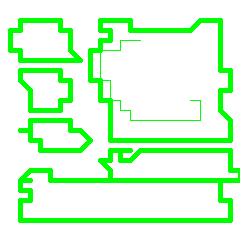

# Make a Sketch

\[The feature associated with this page, [Windows Media Player SDK](/windows/win32/wmp/windows-media-player-sdk), is a legacy feature. It has been superseded by [MediaPlayer](/uwp/api/Windows.Media.Playback.MediaPlayer). **MediaPlayer** has been optimized for Windows 10 and Windows 11. Microsoft strongly recommends that new code use **MediaPlayer** instead of **Windows Media Player SDK**, when possible. Microsoft suggests that existing code that uses the legacy APIs be rewritten to use the new APIs if possible.\]

You do not need to do this, but it can be very helpful in getting your design to look the way you want it to. By planning ahead, you can save yourself having to move art around on multiple bitmap files.

Start up Photoshop and create a new image of the size required. Create a new layer to hold the rough sketch. If you have a sketch and a scanner, you might want to scan your sketch into Photoshop. The following illustration shows an example of a rough sketch.

The PlayPause button is at the upper left, the Stop, Next, and Prev buttons are at the left, the Volume trackbar is at the bottom, and the Marquee is between the PlayPause button and the Volume trackbar.

When creating a skin for Windows Media Player 10 Mobile or later, a PlayPauseStop button should be used instead of a PlayPause button. An additional Stop button is not needed.

## Related topics

<dl> <dt>

[**Creating the Art**](creating-the-art.md)
</dt> </dl>

 

 

