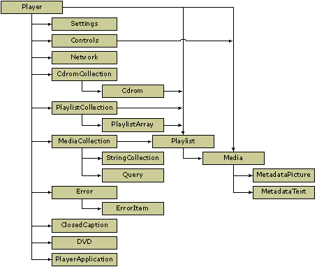

# Player Object Model for Scripting Languages

\[The feature associated with this page, [Windows Media Player SDK](/windows/win32/wmp/windows-media-player-sdk), is a legacy feature. It has been superseded by [MediaPlayer](/uwp/api/Windows.Media.Playback.MediaPlayer). **MediaPlayer** has been optimized for Windows 10 and Windows 11. Microsoft strongly recommends that new code use **MediaPlayer** instead of **Windows Media Player SDK**, when possible. Microsoft suggests that existing code that uses the legacy APIs be rewritten to use the new APIs if possible.\]

ActiveX uses the concept of objects to contain programming functionality. Windows Media Player uses several objects to divide up the functionality the control provides. The root object is the **Player** object, and the other objects are attached to the **Player** object through specific properties.

The following diagram shows how the Windows Media Player 11 ActiveX control object model works for scripting languages.

In C++, and sometimes in .NET languages, objects are represented by COM interfaces. In the Windows Media Player object model, COM interface names are the same as the object name, but are prefixed with "IWMP". For example, the **Network** object is exposed through the **IWMPNetwork** interface.

The following sections provide conceptual overviews for each object:

-   [About the Cdrom and CdromCollection Objects](about-the-cdrom-and-cdromcollection-objects.md)
-   [About the ClosedCaption Object](about-the-closedcaption-object.md)
-   [About the Controls Object](about-the-controls-object.md)
-   [About the DVD Object](about-the-dvd-object.md)
-   [About the Error and ErrorItem Objects](about-the-error-and-erroritem-objects.md)
-   [About the MediaCollection and Media Objects](about-the-mediacollection-and-media-objects.md)
-   [About the MetadataPicture Object](about-the-metadatapicture-object.md)
-   [About the MetadataText Object](about-the-metadatatext-object.md)
-   [About the Network Object](about-the-network-object.md)
-   [About the Player Object](about-the-player-object.md)
-   [About the PlayerApplication Object](about-the-playerapplication-object.md)
-   [About the Playlist, PlaylistCollection, and PlaylistArray Objects](about-the-playlist--playlistcollection--and-playlistarray-objects.md)
-   [About the Query Object](about-the-query-object.md)
-   [About the Settings Object](about-the-settings-object.md)
-   [About the StringCollection Object](about-the-stringcollection-object.md)

Additional functionality is available through certain COM interfaces. Whether you can access these interfaces may depend on the language you use for programming and other factors, such as the mode used to create the instance of the Windows Media Player control. For a complete list of COM interfaces exposed by the Windows Media Player control, see the [Object Model Reference for C++](object-model-reference-for-c.md).

## Related topics

<dl> <dt>

[**About the Player Object Model**](about-the-player-object-model.md)
</dt> <dt>

[**Using the Windows Media Player Control in a .NET Framework Solution**](using-the-windows-media-player-control-in-a--net-framework-solution.md)
</dt> </dl>

 

 

