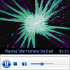
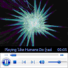
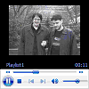

# Player.uiMode

The **uiMode** property specifies or retrieves a value indicating which controls are shown in the user interface.

## Syntax

*player* .**uiMode**

## Possible Values

This property is a read/write **String**.


| Value     | Description                                                                                                                                                                                                           | Audio Example                                          | Video Example                                          |
|-----------|-----------------------------------------------------------------------------------------------------------------------------------------------------------------------------------------------------------------------|--------------------------------------------------------|--------------------------------------------------------|
| invisible | Windows Media Player is embedded without any visible user interface (controls, video or visualization window).                                                                                                        | (Nothing is displayed.)                                | (Nothing is displayed.)                                |
| none      | Windows Media Player is embedded without controls, and with only the video or visualization window displayed.                                                                                                         |  |  |
| mini      | Windows Media Player is embedded with the status window, play/pause, stop, mute, and volume controls shown in addition to the video or visualization window.                                                          |  |  |
| full      | Default. Windows Media Player is embedded with the status window, seek bar, play/pause, stop, mute, next, previous, fast forward, fast reverse, and volume controls in addition to the video or visualization window. |  |  |
| custom    | Windows Media Player is embedded with a custom user interface. Can only be used in C++ programs.                                                                                                                      | (Custom user interface is displayed.)                  | (Custom user interface is displayed.)                  |


 

## Remarks

This property specifies the appearance of the embedded Windows Media Player. When **uiMode** is set to "none", "mini", or "full", a window is present for the display of video clips and audio visualizations. This window can be hidden in mini or full mode by setting the **height** attribute of the **OBJECT** tag to 40, which is measured from the bottom, and leaves the controls portion of the user interface visible. If no embedded interface is desired, set both the **width** and **height** attributes to zero.

If **uiMode** is set to "invisible", no user interface is displayed, but space is still reserved on the page as specified by **width** and **height**. This is useful for retaining page layout when **uiMode** can change. Additionally, the reserved space is transparent, so any elements layered behind the control will be visible.

If **uiMode** is set to "full" or "mini", Windows Media Player displays transport controls in full-screen mode. If **uiMode** is set to "none", no controls are displayed in full-screen mode.

If the window is visible and audio content is being played, the visualization displayed will be the one most recently used in Windows Media Player.

If **uiMode** is set to "custom" in a C++ program that implements **IWMPRemoteMediaServices**, the skin file indicated by **IWMPRemoteMediaServices::GetCustomUIMode** is displayed.

During full-screen playback, Windows Media Player hides the mouse cursor when **enableContextMenu** equals false and **uiMode** equals "none".

## Examples

The following example creates an HTML SELECT element that allows the user to change the user interface for an embedded **Player** object. The **Player** object was created with ID = "Player".


```
<!-- Create an HTML SELECT element. -->
<SELECT  ID = UI  LANGUAGE="JScript"

         /* Specify the UI mode the user selects. */
         onChange = "Player.uiMode = UI.value">

/* These are the four UI mode options. */
<OPTION VALUE="invisible">Invisible
<OPTION VALUE="none">No Controls
<OPTION VALUE="mini">Mini Player
<OPTION VALUE="full">Full Player
</SELECT>

```


Windows Media Player 10 Mobile: This property only accepts or returns values of "none" or "full". On Smartphone devices, only playback status and a counter are displayed when *uiMode* is set to "full".

## Requirements


| Requirement | Value |
|--------------------|---------------------------------------------------------------------------------------------------------------------------|
| Version<br/> | Windows Media Player version 7.0 or later. Windows Media Player 9 Series or later for "invisible" or "custom".<br/> |
| DLL<br/>     | <dl> <dt>Wmp.dll</dt> </dl>                                        |


## See also

<dl> <dt>

[**IWMPRemoteMediaServices Interface**](/previous-versions/windows/desktop/api/wmp/nn-wmp-iwmpremotemediaservices)
</dt> <dt>

[**IWMPRemoteMediaServices::GetCustomUIMode**](/previous-versions/windows/desktop/api/wmp/nf-wmp-iwmpremotemediaservices-getcustomuimode)
</dt> <dt>

[**Player Object**](player-object.md)
</dt> </dl>

 

 


