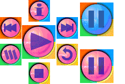

# Pushed File

The Pushed file contains the images that will be displayed when the user taps on a button. You can also include the normal and pushed images for the pause state of the PlayPause button.

The following image is a typical Pushed file.

This stores the images that will be displayed when the hit-type buttons are tapped. Also stored in this file are the normal and pushed images for the paused image of the PlayPause button. Except for the PlayPause secondary images on the right, the other button images line up with the Background image, using the offset defined in the Bitmaps section of the skin definition file.

Notice that the background of the button image exactly matches the corresponding area in the Background file. This is important, because when the user taps a hit-type button, the entire rectangle defined for the pushed image will replace the matching area in the Background file. Keep the graphic consistent with the background image to ensure that only the parts of the button that you want to appear different will actually change.

## Related topics

<dl> <dt>

[**Art Files**](art-files-mobile.md)
</dt> </dl>

 

 

