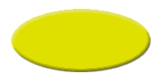

# Simple Art Example

Three art files are needed to create a simple skin with two buttons. A primary image and a mapping image are required, and an alternate image provides a visual cue to the user that a button is clickable.

These art files were created in an art program that uses layers. Using layers makes it easier to make sure that your primary, mapping, and alternate images are all the same size and line up with each other.

The detailed instructions on creating the art are in the [Skin Creation Guide](skin-creation-guide.md).

## Primary Image

The primary image is a simple yellow oval with two buttons, a pink one to start Windows Media Player and purple button to stop it. The background is a slightly darker yellow than the oval. This image is shown in the following illustration.


The primary image was from the following images, each in a separate layer. First an oval was created with a layer bevel and emboss effect. This image is shown in the following illustration.



Then the two buttons were created, also with layer bevel and emboss effects. This is shown in the following illustration.


Next the image background was created. A slightly darker yellow was chosen so that any anti-aliasing between the oval and the background will not be noticed. The color value is \#CCCC00. This image is shown in the following illustration.


The layers that contained these images were made visible and saved as a copy in bitmap format, creating the primary image. The primary composite image will be used by the **backgroundImage** attribute of the **VIEW** element.

## Mapping Image

A mapping image is needed to specify when and where a skin is clicked. A mapping image was created with a red area and a green area. This image is shown in the following illustration.


The green area will be used to identify the area on the skin that will start Windows Media Player and the red area will be used to stop it. The mapping image is the same size as the primary image.

The mapping image was created by copying the button layer to a new layer and turning off the bevel and emboss effect. Flat images are needed for mapping because Windows Media Player will be looking for single color values in each area. It can only search for a color you define, such as red (\#FF0000). If your image has a bevel or other effect, not all of it will be the exact red you need.

To make the mapping buttons an easy color to remember, the images were filled with pure red and pure green, but any color can be used. You will need to remember the color numbers in your map so that they can be entered in the XML skin definition file. In this case, red is \#FF0000 and green is \#00FF00.

Then, with only the new layer visible, the image was saved as a copy to a BMP file. It will be called by the **mappingImage** attribute of the **BUTTONGROUP** element.

## Alternate Image

Alternate images are not required but are very useful to give visual cues to the user. In this case, a hover image is recommended so that the user knows what areas can be clicked on.

An alternate image was created with two yellow buttons. This is shown in the following illustration.


The alternate image was created by copying the original button layer to a new layer and then changing the fill color to yellow. The bevel and emboss effect was kept. Then a new layer was created and images were added: the arrow indicates "play" and the square indicates "stop". Then, with only the new yellow button and type layers visible, the image was saved as a copy to a bitmap file.

The result is that when the mouse hovers over an area defined by the mapping image, the hover image will be displayed, alerting the reader that if they click on that spot, they can play or stop Windows Media Player.

## Final Image

Here is the final image of the skin.


And this is the image you will see if you hover over the pink button on the right.


## XML Code for the Art Example

The details of how to write XML code are given in the [Skin Creation Guide](skin-creation-guide.md), but to show how little code is needed to create a working skin, here is the code for the artwork in this example.

Predefined buttons are used for the play and stop functions. You must load a file or playlist from the Windows Media anchor. When Windows Media Player changes to skin mode, a small box appears in the lower-right corner of the screen. This box is called the "anchor". Clicking the anchor gives you the minimum functionality needed, in case a skin does not provide a way to return to the full mode of Windows Media Player. The user can switch between modes by using the **View** menu if in full mode, or by clicking the anchor if in skin mode.


```C++
<THEME>
    <VIEW
        clippingColor = "#CCCC00"
        backgroundImage = "background.bmp"
        titleBar = "false">
         
        <BUTTONGROUP
            mappingImage = "map.bmp"
            hoverImage = "hover.bmp">
                
        <PLAYELEMENT
            mappingColor = "#00FF00"/>

        <STOPELEMENT
            mappingColor = "#FF0000"/>
                
        </BUTTONGROUP>
    </VIEW>
</THEME>

```


## Related topics

<dl> <dt>

[**Art Files**](art-files.md)
</dt> </dl>

 

 


