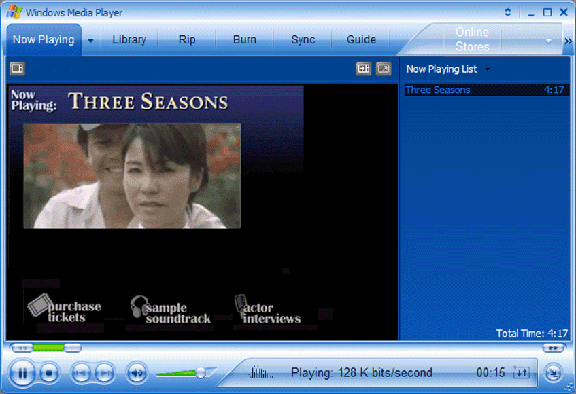

# Using Borders in Windows Media Download Packages (deprecated)

This page documents a feature that may be unavailable in future versions of Windows Media Player and the Windows Media Player SDK.

Borders enable you to create a customized graphical user interface for your packaged content. The border can include elements such as images, interactive controls, and links to websites. You can use borders in cases where you want to add additional value to your packaged content, such as for branding or advertising. After users download and open your Windows Media Download package, Windows Media Player automatically displays your custom border when it plays the packaged content.

Unlike a skin, which enables users to completely replace the Windows Media Player user interface, a border is displayed only in the **Now Playing** pane of the full mode Player. However, the same tools and technologies that you use to create skins are also used to create borders. The following illustration shows a border.

It is important to understand the basic techniques for creating a skin before attempting to create a border. Border programming is accomplished using two programming languages: Extensible Markup Language (XML) and Microsoft JScript. XML is used to define interface elements such as buttons, sliders, and text boxes. You don't need to understand all the details of XML since you don't have to write new XML code elements; you can simply use the ones provided by Windows Media Player. Although JScript is not required for creating borders, it can be used to provide additional functionality.

A compressed border file with a .wmz file name extension includes a border definition file with a .wms file name extension and all the image files used within the border.

To include a border in a Windows Media Download package, simply create a border and reference that border in a Windows Media metafile playlist. The border file is loaded into Windows Media Player after the Player parses the metafile and interprets the **SKIN** element that references the border. The **SKIN** element is used only for borders, and the HREF attribute of the **SKIN** element can reference only one skin for each package.

## Related topics

<dl> <dt>

[**Borders for Windows Media Player (deprecated)**](borders-for-windows-media-player--deprecated.md)
</dt> <dt>

[**Windows Media Download Packages (deprecated)**](windows-media-download-packages--deprecated.md)
</dt> <dt>

[**Windows Media Player Skins**](windows-media-player-skins.md)
</dt> </dl>

 

 

