# Validation Tests for On-boarding Type 2 Online Stores

\[The feature associated with this page, [Windows Media Player SDK](/windows/win32/wmp/windows-media-player-sdk), is a legacy feature. It has been superseded by [MediaPlayer](/uwp/api/Windows.Media.Playback.MediaPlayer). **MediaPlayer** has been optimized for Windows 10 and Windows 11. Microsoft strongly recommends that new code use **MediaPlayer** instead of **Windows Media Player SDK**, when possible. Microsoft suggests that existing code that uses the legacy APIs be rewritten to use the new APIs if possible.\]

This topic describes tests that Microsoft will perform to validate your Type 2 online store. Microsoft requires that you run these tests before you submit a release candidate. Your online store must successfully pass these tests to be published.

> [!Note]  
> If your store is Type 1 rather than Type 2, you can use this topic as a guideline to understand the scope of the certification testing that is covered for Type 1 stores. For the complete set of tests for Type 1 stores, contact [Microsoft Support](https://support.microsoft.com/ph/7763#tab0).

 

This topic contains the following sections.

-   [Test Checklist](#test-checklist)
    -   [Test Pass Preparation](#test-pass-preparation)
-   [Test Environment](#test-environment)
-   [Configuration and Setup](#configuration-and-setup)
    -   [Setting Up a Test Machine](#setting-up-a-test-machine)
    -   [Setting Up a Store](#setting-up-a-store)
    -   [Creating an Account](#creating-an-account)
    -   [Setting Up Credential Caching](#setting-up-credential-caching)
-   [Content Acquisition](#content-acquisition)
    -   [Streaming Content](#streaming-content)
    -   [Obtaining Content](#obtaining-content)
    -   [Burning Content](#burning-content)
    -   [Transferring Content](#transferring-content)
-   [Store Features](#store-features)
    -   [Managing an Account](#managing-an-account)
    -   [Managing the Info Center](#managing-the-info-center)
-   [Store Interaction](#store-interaction)
    -   [Yielding to the Active Store](#yielding-to-the-active-store)
    -   [Preventing the Tested Store From Taking Over the Active Store](#preventing-the-tested-store-from-taking-over-the-active-store)
    -   [Accessing a Store in High-Contrast Mode](#accessing-a-store-in-high-contrast-mode)
    -   [Securing a Store](#securing-a-store)

## Test Checklist

Use the checklist in the following table to validate your Type 2 online store that you wish to bring on board.

Test

Windows XP

Windows Vista

Windows 7

Result (pass/fail/not applicable)

32

64

32

64

32

64

1. Verify that software installs.

2. Verify that software uninstalls.

3. Verify that software does not run in the tray.

4. Verify that the store tab operates.

5. Verify that the store has an option to create a new account.

6. Verify that the created account can sign in.

7. Verify that the store has an option to save user information.

8. Verify that credential caching is present and working.

9. Verify that the user is prompted for credentials if they are not cached.

10. Verify that all available types of content stream.

11. Verify that content plays in Microsoft Windows Media Player.

12. Verify that a calculated price is correct.

13. Verify that purchased content is downloaded to the library.

14. Verify that metadata is downloaded for the purchase.

15. Verify that media usage rights are correct for the purchase.

16. Verify that the purchased content can play.

17. Verify that clicking the **Buy** or **Shop** button switches to the store.

18. Verify that purchased content downloaded.

19. Verify that purchased content can be burned.

20. Verify that the burn count is decremented.

21. Verify that content can be transferred to another computer.

22. Verify that content transfers to a device.

23. Verify that the sync count is decremented.

24. Verify that the purchase history tracks prior purchases.

25. Verify that a prior purchase can be restored.

26. Verify a store's functionality to manage multiple computers.

27. Verify that the Info Center is off by default.

28. Verify that the Info Center has media information in the now-playing area.

29. Verify that links navigate to the store.

30. Verify that the tested store yields to the active store.

31. Verify that the tested store does not take over the current store.

32. Verify that the store is accessible in high-contrast mode.

33. Verify that the store is secure.

 

### Test Pass Preparation

Before you run a test pass, you should ensure that the store and the test accounts are ready for testing. You should determine the following information before the pass starts. If you can determine the information some days in advance of the test pass, the pass will run more efficiently.

-   Determine the following information about test accounts that are supplied by the store:
    -   Accounts and passwords work to allow a user to sign in
    -   Accounts are correctly and adequately funded for each type of business mode the store offers
    -   Accounts are valid for all locales to be tested, or accounts exist for each locale if accounts cannot cross locales
-   Determine which locales to test.
-   Determine which languages to test.
-   Determine the following information about the test environment:

    -   Live stores that work with Windows XP, Windows Vista, and Windows 7
    -   The non-live store to test
    -   Verify that the non-live store to test is visible in all versions of the operating system and all versions of the Windows Media Player platform.

-   Determine the following information about the store to test:

    -   Store name
    -   Expected store tab logo graphics and label
    -   Is the store live for all operating system versions?
    -   Is this is a new version of the store under test?
    -   Is the store under test a Type 1 or Type 2 store?
    -   Has the store type changed?

-   Determine on which operating system versions and platforms you plan to test the store.
-   Determine that the installer and plug-in works on all operating system versions and platforms to be tested.
-   Determine if a navigation document is required.
-   Determine the following information about the media that the store offers:

    -   Formats
    -   Is any proprietary software required?
    -   Must you test all media types, or only a subset of media types?

-   Determine the following information about media usage rights:

    -   Does the store media have content protection?
    -   If so, determine the type of content protection that the media have.
    -   If so, determine the expected protected behavior.
    -   Do the media usage rights include computer-to-computer sharing?
    -   The sync rights
    -   The burn rights
    -   The play rights
    -   The expiration dates, if any

-   Determine if you have sufficient media (a large enough catalog) to provide a meaningful sample.
-   Determine what the stage pass is: RC 0, compliance, and so on.
-   Determine if the test pass is a certain type: regression, smoke, and so on.

## Test Environment

You must conduct testing on the following configurations:

-   Microsoft Windows Media Player 11 on Windows XP with Service Pack 3 (SP3) 32-bit and 64-bit operating systems
-   Windows Media Player 11 on Windows Vista 32-bit and 64-bit (32-bit Windows Media Player) operating systems
-   Microsoft Windows Media Player 12 on Windows 7 32-bit and 64-bit (32-bit Windows Media Player) operating systems

Although you must perform testing on all the operating system versions and platforms listed, 32-bit versions of Windows Vista and Windows 7 are the priority targeted operating system versions. You must test the installation of any software on all platforms.

Screen shots in this topic use a fictitious store, Proseware, to demonstrate the usage of the user interface.

## Configuration and Setup

The following sections describe how to configure and set up validation testing to on-board a Type 2 online store.

### Setting Up a Test Machine

Perform the following steps to set up a test machine:

1.  Point the test computer to content test servers by adding a store-specific registry key.
2.  Set values in the **Regional and Language Options** dialog box to the proper language and locale settings. To set the language, select the **Formats** tab and then select the language from the **Current format** combo box. To set the region, select the **Location** tab and then select the region from the **Current location** combo box. Additionally, for stores that require installation of a plug-in or store-specific custom software, you might need to change the system locale to the language of the store's locale to facilitate installation. The software installer must support both single and double byte characters and must run on any locale. You must test in the native locale. To set the native locale, open the **Region and Language** dialog box, select the **Administrative** tab, and then click the **Change system locale** button as shown in the following screen shot. Clicking this button displays the **Region and Language Settings** dialog box. The **Current system locale** combo box in that dialog box changes the system locale.

    The following screen shots show the tabs on which you can set region and language:

    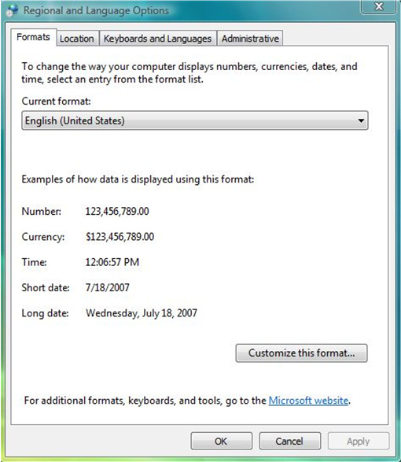

    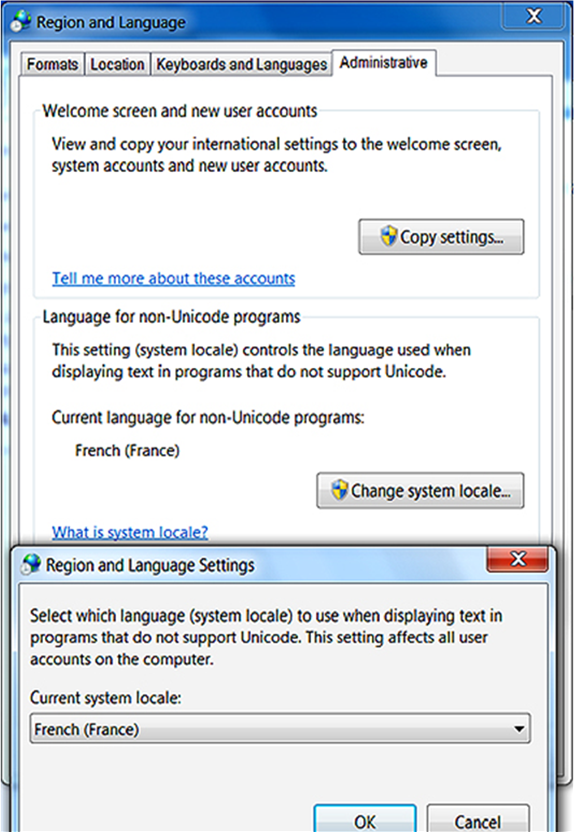

3.  Turn off the view of a store's Info Center by setting Windows Media Player to play a visualization. The main difference between the platforms is that in Windows Media Player 11, you start by clicking **Now Playing**, whereas in Windows Media Player 12, you start by right-clicking the main window.

    The following screen shot shows the sequence of menu options that plays a visualization in Windows Media Player 11:

    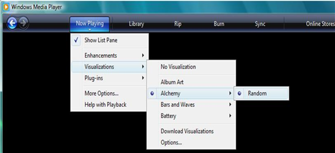

    The following screen shot shows the sequence of menu options that plays a visualization in Windows Media Player 12:

    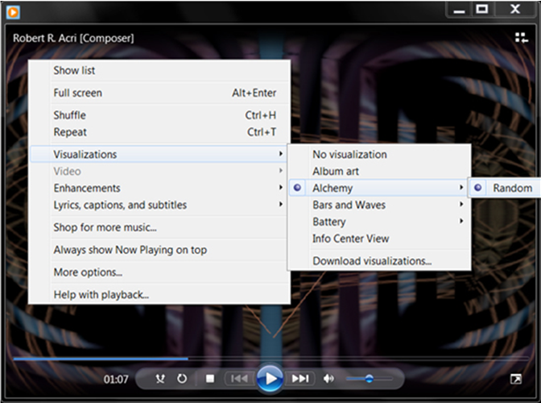

### Setting Up a Store

First perform the following steps to set up a store, and then perform the steps that follow the initial steps to verify the store setup:

1.  Launch Windows Media Player and wait several seconds to acquire the latest AllServices.xml file.
2.  For Windows XP and Windows Vista, to select an online store, first click the tab that splits between the Media Guide view and the Online Stores view. Then, from the menu click **Browse all Online Stores**, and select the store by clicking its icon in the list of stores. For Windows 7, click the button in the library-navigation pane that splits between the **Media Guide** button and the **Online Stores** button. Then, from the menu click **Browse all online stores**, and select the store by clicking its icon in the list of stores.

    The following screen shot shows how to select an online store in Windows Media Player 11:

    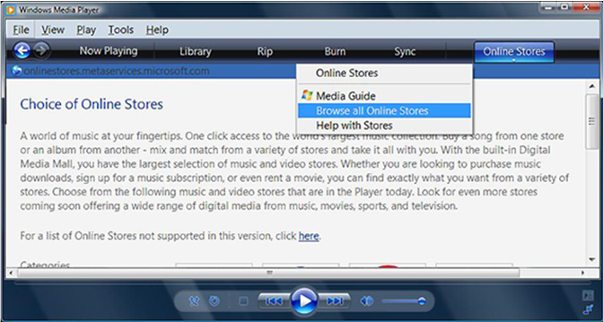

    The following screen shot shows how to select an Online Store in Windows Media Player 12:

    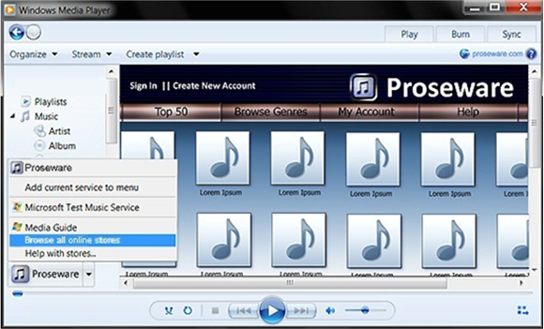

3.  Follow instructions from the store to install any additional software that is needed to use the store.

**To verify store setup**

1.  Verify that the software installs.

    Verify that the OCX plug-in or any other software from the store downloads and installs without error.

2.  Verify that the software uninstalls.

    Verify that in Control Panel, in the **Programs and Features** item, the software that the store installs appears in the **Uninstall or change a program** list, and verify that you can uninstall it from this list without error.

3.  Verify that software does not run in the system tray.

    Verify that none of the software from the store adds icons to the program notification area (on the Taskbar to the left of the clock) prior to customer consent to download store software.

    The basic store experience should not require installation of additional software. A basic media experience, such as streaming media, should be available. Some stores install additional software such as download managers for a premier media experience; these stores can have icons in the system tray if the icons represent applications that are separate from Windows Media Player.

4.  Verify that the store tab operates.

    Verify that the store tab changes to indicate the selected store.

    For Windows XP and Windows Vista with Windows Media Player 11, verify that the store name and icon are visible against the dark Windows Media Player 11 background.

    For Windows 7 with Windows Media Player 12, verify the store name and icon are visible in the library-navigation pane, in the service-selector context menu.

    Verify that the store is listed at the top of the store selector list in the menu.

    > [!Note]  
    > There will be no **Add current service to menu** option if the Type 2 store is the featured (default) store for the region.

     

    The following screen shot shows the menu that appears when you click the tab at the top right corner of Windows Media Player 11:

    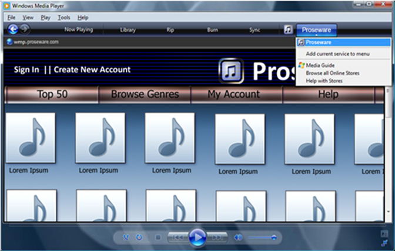

    The following screen shot shows the menu that appears when you click the split button at the lower left corner of Windows Media Player 12:

    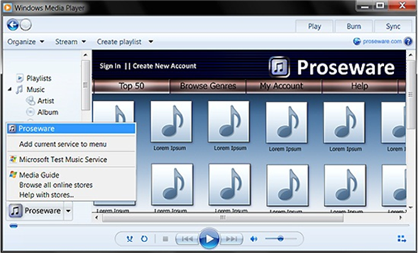

### Creating an Account

**To verify account setup**

1.  Verify that the store has an option to create a new account, and then follow the store instructions to create a new account.

    The following screen shot highlights a **Create New Account** button as it might appear in Windows Media Player 11:

    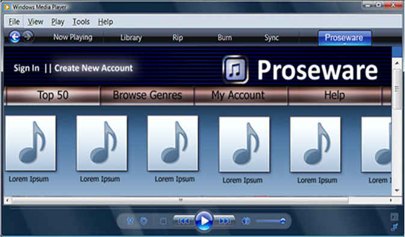

    The following screen shot highlights a **Create New Account** button as it might appear in Windows Media Player 12:

    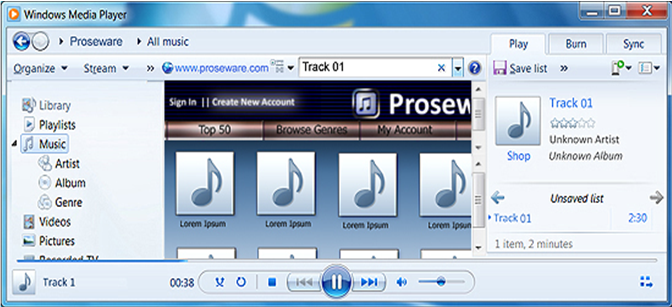

2.  Verify that you can sign in to the account that you created.

### Setting Up Credential Caching

First perform the following steps to set up credential caching, and then perform the steps that follow the initial steps to verify the credential-caching setup:

1.  At the sign-in page, enter credentials and select the option to save user information.
2.  Verify that the sign-in page has a check box that allows the user to cache credentials.
3.  Optional credential caching is an important security point. Automatic credential caching can expose personally identifiable information of users who sign into a shared or public computer. You should protect customer information by offering a check box that renders the caching optional.

**To verify credential caching**

1.  Verify that the store has a check box for a **Save my user information** option.

    1.  Close Windows Media Player.
    2.  Reopen Windows Media Player and attempt to download some content.

2.  Verify that credential caching is present and working.

    1.  Sign out of the store.
    2.  Close Windows Media Player.
    3.  Reopen Windows Media Player and attempt to download some content.

3.  Verify that the user is prompted for credentials if they are not cached.

    After signing out and then trying to use the store, the customer should be prompted for credentials.

## Content Acquisition

This section describes the various ways to acquire content and how to verify that that content was acquired.

### Streaming Content

Stream all available types of content from the store. For example, stream radio, video, audio, and previews content.

**To verify streaming content**

1.  Verify that all available types of content stream.

2.  Verify that content plays in Windows Media Player and not some other player or control.

### Obtaining Content

First perform the following steps to purchase content, and then perform the steps that follow the initial steps to verify the purchase and verify that the content downloaded:

1.  Launch Windows Media Player.
2.  Sign in to the test account.
3.  Navigate to the content to purchase.
4.  Follow the store-specific procedure to purchase content.

**To verify purchased and downloaded content**

1.  Verify that the calculated price is correct.

    Verify that the price is correct, especially when purchasing multiple pieces of content at once, and verify that any account balance information is updated correctly after purchase. Some content can be purchased as single tracks and some as albums only. Verify that the album price is not larger than the sum of the individual tracks.

2.  Verify that the purchased content downloads to the library.

    When the download completes, navigate to the downloaded content in the Windows Media Player library. The downloaded content is located in the current user's library.

    -   For Windows XP and Windows Vista with Windows Media Player 11, downloaded content appears in the library navigation pane, under **Library** pivot, and then under **Songs**.
    -   For Windows 7 with Windows Media Player 12, content that is downloaded to the Windows Media Player library appears in the Windows Media Player navigation pane under **Music**.

3.  Verify that metadata downloads for the purchase.

    Ensure that the following columns appear in the Windows Media Player library (add them if not):

    -   Album Artist
    -   Title
    -   Album Title
    -   Content Provider
    -   Genre

    The preceding columns must be populated. Content should have album art. However, album art is not required to pass validation testing.

4.  Verify that media usage rights are correct for the purchase.

    For each downloaded track, right-click the track and select **Properties**, and then select the **Media Usage Rights** tab.

    The store can choose to protect its content with media usage rights, or can choose to not protect the content. The **Media Usage Rights** tab reflects that status either by listing the restrictions, or by stating that the content is not protected. The store must communicate its most current plan for media usage rights. You must verify actual results against this expected behavior.

    Media rights licenses must be pre-delivered. The customer must not be required to play the content or go through some other process to get the license. You must compare the specific media usage rights to what the store has communicated to the customer as appropriate. Rights must be transferable to at least two other computers. Customers must be able to burn and synchronize their media.

    The following screen shot shows the media usage rights of a protected file:

    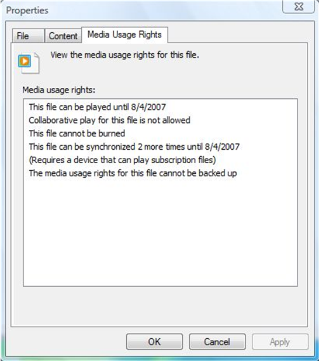

    If the content is not protected, the **Media Usage Rights** tab indicates this fact.

    The following screen shot shows the media usage rights of an unprotected file:

    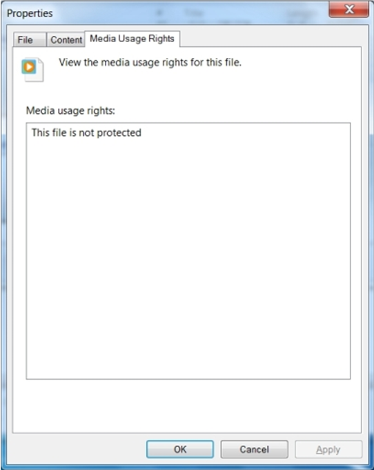

5.  Verify that the purchased content plays.

    Verify that downloaded content plays in Windows Media Player.

    Play any content that was purchased from the store and that resides in the local library, or stream a preview.

    Perform the following steps to purchase content in Windows XP and Windows Vista with Windows Media Player 11:

    1.  Click the **Now Playing** tab.
    2.  In the list pane, position the mouse pointer to hover over album art in order to show the **Buy** link.
    3.  Click **Buy**.

    The following screen shot shows the location of the **Buy** link in Windows Media Player 11:

    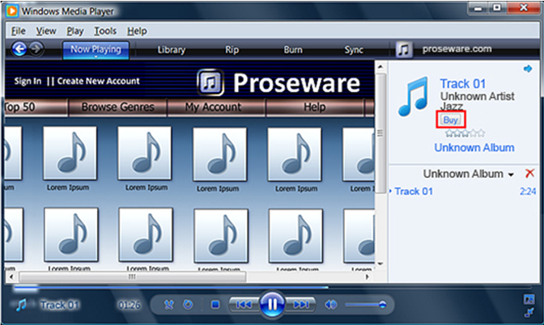

    Perform the following steps to purchase content in Windows 7 with Windows Media Player 12:

    1.  In library mode, click the **Play** tab.
    2.  In the playlist, under the album art, click **Shop**

    The following screen shot shows how to buy content in Windows Media Player 12:

    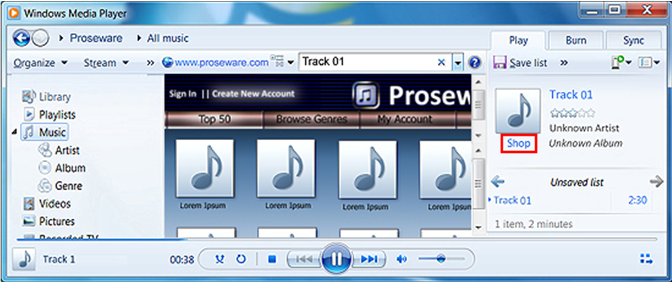

6.  Verify that clicking **Buy** or **Shop** switches to the store.

    The Windows Media Player should switch to the store in library view and load the purchasing experience of the store.

    You must then continue to purchase the track.

7.  Verify that after clicking **Buy** or **Shop**, the content downloads.

    Verify that the media usage rights are appropriate for the purchased content and its metadata, and verify that the track plays. In general, this method of purchase should have the same results as other methods.

### Burning Content

First perform the following steps to burn purchased content (copy purchased content to a writeable CD or DVD), and then perform the steps that follow the initial steps to verify that the content burns:

> [!Note]  
> Before you burn a purchased track, note its burn count so you can later verify whether the count decrements after you burn the track.

 

1.  Click the **Burn** tab
2.  Drag purchased tracks to the **Burn List**.
3.  Click the **Start Burn** button.

The following screen shot shows the **Burn List** on the right side of the screen and the **Start Burn** button below the **Burn List** in Windows Media Player 11:

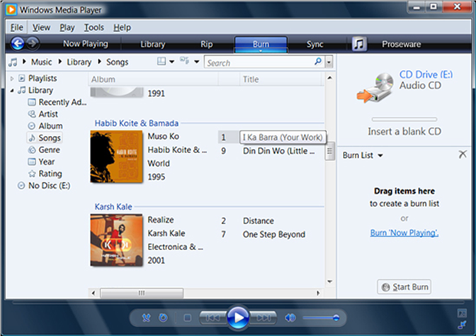

The following screen shot shows how the burn list appears in Windows Media Player 12 after you drag a track to the burn list, and it shows the **Start Burn** button at the top of the **Burn** tab:

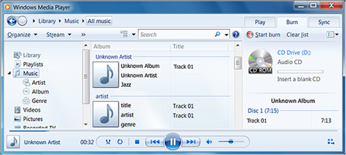

**To verify that purchased content can be burned**

1.  Verify that the purchased content burns by playing the CD or DVD after burning completes.

2.  Verify that the burn count is decremented.

    Navigate to the library and open the media usage rights for a purchased track that was burned.

    If the number of times a track can be burned is limited, verify that this number decreases after the track is burned.

### Transferring Content

Transfer content to another computer.

**To verify that purchased content can be transferred to another computer**

-   If the store allows transferring content to another computer, transfer the content to at least two computers.

First perform the following steps to sync to a device and transfer purchased content to that device, and then perform the steps that follow the initial steps to verify that the content is transferred:

> [!Note]  
> Before you transfer a purchased track, note its sync count so you can later verify whether the count decrements after you transfer the track.

 

1.  Connect a device with a secure clock. Examples include devices that use Windows Media DRM for Portable Devices, such as a Portable Media Center like the iRiver H10, the Creative Zen, and so on.
2.  In Windows Media Player, click the **Sync** tab.
3.  Drag content from the library to the **Sync list** area on the **Sync** tab.
4.  Click the **Start Sync** button.

The following screen shot shows Track 1 in the **Sync list** area and shows the **Start Sync** button in Windows Media Player 11:

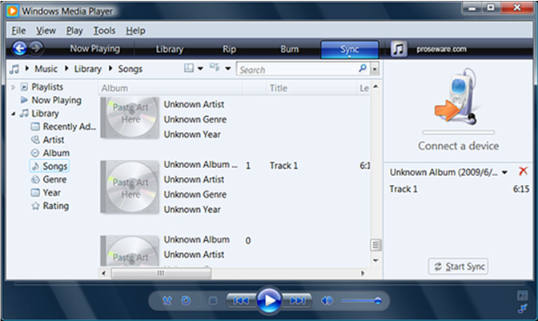

The following screen shot shows Track 1 in the **Sync list** area and shows the **Start Sync** button in Windows Media Player 12:

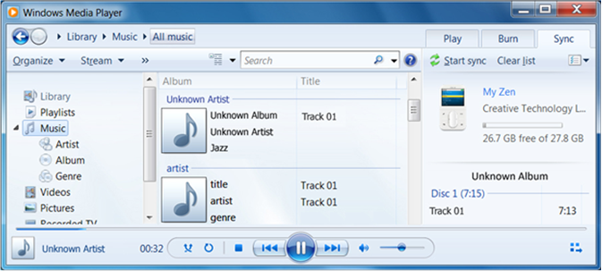

**To verify that purchased content can be transferred to another device**

1.  Verify that the purchased content is transferred to the device by playing the content on the device. The transferred content must also have appropriate metadata.

2.  Verify that the sync count is decremented.

    Navigate to the library and open the media usage rights for a transferred track.

    If the number of times a track can sync is limited, verify that this number decreases when the track is transferred.

## Store Features

The following sections describe how to test various features of an on-boarded online store.

### Managing an Account

Sign in with an account that has made some purchases and open the purchase history.

**To verify purchase history**

-   Verify that the purchase history tracks prior purchases.

If the store or account type supports this feature, attempt to restore a deleted purchase.

**To verify that prior purchases can be reacquired**

-   Verify that a prior purchase can be restored.

If the store supports using multiple computers with the account, verify any functionality that this feature provides.

**To verify multiple computer management with a single account**

-   Verify the store's functionality to manage multiple computers.

### Managing a Store-Specific Account

The store might not have typical account types, restrictions, or content. For example, a store that rents streaming video would need some user interface to display active rentals and that user interface would need to be tested.

> [!Note]  
> Although Microsoft cannot certify store-specific account functionality, to ensure a good customer experience, you should test that functionality.

 

### Managing the Info Center

First perform the following steps to prepare for testing the default state, and then perform the next step that follows the initial steps to verify that the Info Center is off by default:

1.  Play some content from the store.
2.  Switch to Now Playing mode. In Windows XP or Windows Vista with Windows Media Player 11, click the **Now Playing** tab. In Windows 7 with Windows Media Player 12, click the **Switch to Now Playing** button at the lower right corner.

**To verify that the Info Center is off by default**

-   Verify that the Info Center is off by default.

If the store offers an Info Center view, play some content from the store, and while the content is playing, switch to Now Playing mode and turn Info Center on.

In Windows XP or Windows Vista with Windows Media Player 11, right-click the now-playing window, and then from the context menu select **Info Center View**.

The following screen shot shows the context menu in Windows Media Player 11:

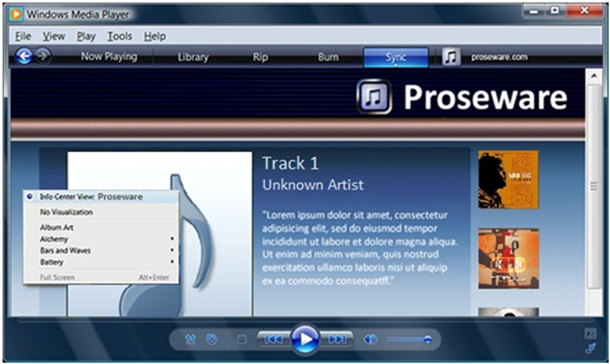

In Windows 7 with Windows Media Player 12, right-click the now-playing window, on the context menu select **Visualizations**, and then click **Info Center View**.

The following screen shot shows the context menu in Windows Media Player 12:

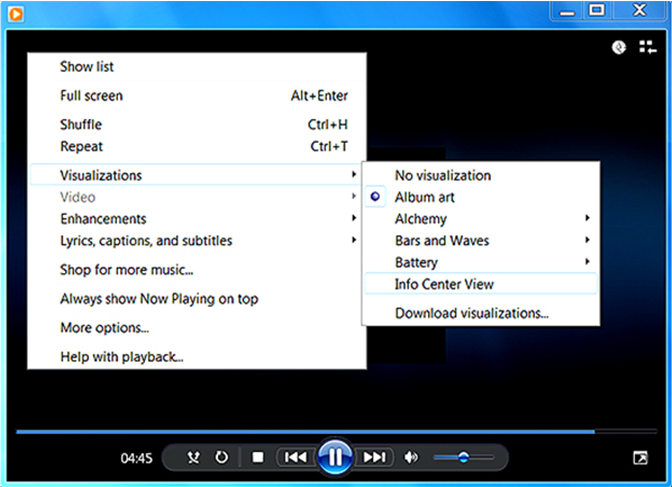

**To verify that the Info Center is functional**

-   Verify that the Info Center shows media information in the now-playing area. The following screen shot shows an example of such media information:

    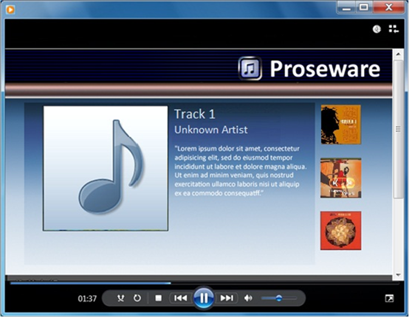

If any buy links or other links appear on the page, click the links.

**To verify links in the Info Center view**

-   Verify that the links show the store.

    The Windows Media Player should switch to the store in its library.

## Store Interaction

The following sections describe how to test interaction between the other stores and the store that you are testing.

### Yielding to the Active Store

Switch to a store other than the store being tested.

**To verify yielding to the active store**

-   Verify that the tested store yields to the active store.

### Preventing the Tested Store From Taking Over the Active Store

-   With another store selected, close Windows Media Player and restart the computer.
-   Launch Windows Media Player.

**To verify that the tested store does not take over**

-   Verify that the most recently active store appears and that the tested store does not appear.

### Accessing a Store in High-Contrast Mode

First enable high-contrast mode by pressing LEFT SHIFT+LEFT ALT+PRINT SCREEN, and then perform the following steps to verify high-contrast accessibility:

**To verify that the store is accessible in high-contrast mode**

1.  Verify that the log-in user interface is intact and functional.
2.  Verify that all windows and dialog boxes appear correctly.
3.  Purchase media. Verify that purchase and download buttons, download managers, price information, and so on is visible.
4.  Verify that you can stream, burn, and synchronize.
5.  Look for clipped text and user-interface elements, text that is not legible, and other visible defects.

### Securing a Store

Perform the following steps to verify account security:

**To verify account security**

1.  Enter malformed account information into the log-in page and dialog box and verify that the store rejects it.
2.  Sign in, view the account page, and sign out.
3.  Click the back button in Windows Media Player, and verify that you do not see the previous user account information.

 

 

