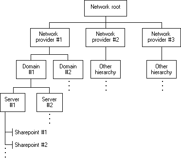

# About Windows Networking

Applications can use the WNet functions to add and cancel network connections and to retrieve information about the current configuration of the network.

The following figure shows the structure of a typical network.

In the preceding figure, the hierarchy for Windows NT Server/Windows 2000 Server resources is given in detail as Network provider \#1. Network resources from other providers have different hierarchical systems. An application does not need information about the hierarchy before it begins to work with a network. It can proceed from the network root (that is, the topmost container resource) and retrieve information about the network's resources as the information is required.

Network resources that contain other resources are called *containers*. Container resources are in boxes in the preceding figure.

Resources that do not contain other resources are called *objects*. In the preceding figure, Sharepoint \#1 and Sharepoint \#2 are objects. A *sharepoint* is an object that is accessible across the network. Examples of sharepoints include printers and shared directories.

 

 

