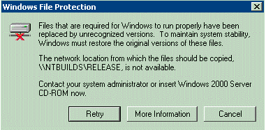
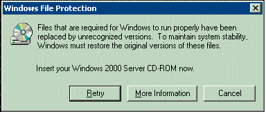

# Detecting Resource Replacement

Windows Resource Protection (WRP) prevents the replacement of essential system files, folders, and registry keys that are installed as part of Windows Vista or Windows Server 2008.

WRP protects files, folders, and registry keys on Windows Vista or Windows Server 2008 by detecting and preventing attempts to replace protected resources. This protection is based on a Windows discretionary access control list (DACL) and access control lists (ACL) defined for protected resources. Permission for full access to modify WRP-protected resources is restricted to TrustedInstaller. WRP-protected resources can only be changed using the [Supported Resource Replacement Mechanisms](supported-file-replacement-mechanisms.md) with the Windows Modules Installer service. Applications attempting to modify a WRP-protected resource never change the resource and may receive an error message that states that access to the resource was denied.

Applications and installers can use the [**SfcIsFileProtected**](/windows/desktop/api/Sfc/nf-sfc-sfcisfileprotected) and [**SfcIsKeyProtected**](/windows/desktop/api/Sfc/nf-sfc-sfciskeyprotected) functions to determine whether a file or registry key is protected.

**Windows Server 2003 and Windows XP:  **

Windows File Protection (WFP) protects system files by detecting attempts to replace protected system files. This protection is triggered after WFP receives a directory change notification for a file in a protected directory. When WFP receives this notification, it determines which file has changed. If the file is protected, WFP looks up the file signature in a catalog file to determine if the new file is the correct version. If the file version is not correct, the system replaces the file with the correct version from either the cache or distribution media, depending on whether the file is located in the cache. WFP searches for the correct file in the following order:

1.  Search the cache directory.
2.  Search the network install path, if the system was installed using network install.
3.  Search on a Windows CD-ROM, if the system was installed from CD-ROM.

If WFP cannot automatically find the file in the first two locations, it displays the following message:



If the system was installed using a CD-ROM, WFP displays the following message:



If an administrator is not logged on, WFP cannot display either of these dialog boxes. WFP will display the dialog box after an administrator logs on.

WFP also logs the file replacement attempt in the system event log. If the administrator canceled restoration of the correct file, WFP logs the cancellation.

## Retrieving the List of Protected Files

The following example shows how applications and installers can use the [**SfcGetNextProtectedFile**](/windows/desktop/api/Sfc/nf-sfc-sfcgetnextprotectedfile) function to get the complete list of protected files.


```C++
#include <windows.h>
#include <sfc.h>
#include <stdio.h>

#pragma comment(lib, "sfc")

void wmain (int argc, WCHAR ** argv)
{  UNREFERENCED_PARAMETER(argc);    
   PROTECTED_FILE_DATA pfd = {0};
   BOOL fResult;

   wprintf (L"List of protected files:\n\n", argv[1]);

   while (FALSE != (fResult = SfcGetNextProtectedFile (NULL, &pfd)))
   {
      wprintf (L"   %lu   %s\n", pfd.FileNumber, pfd.FileName);
   }

   if (GetLastError() == ERROR_NO_MORE_FILES)
   {
      wprintf (L"\nAll %lu protected files listed\n", pfd.FileNumber);
   }
   else
   {
      wprintf (L"\nerror %lu: SfcGetNextProtectedFile() failed unexpectedly\n", GetLastError());
   }

}
```


 

 


