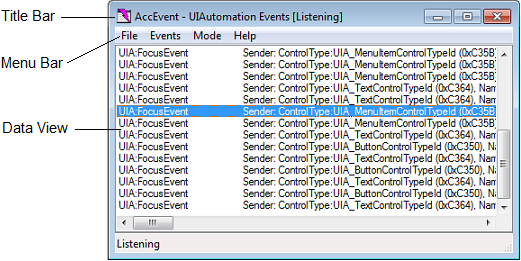

# Accessibility tools - AccEvent (Accessible Event Watcher)

**AccEvent (Accessible Event Watcher)** lets developers and testers to validate that an application's UI elements raise proper Microsoft UI Automation and Microsoft Active Accessibility events when UI changes occur. Changes in the UI can occur when focus changes, or when a UI element is invoked, selected, or has a state or property change.

**AccEvent** is installed with the Windows Software Development Kit (SDK). It is located in the \\bin\\<*version*>\\<*platform*> folder of the SDK installation path (Accevent.exe).

> [!NOTE]
> **AccEvent** is a legacy tool. We recommend using [Accessibility Insights](https://accessibilityinsights.io/) instead.

## Requirements

**AccEvent** can be used to examine accessibility data on systems that don't have UI Automation, it was originally written for Microsoft Active Accessibility. To examine UI Automation, UI Automation must be present on the system. For more information, see the "Requirements" section of [UI Automation](entry-uiauto-win32.md).

**AccEvent** is installed as part of the overall set of tools in the Windows SDK, it is not distributed as a separate exe download. The Windows SDK includes all of the accessibility-related tools documented in this section. [Get the Windows SDK.](https://developer.microsoft.com/) (There's also an SDK download archive linked from that page, if you need a previous version.)

To run **AccEvent**, find AccEvent.exe in the \\bin\\<*version*>\\<*platform*> folder and run it (you don't typically have to run as administrator).

## The Accessible Event Watcher Window

When you launch **AccEvent**, the main window is displayed. The main **AccEvent** window displays the UI Automation or Microsoft Active Accessibility events raised by applications that are running. The main window has the following major parts:

- Title bar. Displays the current operating mode and state.
- Menu bar. Provides access to **AccEvent** functionality.
- Data view. Displays information about each event, including the event ID and selected properties of the UI element that raised the event.

**AccEvent** has a graphical user interface only; there are no command line arguments for this tool, but you could use other tools to process the output log as text.

The following image shows the main **AccEvent** window.

## Accessible Event Watcher Tasks

This section includes information about commonly used **AccEvent** tasks.

### Configuring the Operating Mode

You use the **Mode** menu to configure the **AccEvent** operating mode and select settings that control the behavior of the tool. You can select the following options.

| When this option is selected | **AccEvent** does this                                                                                                                                                                                                                           |
|------------------------------|----------------------------------------------------------------------------------------------------------------------------------------------------------------------------------------------------------------------------------------------|
| Always on Top                | Appears on top of any other user interface on the screen.                                                                                                                                                                                    |
| UIA Events                   | Displays information about UI Automation events.                                                                                                                                                                                             |
| WinEvents (In Context)       | Displays information about Microsoft Active Accessibility events (WinEvents) passed to hook functions that reside in the server address space. For more information, see [In-Context Hook Functions](in-context-hook-functions.md).         |
| WinEvents (Out of Context)   | Displays information about Microsoft Active Accessibility events (WinEvents) passed to hook functions that reside in the client address space. For more information, see [Out-of-Context Hook Functions](out-of-context-hook-functions.md). |
| Show Highlight Rectangle     | Highlights a rectangle around the UI element that raised the selected event.                                                                                                                                                                 |
| Show Information Tooltip     | Shows event information in a tooltip.                                                                                                                                                                                                        |
| Settings                     | Displays the **UIA Event Settings** or **WinEvent Settings** dialog box.                                                                                                                                                                     |

 

### Filtering UI Automation Events

To configure the UI Automation events and properties that are displayed in the **AccEvent** window, click the **Mode** menu, select **UIA Events**, and then select **Settings**. The **UIA Event Settings** dialog box is displayed. You can also use this dialog box to filter for events.

The **UIA Event Settings** dialog box contains the following panes:

- **Global Events**

    Select the **FocusChangedEvent** check box to display information about global focus-changed events.

- **Event Type**

    Select the events that you are interested in.

- **Scope**

    Select the UI element that you want **AccEvent** to listen to for events.

- **Include events from**

    Select **Immediate children** if you what to see events from the immediate child elements of the UI element selected in the **Scope** pane. If you want to see events from all descendant elements, select **All Descendants**.

- **Report Properties**

    Select the properties that you want displayed after each event in the main window. If **Show Information Tooltip** is selected in the **Mode** menu, the selected properties are also displayed in a tooltip.

### Filtering Active Accessibility Events

To configure the Microsoft Active Accessibility events and properties that are displayed in the **AccEvent** window, click the **Mode** menu, select either **WinEvents (In Context)** or **WinEvents (Out of Context)**, and then select **Settings**. The **WinEvent Settings** dialog box is displayed. You can also use this dialog box to filter for events.

The **WinEvent Settings** dialog box contains the following panes:

- **Objects**

    Select the objects that you want **AccEvent** to listen to for events. **AccEvent** can listen for events originating from windows, from the cursor, or from the caret. **Window** is selected by default.

- **Events**

    Select the events that you are interested in. All events are displayed by default.

- **Event Information**

    Select the information you want displayed after each event's name in the main window.

- **Object Properties**

    Select the properties that you want displayed after each event in the main window. If **Show Information Tooltip** is selected in the **Mode** menu, the selected properties are also displayed in a tooltip. **Name**, **Role**, and **State** are selected by default.

- **Filtering**

    Select one of the radio buttons in the filtering section to filter the events raised by the windows specified in the **hWNDs** field. The **Don't filter** radio button is selected by default.

    - Select the **Exclude** radio button to display only the events raised from objects other than the specified windows.
    - Select the **Include only** radio button and specify one or more window handles to display only events raised from those windows.
    - Check the **and Descendants** check box to include events raised by the descendants of the specified windows.

- **Options**

    Select any of the following options:

    

    | When this option is selected                                  | **AccEvent** does this                                                                                                                                                                                 |
    |---------------------------------------------------------------|----------------------------------------------------------------------------------------------------------------------------------------------------------------------------------------------------|
    | Use Invoke                                                    | Uses [IDispatch::Invoke](/windows/win32/api/oaidl/nf-oaidl-idispatch-invoke) to retrieve object properties instead of using [**IAccessible**](/windows/desktop/api/oleacc/nn-oleacc-iaccessible) methods.                               |
    | Always Get Object (even if no object properties selected)     | Retrieves the object associated with the event even if no items are selected in the Object Properties pane.                                                                                        |
    | Display default property (in addition to selected properties) | Displays the default property, if any, for the object associated with the event, along with the items selected in the Object Properties pane.                                                      |
    | Display event information from invisible/hidden windows       | Displays the selected items from the Event Information pane for all objects, including those in invisible or hidden windows.                                                                       |
    | Display full event information from invisible/hidden windows  | Displays the selected items from the Event Information pane, and the selected (or default) items from the Object Properties pane, for all objects, including those in invisible or hidden windows. |
    | DebugBreak on next event                                      | Causes a breakpoint exception to occur in the process that originates the next WinEvent. This signals the debugger to handle the exception.                                                        |

### Using the Event Menu

Use the **Event** menu to perform the following tasks:

| When this option is selected | **AccEvent** does this                                    |
|------------------------------|-------------------------------------------------------|
| Start Listening              | Starts displaying event information in the Data view. |
| Stop Listening               | Stops displaying event information in the Data view.  |
| Clear Event History          | Clears the contents of the Data view.                 |
| Select All Events            | Selects all events listed in the Data view.           |
| Copy Selected Events         | Copies the selected events to the clipboard.          |

### Saving Active Accessibility Events

To begin saving events to a text file, open the **File** menu and select **Start Logging to File**. **AccEvent** begins writing events to the specified file until you select **Stop Logging** from the **File** menu. The text file can be useful for troubleshooting and reviewing the events at a later time.

## Related topics

- [Accessible Event Watcher](accessible-event-watcher.md)
- [Testing Tools](testing-tools.md)
- [UI Accessibility Checker](ui-accessibility-checker.md)
- [UI Automation Events Overview](uiauto-eventsoverview.md)
- [UI Automation Verify](ui-automation-verify.md)
- [WinEvents](winevents-infrastructure.md)