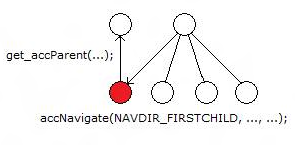

# AccNavigate\_ReturnedElementWithIncorrectParent

## Text

Calling accNavigate((Live Search), 0, NAVDIR\_FIRSTCHILD) which returned (x-gadget:///gadget.html) returned the incorrect parent(\[NULL\]) and not (Live Search)

## Type

Error

## Description

When [**get\_accParent**](/windows/desktop/api/Oleacc/nf-oleacc-iaccessible-get_accparent) is called on the child element returned by [**accNavigate**](/windows/desktop/api/Oleacc/nf-oleacc-iaccessible-accnavigate) (using either the NAVDIR\_FIRSTCHILD or NAVDIR\_LASTCHILD navigation constants), the parent element returned does not match the parent element specified in the **accNavigate** call.

This issue can cause navigation problems for automated tools because traversing elements might be erratic and unpredictable.

## Possible causes

An incorrect or invalid MSAA implementation.

## Related topics

<dl> <dt>

[**IAccessible::accNavigate**](/windows/desktop/api/Oleacc/nf-oleacc-iaccessible-accnavigate)
</dt> <dt>

[**IAccessible::get\_accParent**](/windows/desktop/api/Oleacc/nf-oleacc-iaccessible-get_accparent)
</dt> </dl>

 

 

