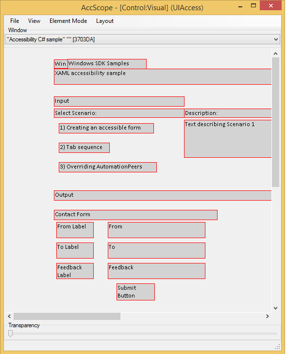

# Accessibility tools - AccScope

The **AccScope** tool enables developers and testers to evaluate the accessibility of their app during the app's development and design, rather than in the late testing phases of an app's development cycle. Testing can even start in early prototype phases. **AccScope** can visualize how a screen reader exposes the UI Automation information that an app provides, and can show areas where you might want to add info or support to your app to improve its accessibility.

> [!NOTE]
> **AccScope** is a legacy tool. We recommend using [Accessibility Insights](https://accessibilityinsights.io/) instead.

## About AccScope

**AccScope** is installed with the Windows Software Development Kit (SDK). It is located in the \\bin\\<*version*>\\<*platform*>\\AccScope folder of the SDK installation path. Run the program AccScope.exe.

**AccScope** is a desktop app, not a Windows Store app. You can use it to look at any app that appears as a window, including a desktop app, or a Windows Store app.

You might need to run **AccScope** as administrator the first time you use it, to enable the Narrator mode.

**AccScope** is available as part of the accessibility tools binaries, in the Windows SDK. It is not distributed as a separate exe download and does not exist in previous SDKs.

## File menu options

- Select **Refresh** to refresh all info in **AccScope** to match the current state of the target window. For a UI that contains a large number of elements this can take several seconds to complete.
- Check or uncheck **Always on Top** to change the windowing behavior of the **AccScope** UI. **Always on Top** checked is the default.
- Select **Exit** to quit **AccScope**.

## View options

- Select **Full Screen** to run the **AccScope** tool in a full screen view (then use tabbing to view the target window). If both **AccScope** and the target app are running full screen, placement, bounding rectangles and overall visualization of elements will correspond between your app and the **AccScope** view.
    > [!Note]  
    > **AccScope** and its target should be run on the same display.

     

- Select **Auto Focus** to enable AccScope to change the target window whenever a user moves focus to the window (using mouse or keyboard).
- Select **Auto Refresh** to enable the **AccScope** mode that refreshes all accessibility data of the target window every 5 seconds. This is useful if the Microsoft UI Automation data of target window changes constantly.
- Select **Live Regions** to highlight any live regions that issue notifications in the target window. A live region event firing display a red popup that has info about the live region including its name and its "aria-live" value (or the equivalent ARIA value analog for apps not directly using HTML but using the Live Regions concept in the UI Automation support).

## Element Mode

You can choose to view a target window through one of these modes:

- **Leaf Control**: Shows a UI Automation view of **Control** elements with parent-child relationships, in other words a view of "leaf level" interactive controls. Use this option to see if all interactive controls are appearing correctly in the UI Automation tree for a **Control** view.
- **Text Pattern**: Shows visible text ranges of the **TextPattern** containers from the target window. Use this option to visually represent the visible text ranges of UI Automation **TextPattern** elements.
- **Narrator**: Shows the UI Automation elements that Narrator can identify using the Narrator 'item navigation’ metaphor.
- **Custom Filter**: Shows a filtered control tree with a choice of control subsets: **Button**, **Checkbox**, **Combobox**, **Grid**, **Hyperlink**, **List**, **Menu** or **Table**.

Changing the **Element Mode** setting triggers a refresh of the visualization. For a UI that contains a large number of elements this can take several seconds to complete.

## Layout options

You can select either **Visual** or **List** as the visualization mode for the **AccScope** layout. **Visual** places the elements in coordinate space in the same relationship as the target window. **List** orders the elements in a descending list that's left-aligned in the **AccScope** window and the list order is equivalent to tab order or reading order.

- Select an option from **Show Images** to control when the simple rectangles for image elements are replaced by the actual image (or a small viewport of that image, since often the rectangles are smaller than the actual image). The default is **On Hover**, which displays the image when you navigate within **AccScope** and hover the mouse over the rectangle for an image element. Alternate choices are **Always** or **Never**.
- Select **Show Tooltip** to show basic element info whenever you hover the mouse over the an element in the **AccScope** visualization. If the **Element Mode** is **Leaf Control** or **Text Pattern** the info shown in the tooltip is the highest-priority element-level UI Automation properties. If the **Element Mode** is **Narrator** the info includes the text that Narrator would read for the element.
- Select **Show Numbers** to display sequence numbers that indicate control render order in layout. The number scheme is based on the **Element Mode** setting:
    - **Leaf Control**: the numbers indicates the order in which leaf controls appear in the UI Automation tree.
    - **Text Pattern**: the numbers indicate the order in which text ranges appear in a document range.
    - **Narrator**: the number indicates the order in which the elements are navigated in Narrator's item navigation.

## Choosing a window

Under the label **Window** you'll find a dropdown that lists all the HWND windows that are currently active on the system. The text for each window that appears in the dropdown list is the window title, and also a hex window ID in square brackets. Choose one of these to change the target window that **AccScope** is reporting on. You can choose the same item again to get the same behavior as an explicit **Refresh**.

## Using the AccScope visualization

The image below is a screenshot of the **AccScope** visualization. This particular screenshot shows the **AccScope** tool viewing the top-level window for the [XAML accessibility sample](https://github.com/microsoftarchive/msdn-code-gallery-microsoft/tree/411c271e537727d737a53fa2cbe99eaecac00cc0/Official%20Windows%20Platform%20Sample/XAML%20accessibility%20sample) output, running as an app on the same machine. This screenshot shows the default element mode of **Leaf Control** and the **Visual** value for **Layout**.

Note how this visualization represents the controls in the approximate coordinate space you'd see in the app. But instead of showing you the XAML visuals, or the complete text of text controls, it shows the **Name** property values that come from every control element, using UI Automation.

In addition to the menu options described previously you also can use these techniques:

- Click on any element's rectangle in either **Visual** or **List** visualizations to display a **UIA Properties** popup. This lists a number of the important UI Automation properties for that element including some of the standard [**IUIAutomationElement**](/windows/desktop/api/UIAutomationClient/nn-uiautomationclient-iuiautomationelement) properties and other info such as ARIA values and a **Provider description**.
- Right-click on any element's rectangle in either **Visual** or **List** visualizations to display a context menu for exercising the patterns that the element supports. For example, if an element supports [**InvokePattern**](/windows/desktop/api/UIAutomationClient/nn-uiautomationclient-iuiautomationinvokepattern), the context menu includes an item for **Invoke**. Select that item and the appropriate pattern API is exercised in the corresponding app. **AccScope** supports this feature for the following patterns: **Invoke**, **ExpandCollapse**, **Toggle**, **SelectionItem**, **ScrollItem**.
- Adjust the **Transparency** slider to change the opacity/transparency of the **AccScope** window. By default it's shown as 100% opacity. Making the window partly transparent can be useful for seeing the parts of the target window through the **AccScope** UI while using the **Always On Top** mode.
- If they're shown, use the horizontal and vertical scrollbars to change the view center of the visualization. This is useful if you're using the **Visual** layout option but not using the **Full Screen** view option, while leaving the **AccScope** window small in comparison to the target window.

## Testing the Narrator scenario

The Narrator scenario is the most important aspect to test when using **AccScope**, which is specifically designed to visualize how basic Narrator item navigation works when it's applied to your app.

To test the Narrator scenario, use these **AccScope** configuration options:

- **Element Mode**: **Narrator**
- **Layout**: **Visual**
- **Layout** options: **Show Tooltip** and **Show Numbers** both selected

Here are some specific areas of your app to test for the Narrator scenario:

- **Element order:** Verify that the order in which Narrator reads your controls is accurate, according to the numbers (green circles) displayed in the visualizations. If elements aren't in the order you expect for reading, modify the app's UI structure and the resulting UI Automation tree, and test again until you've verified that your elements are in expected reading order.
- **Spoken text:** Move the mouse within the visualization and hover over each of the element rectangles to display the tool tips for each element. In Narrator mode the tool tips display a **Narrator Text** entry that is literally the text that Narrator reads. Generally this text is composed from the **Name** and the **Control Type**. Verify that this is the right info for each control in your UI. If any info is incorrect, modify the UI Automation properties through the techniques enabled by your particular UI framework for doing so. (If **Control Type** is unexpected, you might need to use a different control, because that's often exclusively controlled by a UI framework's control implementations.) Then test again and verify that **Narrator Text** is correct.
- **Element layout:** Check each of these cases:
    - Verify that redundant elements are not exposed by Narrator. An example of a redundant element is the ratings control in each Windows Store tile item.
    - Verify that important elements (elements the user needs to accomplish key tasks in the app) each appear in Narrator item navigation.
    - If you're using the **Visual** layout and an element is missing because controls overlap each other, switch to **List** layout to see the sequence that Narrator reports.
    - Verify that the UI Automation tree structure overall is accurate and expected for your app.

## Related topics

- [Accessible Event Watcher](accessible-event-watcher.md)
- [Testing Tools](testing-tools.md)
- [UI Accessibility Checker](ui-accessibility-checker.md)
- [UI Automation Verify](ui-automation-verify.md)
- [Microsoft Accessibility](https://www.microsoft.com/accessibility/)
