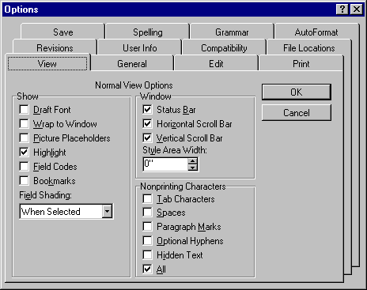

# Appendix B: Standard Dialog Manager Support

Microsoft Active Accessibility provides complete support for Standard Dialog Manager (SDM) dialog box controls. SDM is an internal Microsoft code library that provides Microsoft applications with a degree of independence from the differences between the Macintosh and Microsoft Windows operating systems. SDM is primarily used for dialog boxes in Microsoft Excel and Microsoft Word.

SDM presents problems for accessibility aids because it uses nonstandard implementations of dialog boxes. For example, SDM dialog box buttons do not use window handles the same way that the standard user interface elements do. You cannot send messages to buttons and buttons are not contained in the window list. An application using SDM communicates with the control through a private interface.

The following illustration shows a sample dialog box from Word. Although it looks like a regular Windows dialog box that uses the tab control, it is really an SDM dialog box.

 

 

