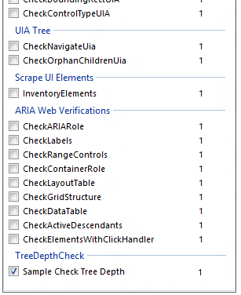

# Custom Verification Routines

This section describes how to create a custom verification routine for the UI Accessibility Checker (AccChecker) tool.

-   [Creating a Custom Verification](#creating-a-custom-verification)
    -   [Sample Custom Verification](#sample-custom-verification)
-   [Using a Custom Verification](#using-a-custom-verification)
    -   [The AccChecker Graphical User Interface (GUI)](#the-accchecker-graphical-user-interface-gui)
    -   [AccChecker Automation](#accchecker-automation)
-   [Related topics](#related-topics)

UI Accessibility Checker (AccChecker) is an accessibility test tool designed to verify the implementation of Microsoft Active Accessibility (MSAA) in a control or application UI. High impact accessibility issues that might be exposed by the MSAA implementation are tested with a set of built-in automated verification routines. These native verification routines can be augmented with customized routines using the extensible AccChecker platform.

## Creating a Custom Verification

A custom verification is built as a class library (DLL) that implements a single interface (`IVerificationRoutine`) containing one member (`Execute`):


```CSharp
void Execute(
    System.IntPtr hwnd, 
    AccCheck.Logging.ILogger logger, 
    bool AllowUI, 
    AccCheck.GraphicsHelper graphics
);
```


**Parameters**

*hwnd*

Type: **System.IntPtr**

The HWND of the element being verified.

*logger*

Type: **AccCheck.Logging.ILogger**

The selected logging method. Possible types include **AccumulatingLogger** (used by AccChecker to cache all log entries until verifications are complete), **ConsoleLogger**, **TextFileLogger**, and **XMLSerializingLogger**.

*AllowUI*

Type: **bool**

Indicates whether the verification routine displays the UI it is testing. Generally set to false in automated testing scenarios.

*graphics*

Type: **AccCheck.GraphicsHelper**

Used for screenshots and other visualizations within AccChecker.

### Sample Custom Verification

The following example is a C# custom verification that performs a simple element tree depth check. An error is logged if the element tree is greater than 50 levels deep, a warning is logged if the element tree is 20 to 50 levels deep, and an informational message is logged otherwise.


```CSharp
using System;
using System.Collections.Generic;
using System.Text;
using AccCheck;
using AccCheck.Logging;
using AccCheck.Verification;

namespace VerificationRoutines
{
    \\ Verification routine attributes.
    \\ If these values are not specified, the verification will not be displayed in the 
    \\ AccChecker UI. However, it is still loaded and will be included in all subsequent 
    \\ verification runs since it cannot be unchecked and excluded.
    [Verification(
        // Title - the title of the verification routine.
        "Sample Check Tree Depth",
        // Description - this attribute is not currently displayed.
        "Checks that the accessibility tree isn't excessively deep.",
        // Group Title - the verification group to add the routine. This can be a new or 
        //  existing group.
        Group = "TreeDepthCheck"
        )]

    public class CheckTreeDepth : IVerificationRoutine
    {
        private const int S_OK = 0;
        private const int ERROR_TREE_DEPTH = 50;
        private const int WARNING_TREE_DEPTH = 20;
        private int _depth = 0;

        private void TraverseTree(Accessible parent, int level)
        {
            if (level > _depth)
            {
                _depth = level;
            }

            // never go deeper than ERROR_TREE_DEPTH, that's a sign of a loop
            if (_depth > ERROR_TREE_DEPTH)
            {
                return;
            }

            Accessible[] children;
            if (parent.Children(out children) == S_OK)
            {
                foreach (Accessible child in children)
                {
                    TraverseTree(child, level + 1);
                }
            }
        }

        public void Execute(IntPtr hwnd, ILogger logger, bool AllowUI, 
                GraphicsHelper graphics)
        {
            Accessible root;
            if (Accessible.FromWindow(hwnd, out root) == S_OK)
            {
                TraverseTree(root, 0);
            }
            else
            {
                return;
            }

            if (_depth >= ERROR_TREE_DEPTH)
            {
                logger.Log(new LogEvent(EventLevel.Error, "DepthCheck", String.Format(
                    "The tree is too deep; the tree is {0} levels deep", _depth), "", 
                    System.Drawing.Rectangle.Empty, this.GetType()));
            }
            else if (_depth >= WARNING_TREE_DEPTH)
            {
                logger.Log(new LogEvent(EventLevel.Warning, "DepthCheck", String.Format(
                    "The tree might be too deep; the tree is {0} levels deep", _depth), "", 
                    System.Drawing.Rectangle.Empty, this.GetType()));
            }
            else
            {
                logger.Log(new LogEvent(EventLevel.Information, "DepthCheck", String.Format(
                    "The tree is {0} levels deep", _depth), "", 
                    System.Drawing.Rectangle.Empty, this.GetType()));
            }
        }
    }
}
```


> [!Note]  
> A Microsoft Visual Studio solution that contains verification sample code is included with the help documentation. The files are located in the AccChecker installation path.

 

## Using a Custom Verification

This section describes how to incorporate a custom verification into AccChecker test scenarios.

### The AccChecker Graphical User Interface (GUI)

To include a custom verification routine in the AccChecker application, simply click Open DLL from the File menu and locate the DLL for the routine. The custom routine will be added to the bottom of the list of verifications in the Select verification routines pane.

The following screen shot shows the Sample Check Tree Depth custom verification added to AccChecker.



> [!Note]  
> If the verification attribute values are not specified in the custom verification routine, the verification is still loaded into AccChecker even though it does not appear in the UI. Since it is not displayed in the UI, it cannot be unchecked and excluded from subsequent verification runs.

 

### AccChecker Automation

Incorporating a custom verification routine into an automated AccChecker framework is as simple as adding the verification DLL and enabling the desired verification routines.

The following code snippet demonstrates how to use the AccChecker API to test tabbing functionality in the Windows Firewall control panel application.


```CSharp
using System;
using System.Collections.Generic;
using System.Linq;
using System.Text;
using AccCheck.Logging;

public class TestCases : TestBase
{
    public void AccessibilityTestCase()
    {
        //  Get our user interface ready for AccChecker.
        Setup();

        //  AccChecker's class representing verifications that you can run.
        AccCheck.Verification.VerificationManager vm = new AccCheck.Verification.VerificationManager();

        //  Create a console logger to get output in the console.
        ConsoleLogger consoleLogger = new ConsoleLogger();

        //  Add the AccChecker Console Logger.
        vm.AddLogger(consoleLogger);

        //  Disable all verifications; all verifications are enabled by default.
        vm.DisableVerifications(AccCheck.Verification.VerificationFilter.All);

        // Add a custom verification DLL.
        vm.AddVerificationDll("CheckTreeDepthVerification.dll");
        
        // Enable the routine we want to run.
        vm.EnableRoutine("Sample Check Tree Depth");

        //  Run the verification routine against the firewall.
        vm.ExecuteEnabled(_fireWallHwnd);

        //  Check the logger to see if the verification failed.
        if (consoleLogger.ErrorCount > 0)
        {
            Console.WriteLine("Test failed!");
            Console.WriteLine("Error count = " + consoleLogger.ErrorCount);
        }

        // Clean up the user interface.
        Cleanup();
    }
}
```


> [!Note]  
> A Microsoft Visual Studio 2008 solution that contains verification sample code is included with the help documentation. The files are located in the AccChecker installation path.

 

## Related topics

<dl> <dt>

[UI Accessibility Checker](ui-accessibility-checker.md)
</dt> </dl>

 

 


